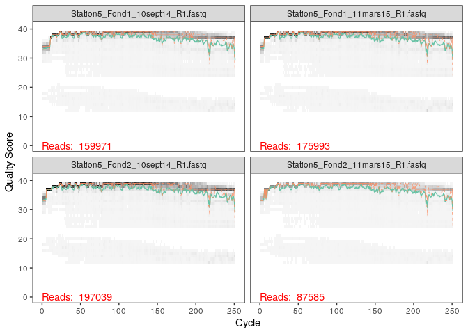
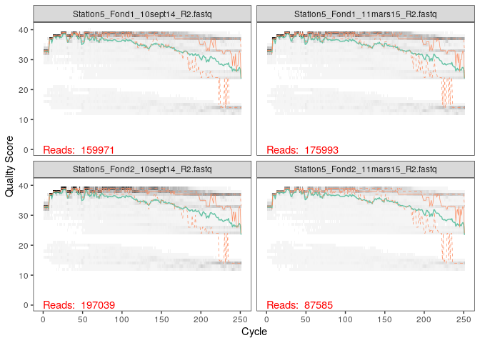

CC2 Rade de Brest
================

  - [Dada2](#dada2)
      - [Créer le chemin pour trouver les
        données](#créer-le-chemin-pour-trouver-les-données)
      - [Séparer les R1 des R2](#séparer-les-r1-des-r2)
      - [Scores de qualité pour déterminer le seuil ou les erreurs sont
        trop
        fréquentes](#scores-de-qualité-pour-déterminer-le-seuil-ou-les-erreurs-sont-trop-fréquentes)
          - [Forward](#forward)
          - [Reverse](#reverse)
          - [On constate qu’a partir de 220 il y a un taux d’erreurs
            croissant](#on-constate-qua-partir-de-220-il-y-a-un-taux-derreurs-croissant)
      - [Filtrage des données](#filtrage-des-données)
      - [Tronquer correctement pour éliminer le taux d’erreurs et
        permettre l’assemblage des
        contigs](#tronquer-correctement-pour-éliminer-le-taux-derreurs-et-permettre-lassemblage-des-contigs)
      - [Modèle d’erreurs (forward)](#modèle-derreurs-forward)
          - [(Reverse)](#reverse-1)
      - [Visualisation des modèles
        d’erreurs](#visualisation-des-modèles-derreurs)
          - [Forward](#forward-1)
          - [Revserse](#revserse)
      - [Compilation des filtrés et modèle d’erreurs en un seul objet
        (Forward)](#compilation-des-filtrés-et-modèle-derreurs-en-un-seul-objet-forward)
          - [(Reverse)](#reverse-2)
      - [Regroupement des données et visualisation du premier
        echantillon](#regroupement-des-données-et-visualisation-du-premier-echantillon)
      - [Faire une table avec ces
        données](#faire-une-table-avec-ces-données)
      - [Suppression des chimères](#suppression-des-chimères)
      - [ratio des séquences non chimériques par rapport aux séquences
        chimériques](#ratio-des-séquences-non-chimériques-par-rapport-aux-séquences-chimériques)
      - [Compilation de tous les echantillons avec
        sapply](#compilation-de-tous-les-echantillons-avec-sapply)
      - [Téléchargement de la base de
        données](#téléchargement-de-la-base-de-données)
      - [Assigner la taxonomie en comparant les reads a Silva
        database](#assigner-la-taxonomie-en-comparant-les-reads-a-silva-database)
      - [Visualisation des taxa sous forme de
        tableau](#visualisation-des-taxa-sous-forme-de-tableau)
  - [Phyloseq](#phyloseq)
      - [Stratification de nos données en fonction de la profondeur et
        la date de
        l’echantillon](#stratification-de-nos-données-en-fonction-de-la-profondeur-et-la-date-de-lechantillon)
      - [création de l’objet Ps ( incorporer la table d’otu, les non
        chimériques et les
        taxa)](#création-de-lobjet-ps-incorporer-la-table-dotu-les-non-chimériques-et-les-taxa)
      - [Assigner les données à dna avec le package Biostrings pour
        manipuler les données
        biologiques](#assigner-les-données-à-dna-avec-le-package-biostrings-pour-manipuler-les-données-biologiques)
      - [Abondance des bactéries en fonction de la saison et de la
        profondeur suivant
        l’entropie](#abondance-des-bactéries-en-fonction-de-la-saison-et-de-la-profondeur-suivant-lentropie)
          - [On peut déterminer qu’il y a une influence de la saison
            plus précisémenent pour les échantillons concernant la date
            du 11 Mars 2015. Que ce soit avec l’entropie de Shannon ou
            Simpson, on voit une différence marquée des
            communautés.](#on-peut-déterminer-quil-y-a-une-influence-de-la-saison-plus-précisémenent-pour-les-échantillons-concernant-la-date-du-11-mars-2015.-que-ce-soit-avec-lentropie-de-shannon-ou-simpson-on-voit-une-différence-marquée-des-communautés.)
      - [Visualisation sous un autre angle en fonction de la profondeur
        et de la
        saison](#visualisation-sous-un-autre-angle-en-fonction-de-la-profondeur-et-de-la-saison)
          - [On confirme qu’à la surface, il y a une grande influence de
            la saison sur la composition de la communauté microbienne.
            En revanche, on peut voir qu’il y a très peu de différences
            entre l’abondance des bactéries au (printemps et en été) et
            la profondeur “Fond”. Donc plus on descend en profondeur,
            moins les saisons vont avoir une influence sur la structure
            des communautés
            \#\#\#microbiennes.](#on-confirme-quà-la-surface-il-y-a-une-grande-influence-de-la-saison-sur-la-composition-de-la-communauté-microbienne.-en-revanche-on-peut-voir-quil-y-a-très-peu-de-différences-entre-labondance-des-bactéries-au-printemps-et-en-été-et-la-profondeur-fond.-donc-plus-on-descend-en-profondeur-moins-les-saisons-vont-avoir-une-influence-sur-la-structure-des-communautés-microbiennes.)
      - [Manipulation des données pour obtenir une ordination avec les
        distances de
        Bray-curtis](#manipulation-des-données-pour-obtenir-une-ordination-avec-les-distances-de-bray-curtis)
      - [Création de l’ordination](#création-de-lordination)
          - [On visualise une différence très marquée entre les
            échantillons effecutés en 2014 (fin de l’été) et ceux en
            2015 (printemps). Il y a un aspect donc saisonnier, et l’on
            peut aussi comparer les profondeurs entre-elles seulement
            pour 2014, et on voit que même la profondeur influe sur
            l’abondance des
            bactéries.](#on-visualise-une-différence-très-marquée-entre-les-échantillons-effecutés-en-2014-fin-de-lété-et-ceux-en-2015-printemps.-il-y-a-un-aspect-donc-saisonnier-et-lon-peut-aussi-comparer-les-profondeurs-entre-elles-seulement-pour-2014-et-on-voit-que-même-la-profondeur-influe-sur-labondance-des-bactéries.)
      - [Visualisation en Bar plot](#visualisation-en-bar-plot)
          - [On constate une modification de la structure de la
            communauté microbienne en fonction de la saison. En effet,
            la famille des Cyanoblaceae et des Rhodobacteraceae semblent
            tès abondantes lors de l’été et peu abondantes au printemps.
            Cela signifie que l’on peut les qualifier de biomarqueurs,
            puisqu’ils témoignent directement par leur abondance, du
            changement de structure de l’environnement (saisons). Cela
            est logique puisque les Cyanoblaceae et les Rhodobacteraceae
            utilisent des pigments pour capter l’energie solaire, donc
            en fonction des saisons, l’ensoleillement n’est pas le même,
            tout comme l’abondance de certaines bactéries à la surface
            de l’eau.On retrouve aussi une augmentationd des
            Flavobacteriaceae en profondeur (Fond) ce qui en fait un
            biomarqueur pour la
            profondeur.](#on-constate-une-modification-de-la-structure-de-la-communauté-microbienne-en-fonction-de-la-saison.-en-effet-la-famille-des-cyanoblaceae-et-des-rhodobacteraceae-semblent-tès-abondantes-lors-de-lété-et-peu-abondantes-au-printemps.-cela-signifie-que-lon-peut-les-qualifier-de-biomarqueurs-puisquils-témoignent-directement-par-leur-abondance-du-changement-de-structure-de-lenvironnement-saisons.-cela-est-logique-puisque-les-cyanoblaceae-et-les-rhodobacteraceae-utilisent-des-pigments-pour-capter-lenergie-solaire-donc-en-fonction-des-saisons-lensoleillement-nest-pas-le-même-tout-comme-labondance-de-certaines-bactéries-à-la-surface-de-leau.on-retrouve-aussi-une-augmentationd-des-flavobacteriaceae-en-profondeur-fond-ce-qui-en-fait-un-biomarqueur-pour-la-profondeur.)
  - [Logan Mc Teer](#logan-mc-teer)

# Dada2

\#\#Charger tous les packages

``` r
library(phyloseq)
library(Biostrings)
```

    ## Loading required package: BiocGenerics

    ## Loading required package: parallel

    ## 
    ## Attaching package: 'BiocGenerics'

    ## The following objects are masked from 'package:parallel':
    ## 
    ##     clusterApply, clusterApplyLB, clusterCall, clusterEvalQ,
    ##     clusterExport, clusterMap, parApply, parCapply, parLapply,
    ##     parLapplyLB, parRapply, parSapply, parSapplyLB

    ## The following objects are masked from 'package:stats':
    ## 
    ##     IQR, mad, sd, var, xtabs

    ## The following objects are masked from 'package:base':
    ## 
    ##     anyDuplicated, append, as.data.frame, basename, cbind, colnames,
    ##     dirname, do.call, duplicated, eval, evalq, Filter, Find, get, grep,
    ##     grepl, intersect, is.unsorted, lapply, Map, mapply, match, mget,
    ##     order, paste, pmax, pmax.int, pmin, pmin.int, Position, rank,
    ##     rbind, Reduce, rownames, sapply, setdiff, sort, table, tapply,
    ##     union, unique, unsplit, which.max, which.min

    ## Loading required package: S4Vectors

    ## Loading required package: stats4

    ## 
    ## Attaching package: 'S4Vectors'

    ## The following object is masked from 'package:base':
    ## 
    ##     expand.grid

    ## Loading required package: IRanges

    ## 
    ## Attaching package: 'IRanges'

    ## The following object is masked from 'package:phyloseq':
    ## 
    ##     distance

    ## Loading required package: XVector

    ## 
    ## Attaching package: 'Biostrings'

    ## The following object is masked from 'package:base':
    ## 
    ##     strsplit

``` r
library(Rcpp)
library(dada2); packageVersion("dada2")
```

    ## [1] '1.18.0'

``` r
library(phangorn)
```

    ## Loading required package: ape

    ## 
    ## Attaching package: 'ape'

    ## The following object is masked from 'package:Biostrings':
    ## 
    ##     complement

``` r
library(DECIPHER)
```

    ## Loading required package: RSQLite

``` r
library(ggplot2)
library(devtools)
```

    ## Loading required package: usethis

## Créer le chemin pour trouver les données

``` r
path<-"~/DCC2"
list.files(path)
```

    ##  [1] "filtered"                            "Station5_Fond1_10sept14_R1.fastq"   
    ##  [3] "Station5_Fond1_10sept14_R2.fastq"    "Station5_Fond1_11mars15_R1.fastq"   
    ##  [5] "Station5_Fond1_11mars15_R2.fastq"    "Station5_Fond2_10sept14_R1.fastq"   
    ##  [7] "Station5_Fond2_10sept14_R2.fastq"    "Station5_Fond2_11mars15_R1.fastq"   
    ##  [9] "Station5_Fond2_11mars15_R2.fastq"    "Station5_Fond3_10sept14_R1.fastq"   
    ## [11] "Station5_Fond3_10sept14_R2.fastq"    "Station5_Median1_10sept14_R1.fastq" 
    ## [13] "Station5_Median1_10sept14_R2.fastq"  "Station5_Median2_10sept14_R1.fastq" 
    ## [15] "Station5_Median2_10sept14_R2.fastq"  "Station5_Surface1_10sept14_R1.fastq"
    ## [17] "Station5_Surface1_10sept14_R2.fastq" "Station5_Surface1_11mars15_R1.fastq"
    ## [19] "Station5_Surface1_11mars15_R2.fastq" "Station5_Surface2_10sept14_R1.fastq"
    ## [21] "Station5_Surface2_10sept14_R2.fastq" "Station5_Surface2_11mars15_R1.fastq"
    ## [23] "Station5_Surface2_11mars15_R2.fastq"

## Séparer les R1 des R2

``` r
fnFs <- sort(list.files(path, pattern="_R1.fastq", full.names = TRUE))
fnRs <- sort(list.files(path, pattern="_R2.fastq", full.names = TRUE))


sample.names <- sapply(strsplit(basename(fnFs), "R"), `[`, 1)
```

## Scores de qualité pour déterminer le seuil ou les erreurs sont trop fréquentes

### Forward

``` r
plotQualityProfile(fnFs[1:4])
```

<!-- --> \#\#\# On
constate que le taux d’erreurs augmente à partir d’une taille de read de
210

### Reverse

``` r
plotQualityProfile(fnRs[1:4])
```

<!-- -->

### On constate qu’a partir de 220 il y a un taux d’erreurs croissant

## Filtrage des données

``` r
filtFs <- file.path(path, "filtered", paste0(sample.names, "_F_filt.fastq.gz"))
filtRs <- file.path(path, "filtered", paste0(sample.names, "_R_filt.fastq.gz"))
names(filtFs) <- sample.names
names(filtRs) <- sample.names
```

## Tronquer correctement pour éliminer le taux d’erreurs et permettre l’assemblage des contigs

``` r
out <- filterAndTrim(fnFs, filtFs, fnRs, filtRs, truncLen=c(230,220), trimLeft = 21,
              maxN=0, maxEE=c(2,2), truncQ=2, rm.phix=TRUE,
              compress=TRUE, multithread=TRUE)
head(out)
```

    ##                                    reads.in reads.out
    ## Station5_Fond1_10sept14_R1.fastq     159971    140986
    ## Station5_Fond1_11mars15_R1.fastq     175993    156043
    ## Station5_Fond2_10sept14_R1.fastq     197039    171394
    ## Station5_Fond2_11mars15_R1.fastq      87585     77874
    ## Station5_Fond3_10sept14_R1.fastq     117140    103074
    ## Station5_Median1_10sept14_R1.fastq   116519    104069

## Modèle d’erreurs (forward)

``` r
errF <- learnErrors(filtFs, multithread=TRUE)
```

    ## 114176073 total bases in 546297 reads from 4 samples will be used for learning the error rates.

### (Reverse)

``` r
errR <- learnErrors(filtRs, multithread=TRUE)
```

    ## 108713103 total bases in 546297 reads from 4 samples will be used for learning the error rates.

## Visualisation des modèles d’erreurs

### Forward

``` r
plotErrors(errF, nominalQ=TRUE)
```

    ## Warning: Transformation introduced infinite values in continuous y-axis
    
    ## Warning: Transformation introduced infinite values in continuous y-axis

<!-- -->

### Revserse

``` r
plotErrors(errR, nominalQ=TRUE)
```

    ## Warning: Transformation introduced infinite values in continuous y-axis
    
    ## Warning: Transformation introduced infinite values in continuous y-axis

<!-- -->

## Compilation des filtrés et modèle d’erreurs en un seul objet (Forward)

``` r
dadaFs <- dada(filtFs, err=errF, multithread=TRUE)
```

    ## Sample 1 - 140986 reads in 33916 unique sequences.
    ## Sample 2 - 156043 reads in 32313 unique sequences.
    ## Sample 3 - 171394 reads in 42316 unique sequences.
    ## Sample 4 - 77874 reads in 18449 unique sequences.
    ## Sample 5 - 103074 reads in 27308 unique sequences.
    ## Sample 6 - 104069 reads in 25936 unique sequences.
    ## Sample 7 - 96302 reads in 23198 unique sequences.
    ## Sample 8 - 104973 reads in 24081 unique sequences.
    ## Sample 9 - 69116 reads in 16295 unique sequences.
    ## Sample 10 - 76347 reads in 18182 unique sequences.
    ## Sample 11 - 88963 reads in 22158 unique sequences.

### (Reverse)

``` r
dadaRs <- dada(filtRs, err=errR, multithread=TRUE)
```

    ## Sample 1 - 140986 reads in 51519 unique sequences.
    ## Sample 2 - 156043 reads in 47440 unique sequences.
    ## Sample 3 - 171394 reads in 62753 unique sequences.
    ## Sample 4 - 77874 reads in 26562 unique sequences.
    ## Sample 5 - 103074 reads in 39292 unique sequences.
    ## Sample 6 - 104069 reads in 36513 unique sequences.
    ## Sample 7 - 96302 reads in 33342 unique sequences.
    ## Sample 8 - 104973 reads in 33816 unique sequences.
    ## Sample 9 - 69116 reads in 24352 unique sequences.
    ## Sample 10 - 76347 reads in 25472 unique sequences.
    ## Sample 11 - 88963 reads in 32330 unique sequences.

``` r
dadaFs[[1]]
```

    ## dada-class: object describing DADA2 denoising results
    ## 950 sequence variants were inferred from 33916 input unique sequences.
    ## Key parameters: OMEGA_A = 1e-40, OMEGA_C = 1e-40, BAND_SIZE = 16

## Regroupement des données et visualisation du premier echantillon

``` r
mergers <- mergePairs(dadaFs, filtFs, dadaRs, filtRs, verbose=TRUE)
```

    ## 112569 paired-reads (in 4226 unique pairings) successfully merged out of 135634 (in 19330 pairings) input.

    ## 133865 paired-reads (in 3310 unique pairings) successfully merged out of 151552 (in 14363 pairings) input.

    ## 136173 paired-reads (in 5733 unique pairings) successfully merged out of 165045 (in 24769 pairings) input.

    ## 64343 paired-reads (in 1989 unique pairings) successfully merged out of 74753 (in 8662 pairings) input.

    ## 80368 paired-reads (in 2874 unique pairings) successfully merged out of 98431 (in 14619 pairings) input.

    ## 83144 paired-reads (in 2839 unique pairings) successfully merged out of 100288 (in 13131 pairings) input.

    ## 77969 paired-reads (in 2308 unique pairings) successfully merged out of 92987 (in 11318 pairings) input.

    ## 86328 paired-reads (in 2595 unique pairings) successfully merged out of 101482 (in 11385 pairings) input.

    ## 57354 paired-reads (in 1498 unique pairings) successfully merged out of 66294 (in 7013 pairings) input.

    ## 63887 paired-reads (in 1597 unique pairings) successfully merged out of 74167 (in 7683 pairings) input.

    ## 70998 paired-reads (in 2310 unique pairings) successfully merged out of 85158 (in 10936 pairings) input.

``` r
head(mergers[[1]])
```

    ##                                                                                                                                                                                                                                                                                                                                                                                   sequence
    ## 1        TACGAAGGGACCTAGCGTAGTTCGGAATTACTGGGCTTAAAGAGTTCGTAGGTGGTTGAAAAAGTTAGTGGTGAAATCCCAGAGCTTAACTCTGGAACTGCCATTAAAACTTTTCAGCTAGAGTATGATAGAGGAAAGCAGAATTTCTAGTGTAGAGGTGAAATTCGTAGATATTAGAAAGAATACCAATTGCGAAGGCAGCTTTCTGGATCATTACTGACACTGAGGAACGAAAGCATGGGTAGCGAAGAGGATTAGATACCCTCGTAGTCCATGCCGTAAACGATGTGTGTTAGACGTTGGAAATTTATTTTCAGTGTCGCAGGGAAACCGATAAACACACCGCCTGGGGAGTACGACCGCAAGGTT
    ## 2        TACGAAGGGACCTAGCGTAGTTCGGAATTACTGGGCTTAAAGAGTTCGTAGGTGGTTGAAAAAGTTGGTGGTGAAATCCCAGAGCTTAACTCTGGAACTGCCATCAAAACTTTTCAGCTAGAGTATGATAGAGGAAAGCAGAATTTCTAGTGTAGAGGTGAAATTCGTAGATATTAGAAAGAATACCAATTGCGAAGGCAGCTTTCTGGATCATTACTGACACTGAGGAACGAAAGCATGGGTAGCGAAGAGGATTAGATACCCTCGTAGTCCATGCCGTAAACGATGTGTGTTAGACGTTGGAAATTTATTTTCAGTGTCGCAGCGAAAGCGATAAACACACCGCCTGGGGAGTACGACCGCAAGGTT
    ## 3        TACGAAGGGACCTAGCGTAGTTCGGAATTACTGGGCTTAAAGAGTTCGTAGGTGGTTGAAAAAGTTGGTGGTGAAATCCCAGAGCTTAACTCTGGAACTGCCATCAAAACTTTTCAGCTAGAGTTTGATAGAGGAAAGCAGAATTTCTAGTGTAGAGGTGAAATTCGTAGATATTAGAAAGAATACCAATTGCGAAGGCAGCTTTCTGGATCATTACTGACACTGAGGAACGAAAGCATGGGTAGCGAAGAGGATTAGATACCCTCGTAGTCCATGCCGTAAACGATGTGTGTTAGACGTTGGAAATTTATTTTCAGTGTCGCAGCGAAAGCGATAAACACACCGCCTGGGGAGTACGACCGCAAGGTT
    ## 4        TACGAAGGGACCTAGCGTAGTTCGGAATTACTGGGCTTAAAGAGTTCGTAGGTGGTTGAAAAAGTTAGTGGTGAAATCCCAGAGCTTAACTCTGGAACTGCCATTAAAACTTTTCAGCTAGAGTATGATAGAGGAAAGCAGAATTTCTAGTGTAGAGGTGAAATTCGTAGATATTAGAAAGAATACCAATTGCGAAGGCAGCTTTCTGGATCATTACTGACACTGAGGAACGAAAGCATGGGTAGCGAAGAGGATTAGATACCCTCGTAGTCCATGCCGTAAACGATGTGTGTTAGACGTTGGAAATTTATTTTCAGTGTCGCAGCGAAAGCGATAAACACACCGCCTGGGGAGTACGACCGCAAGGTT
    ## 5        TACGAAGGGACCTAGCGTAGTTCGGAATTACTGGGCTTAAAGAGTTCGTAGGTGGTTGAAAAAGTTGGTGGTGAAATCCCAGAGCTTAACTCTGGAACTGCCATCAAAACTTTTCAGCTAGAGTATGATAGAGGAAAGCAGAATTTCTAGTGTAGAGGTGAAATTCGTAGATATTAGAAAGAATACCAATTGCGAAGGCAGCTTTCTGGATCATTACTGACACTGAGGAACGAAAGCATGGGTAGCGAAGAGGATTAGATACCCTCGTAGTCCATGCCGTAAACGATGTGTGTTAGACGTTGGAAATTTATTTTCAGTGTCGCAGGGAAACCGATAAACACACCGCCTGGGGAGTACGACCGCAAGGTT
    ## 6 TACATAGGGGTCAAGCGTTGTCCGGATTTATTGGGCGTAAAGAGCTCGTAGGCGGTTCAACAAGTCGGTCGTAAAAGTTTAGGGCTCAACCCTAAAATGTCGATCGATACTGTTGTGACTAGGATACGGTAGAGGTGAATGGAATTCCGAGTGTAGCGGTGAAATGCGTAGATATTCGGAGGAACACCAATTGCGAAGGCAGTTCACTGGACCGTGATCGACGCTGAGGAGCGAAAGCTAGGGGAGCAAACAGGATTAGATACCCTGGTAGTCCTAGCTGTAAACGATGGATACTAGATGTAGGAACTGGATTGACGGTTTCTGTATCGTAGCTAACGCGTTAAGTATCCCGCCTGGGGAGTACGGTCGCAAGACT
    ##   abundance forward reverse nmatch nmismatch nindel prefer accept
    ## 1      5123       1       2     39         0      0      1   TRUE
    ## 2      4067       2       1     39         0      0      2   TRUE
    ## 3      3667       3       1     39         0      0      2   TRUE
    ## 4      2464       1       1     39         0      0      2   TRUE
    ## 5      2199       2       2     39         0      0      2   TRUE
    ## 6      2173      10       4     32         0      0      2   TRUE

## Faire une table avec ces données

``` r
seqtab <- makeSequenceTable(mergers)
dim(seqtab)
```

    ## [1]    11 15938

``` r
table(nchar(getSequences(seqtab)))
```

    ## 
    ##  352  353  363  364  365  366  367  368  369  370  371  372  373  374  375  376 
    ##    1    1    1    4  182   29  144  141 4602 2208 1790 2381 2526  103 1717   85 
    ##  377  378  382  386  387  389  392 
    ##    9    1    1    2    1    1    8

## Suppression des chimères

``` r
seqtab.nochim <- removeBimeraDenovo(seqtab, method="consensus", multithread=TRUE, verbose=TRUE)
```

    ## Identified 14388 bimeras out of 15938 input sequences.

``` r
dim(seqtab.nochim)
```

    ## [1]   11 1550

## ratio des séquences non chimériques par rapport aux séquences chimériques

``` r
sum(seqtab.nochim)/sum(seqtab)
```

    ## [1] 0.7854329

## Compilation de tous les echantillons avec sapply

``` r
getN <- function(x) sum(getUniques(x))
track <- cbind(out, sapply(dadaFs, getN), sapply(dadaRs, getN), sapply(mergers, getN), rowSums(seqtab.nochim))
# If processing a single sample, remove the sapply calls: e.g. replace sapply(dadaFs, getN) with getN(dadaFs)
colnames(track) <- c("input", "filtered", "denoisedF", "denoisedR", "merged", "nonchim")
rownames(track) <- sample.names
head(track)
```

    ##                             input filtered denoisedF denoisedR merged nonchim
    ## Station5_Fond1_10sept14_   159971   140986    138787    137548 112569   85043
    ## Station5_Fond1_11mars15_   175993   156043    153794    153423 133865  108668
    ## Station5_Fond2_10sept14_   197039   171394    168487    167614 136173  100326
    ## Station5_Fond2_11mars15_    87585    77874     76483     75815  64343   53077
    ## Station5_Fond3_10sept14_   117140   103074    101080    100121  80368   62160
    ## Station5_Median1_10sept14_ 116519   104069    102385    101729  83144   63970

## Téléchargement de la base de données

``` bash
wget https://zenodo.org/record/3986799/files/silva_nr99_v138_train_set.fa.gz
```

    ## --2020-12-19 20:05:27--  https://zenodo.org/record/3986799/files/silva_nr99_v138_train_set.fa.gz
    ## Resolving zenodo.org (zenodo.org)... 137.138.76.77
    ## Connecting to zenodo.org (zenodo.org)|137.138.76.77|:443... connected.
    ## HTTP request sent, awaiting response... 200 OK
    ## Length: 137973851 (132M) [application/octet-stream]
    ## Saving to: ‘silva_nr99_v138_train_set.fa.gz.2’
    ## 
    ##      0K .......... .......... .......... .......... ..........  0% 6.45M 20s
    ##     50K .......... .......... .......... .......... ..........  0% 11.9M 16s
    ##    100K .......... .......... .......... .......... ..........  0% 7.36M 16s
    ##    150K .......... .......... .......... .......... ..........  0% 10.5M 15s
    ##    200K .......... .......... .......... .......... ..........  0% 11.5M 15s
    ##    250K .......... .......... .......... .......... ..........  0% 19.4M 13s
    ##    300K .......... .......... .......... .......... ..........  0% 16.3M 13s
    ##    350K .......... .......... .......... .......... ..........  0% 17.4M 12s
    ##    400K .......... .......... .......... .......... ..........  0% 15.4M 12s
    ##    450K .......... .......... .......... .......... ..........  0% 21.8M 11s
    ##    500K .......... .......... .......... .......... ..........  0% 18.0M 11s
    ##    550K .......... .......... .......... .......... ..........  0% 24.5M 10s
    ##    600K .......... .......... .......... .......... ..........  0% 18.1M 10s
    ##    650K .......... .......... .......... .......... ..........  0% 21.4M 10s
    ##    700K .......... .......... .......... .......... ..........  0% 18.5M 10s
    ##    750K .......... .......... .......... .......... ..........  0% 19.8M 9s
    ##    800K .......... .......... .......... .......... ..........  0% 17.0M 9s
    ##    850K .......... .......... .......... .......... ..........  0% 26.4M 9s
    ##    900K .......... .......... .......... .......... ..........  0% 13.6M 9s
    ##    950K .......... .......... .......... .......... ..........  0% 22.4M 9s
    ##   1000K .......... .......... .......... .......... ..........  0% 21.7M 9s
    ##   1050K .......... .......... .......... .......... ..........  0% 19.5M 9s
    ##   1100K .......... .......... .......... .......... ..........  0% 18.4M 9s
    ##   1150K .......... .......... .......... .......... ..........  0% 22.6M 8s
    ##   1200K .......... .......... .......... .......... ..........  0% 17.4M 8s
    ##   1250K .......... .......... .......... .......... ..........  0% 18.9M 8s
    ##   1300K .......... .......... .......... .......... ..........  1% 20.3M 8s
    ##   1350K .......... .......... .......... .......... ..........  1% 21.4M 8s
    ##   1400K .......... .......... .......... .......... ..........  1% 17.8M 8s
    ##   1450K .......... .......... .......... .......... ..........  1% 21.9M 8s
    ##   1500K .......... .......... .......... .......... ..........  1% 22.3M 8s
    ##   1550K .......... .......... .......... .......... ..........  1% 22.7M 8s
    ##   1600K .......... .......... .......... .......... ..........  1% 20.4M 8s
    ##   1650K .......... .......... .......... .......... ..........  1% 23.5M 8s
    ##   1700K .......... .......... .......... .......... ..........  1% 21.5M 8s
    ##   1750K .......... .......... .......... .......... ..........  1% 23.9M 8s
    ##   1800K .......... .......... .......... .......... ..........  1% 23.2M 8s
    ##   1850K .......... .......... .......... .......... ..........  1% 22.1M 8s
    ##   1900K .......... .......... .......... .......... ..........  1% 23.7M 8s
    ##   1950K .......... .......... .......... .......... ..........  1% 22.4M 7s
    ##   2000K .......... .......... .......... .......... ..........  1% 26.4M 7s
    ##   2050K .......... .......... .......... .......... ..........  1% 22.9M 7s
    ##   2100K .......... .......... .......... .......... ..........  1% 27.2M 7s
    ##   2150K .......... .......... .......... .......... ..........  1% 22.7M 7s
    ##   2200K .......... .......... .......... .......... ..........  1% 27.1M 7s
    ##   2250K .......... .......... .......... .......... ..........  1% 24.4M 7s
    ##   2300K .......... .......... .......... .......... ..........  1% 26.9M 7s
    ##   2350K .......... .......... .......... .......... ..........  1% 24.9M 7s
    ##   2400K .......... .......... .......... .......... ..........  1% 25.8M 7s
    ##   2450K .......... .......... .......... .......... ..........  1% 27.7M 7s
    ##   2500K .......... .......... .......... .......... ..........  1% 26.4M 7s
    ##   2550K .......... .......... .......... .......... ..........  1% 29.6M 7s
    ##   2600K .......... .......... .......... .......... ..........  1% 26.9M 7s
    ##   2650K .......... .......... .......... .......... ..........  2% 27.5M 7s
    ##   2700K .......... .......... .......... .......... ..........  2% 27.1M 7s
    ##   2750K .......... .......... .......... .......... ..........  2% 32.8M 7s
    ##   2800K .......... .......... .......... .......... ..........  2% 23.5M 7s
    ##   2850K .......... .......... .......... .......... ..........  2% 31.0M 7s
    ##   2900K .......... .......... .......... .......... ..........  2% 27.5M 7s
    ##   2950K .......... .......... .......... .......... ..........  2% 27.7M 7s
    ##   3000K .......... .......... .......... .......... ..........  2% 30.0M 7s
    ##   3050K .......... .......... .......... .......... ..........  2% 28.1M 6s
    ##   3100K .......... .......... .......... .......... ..........  2% 28.9M 6s
    ##   3150K .......... .......... .......... .......... ..........  2% 29.7M 6s
    ##   3200K .......... .......... .......... .......... ..........  2% 30.4M 6s
    ##   3250K .......... .......... .......... .......... ..........  2% 37.7M 6s
    ##   3300K .......... .......... .......... .......... ..........  2% 34.7M 6s
    ##   3350K .......... .......... .......... .......... ..........  2% 38.2M 6s
    ##   3400K .......... .......... .......... .......... ..........  2% 36.0M 6s
    ##   3450K .......... .......... .......... .......... ..........  2% 33.1M 6s
    ##   3500K .......... .......... .......... .......... ..........  2% 34.5M 6s
    ##   3550K .......... .......... .......... .......... ..........  2% 38.8M 6s
    ##   3600K .......... .......... .......... .......... ..........  2% 32.4M 6s
    ##   3650K .......... .......... .......... .......... ..........  2% 39.9M 6s
    ##   3700K .......... .......... .......... .......... ..........  2% 35.3M 6s
    ##   3750K .......... .......... .......... .......... ..........  2% 32.4M 6s
    ##   3800K .......... .......... .......... .......... ..........  2% 37.2M 6s
    ##   3850K .......... .......... .......... .......... ..........  2% 37.2M 6s
    ##   3900K .......... .......... .......... .......... ..........  2% 34.0M 6s
    ##   3950K .......... .......... .......... .......... ..........  2% 40.9M 6s
    ##   4000K .......... .......... .......... .......... ..........  3% 31.6M 6s
    ##   4050K .......... .......... .......... .......... ..........  3% 35.1M 6s
    ##   4100K .......... .......... .......... .......... ..........  3% 34.9M 6s
    ##   4150K .......... .......... .......... .......... ..........  3% 34.8M 6s
    ##   4200K .......... .......... .......... .......... ..........  3% 32.8M 6s
    ##   4250K .......... .......... .......... .......... ..........  3% 38.3M 6s
    ##   4300K .......... .......... .......... .......... ..........  3% 58.7M 6s
    ##   4350K .......... .......... .......... .......... ..........  3% 87.9M 6s
    ##   4400K .......... .......... .......... .......... ..........  3%  110M 6s
    ##   4450K .......... .......... .......... .......... ..........  3% 85.9M 5s
    ##   4500K .......... .......... .......... .......... ..........  3% 43.6M 5s
    ##   4550K .......... .......... .......... .......... ..........  3% 64.1M 5s
    ##   4600K .......... .......... .......... .......... ..........  3%  104M 5s
    ##   4650K .......... .......... .......... .......... ..........  3% 96.1M 5s
    ##   4700K .......... .......... .......... .......... ..........  3%  110M 5s
    ##   4750K .......... .......... .......... .......... ..........  3%  100M 5s
    ##   4800K .......... .......... .......... .......... ..........  3% 99.2M 5s
    ##   4850K .......... .......... .......... .......... ..........  3% 74.0M 5s
    ##   4900K .......... .......... .......... .......... ..........  3% 53.5M 5s
    ##   4950K .......... .......... .......... .......... ..........  3% 78.6M 5s
    ##   5000K .......... .......... .......... .......... ..........  3% 85.9M 5s
    ##   5050K .......... .......... .......... .......... ..........  3% 52.6M 5s
    ##   5100K .......... .......... .......... .......... ..........  3% 27.2M 5s
    ##   5150K .......... .......... .......... .......... ..........  3% 12.9M 5s
    ##   5200K .......... .......... .......... .......... ..........  3% 79.9M 5s
    ##   5250K .......... .......... .......... .......... ..........  3%  103M 5s
    ##   5300K .......... .......... .......... .......... ..........  3%  117M 5s
    ##   5350K .......... .......... .......... .......... ..........  4%  123M 5s
    ##   5400K .......... .......... .......... .......... ..........  4%  104M 5s
    ##   5450K .......... .......... .......... .......... ..........  4% 94.4M 5s
    ##   5500K .......... .......... .......... .......... ..........  4% 90.1M 5s
    ##   5550K .......... .......... .......... .......... ..........  4%  112M 5s
    ##   5600K .......... .......... .......... .......... ..........  4% 66.5M 5s
    ##   5650K .......... .......... .......... .......... ..........  4% 41.8M 5s
    ##   5700K .......... .......... .......... .......... ..........  4%  108M 5s
    ##   5750K .......... .......... .......... .......... ..........  4%  134M 5s
    ##   5800K .......... .......... .......... .......... ..........  4% 83.0M 5s
    ##   5850K .......... .......... .......... .......... ..........  4%  115M 5s
    ##   5900K .......... .......... .......... .......... ..........  4%  130M 5s
    ##   5950K .......... .......... .......... .......... ..........  4%  123M 5s
    ##   6000K .......... .......... .......... .......... ..........  4%  116M 4s
    ##   6050K .......... .......... .......... .......... ..........  4%  134M 4s
    ##   6100K .......... .......... .......... .......... ..........  4% 90.3M 4s
    ##   6150K .......... .......... .......... .......... ..........  4%  102M 4s
    ##   6200K .......... .......... .......... .......... ..........  4% 80.7M 4s
    ##   6250K .......... .......... .......... .......... ..........  4% 47.7M 4s
    ##   6300K .......... .......... .......... .......... ..........  4%  114M 4s
    ##   6350K .......... .......... .......... .......... ..........  4%  135M 4s
    ##   6400K .......... .......... .......... .......... ..........  4% 84.7M 4s
    ##   6450K .......... .......... .......... .......... ..........  4% 98.7M 4s
    ##   6500K .......... .......... .......... .......... ..........  4% 45.9M 4s
    ##   6550K .......... .......... .......... .......... ..........  4% 42.5M 4s
    ##   6600K .......... .......... .......... .......... ..........  4% 33.0M 4s
    ##   6650K .......... .......... .......... .......... ..........  4% 47.5M 4s
    ##   6700K .......... .......... .......... .......... ..........  5% 52.8M 4s
    ##   6750K .......... .......... .......... .......... ..........  5% 85.6M 4s
    ##   6800K .......... .......... .......... .......... ..........  5%  121M 4s
    ##   6850K .......... .......... .......... .......... ..........  5%  148M 4s
    ##   6900K .......... .......... .......... .......... ..........  5% 37.8M 4s
    ##   6950K .......... .......... .......... .......... ..........  5% 40.2M 4s
    ##   7000K .......... .......... .......... .......... ..........  5% 53.3M 4s
    ##   7050K .......... .......... .......... .......... ..........  5%  143M 4s
    ##   7100K .......... .......... .......... .......... ..........  5%  123M 4s
    ##   7150K .......... .......... .......... .......... ..........  5%  146M 4s
    ##   7200K .......... .......... .......... .......... ..........  5% 97.8M 4s
    ##   7250K .......... .......... .......... .......... ..........  5% 71.2M 4s
    ##   7300K .......... .......... .......... .......... ..........  5%  120M 4s
    ##   7350K .......... .......... .......... .......... ..........  5% 44.9M 4s
    ##   7400K .......... .......... .......... .......... ..........  5% 20.8M 4s
    ##   7450K .......... .......... .......... .......... ..........  5%  157M 4s
    ##   7500K .......... .......... .......... .......... ..........  5% 91.6M 4s
    ##   7550K .......... .......... .......... .......... ..........  5%  130M 4s
    ##   7600K .......... .......... .......... .......... ..........  5%  127M 4s
    ##   7650K .......... .......... .......... .......... ..........  5%  146M 4s
    ##   7700K .......... .......... .......... .......... ..........  5%  105M 4s
    ##   7750K .......... .......... .......... .......... ..........  5%  139M 4s
    ##   7800K .......... .......... .......... .......... ..........  5% 38.3M 4s
    ##   7850K .......... .......... .......... .......... ..........  5% 53.0M 4s
    ##   7900K .......... .......... .......... .......... ..........  5% 23.8M 4s
    ##   7950K .......... .......... .......... .......... ..........  5% 53.3M 4s
    ##   8000K .......... .......... .......... .......... ..........  5% 75.6M 4s
    ##   8050K .......... .......... .......... .......... ..........  6%  163M 4s
    ##   8100K .......... .......... .......... .......... ..........  6%  125M 4s
    ##   8150K .......... .......... .......... .......... ..........  6%  141M 4s
    ##   8200K .......... .......... .......... .......... ..........  6% 96.3M 4s
    ##   8250K .......... .......... .......... .......... ..........  6%  118M 4s
    ##   8300K .......... .......... .......... .......... ..........  6%  123M 4s
    ##   8350K .......... .......... .......... .......... ..........  6% 13.1M 4s
    ##   8400K .......... .......... .......... .......... ..........  6% 42.4M 4s
    ##   8450K .......... .......... .......... .......... ..........  6% 85.6M 4s
    ##   8500K .......... .......... .......... .......... ..........  6%  134M 4s
    ##   8550K .......... .......... .......... .......... ..........  6%  145M 4s
    ##   8600K .......... .......... .......... .......... ..........  6%  134M 4s
    ##   8650K .......... .......... .......... .......... ..........  6%  159M 4s
    ##   8700K .......... .......... .......... .......... ..........  6% 75.4M 4s
    ##   8750K .......... .......... .......... .......... ..........  6%  143M 4s
    ##   8800K .......... .......... .......... .......... ..........  6% 56.2M 4s
    ##   8850K .......... .......... .......... .......... ..........  6% 49.8M 4s
    ##   8900K .......... .......... .......... .......... ..........  6% 44.7M 4s
    ##   8950K .......... .......... .......... .......... ..........  6% 72.5M 4s
    ##   9000K .......... .......... .......... .......... ..........  6%  140M 4s
    ##   9050K .......... .......... .......... .......... ..........  6% 66.1M 4s
    ##   9100K .......... .......... .......... .......... ..........  6% 50.2M 4s
    ##   9150K .......... .......... .......... .......... ..........  6%  139M 4s
    ##   9200K .......... .......... .......... .......... ..........  6%  102M 3s
    ##   9250K .......... .......... .......... .......... ..........  6%  152M 3s
    ##   9300K .......... .......... .......... .......... ..........  6%  151M 3s
    ##   9350K .......... .......... .......... .......... ..........  6% 51.3M 3s
    ##   9400K .......... .......... .......... .......... ..........  7% 48.9M 3s
    ##   9450K .......... .......... .......... .......... ..........  7% 92.4M 3s
    ##   9500K .......... .......... .......... .......... ..........  7% 28.6M 3s
    ##   9550K .......... .......... .......... .......... ..........  7%  117M 3s
    ##   9600K .......... .......... .......... .......... ..........  7% 65.6M 3s
    ##   9650K .......... .......... .......... .......... ..........  7% 81.2M 3s
    ##   9700K .......... .......... .......... .......... ..........  7% 74.3M 3s
    ##   9750K .......... .......... .......... .......... ..........  7%  166M 3s
    ##   9800K .......... .......... .......... .......... ..........  7% 45.2M 3s
    ##   9850K .......... .......... .......... .......... ..........  7%  148M 3s
    ##   9900K .......... .......... .......... .......... ..........  7% 86.7M 3s
    ##   9950K .......... .......... .......... .......... ..........  7% 50.3M 3s
    ##  10000K .......... .......... .......... .......... ..........  7% 93.3M 3s
    ##  10050K .......... .......... .......... .......... ..........  7%  158M 3s
    ##  10100K .......... .......... .......... .......... ..........  7%  135M 3s
    ##  10150K .......... .......... .......... .......... ..........  7%  139M 3s
    ##  10200K .......... .......... .......... .......... ..........  7% 4.37M 3s
    ##  10250K .......... .......... .......... .......... ..........  7%  111M 3s
    ##  10300K .......... .......... .......... .......... ..........  7% 99.2M 3s
    ##  10350K .......... .......... .......... .......... ..........  7%  123M 3s
    ##  10400K .......... .......... .......... .......... ..........  7%  103M 3s
    ##  10450K .......... .......... .......... .......... ..........  7% 97.7M 3s
    ##  10500K .......... .......... .......... .......... ..........  7%  113M 3s
    ##  10550K .......... .......... .......... .......... ..........  7%  119M 3s
    ##  10600K .......... .......... .......... .......... ..........  7% 49.1M 3s
    ##  10650K .......... .......... .......... .......... ..........  7% 73.0M 3s
    ##  10700K .......... .......... .......... .......... ..........  7% 36.6M 3s
    ##  10750K .......... .......... .......... .......... ..........  8% 79.3M 3s
    ##  10800K .......... .......... .......... .......... ..........  8% 58.4M 3s
    ##  10850K .......... .......... .......... .......... ..........  8% 92.2M 3s
    ##  10900K .......... .......... .......... .......... ..........  8% 65.9M 3s
    ##  10950K .......... .......... .......... .......... ..........  8% 83.8M 3s
    ##  11000K .......... .......... .......... .......... ..........  8% 41.8M 3s
    ##  11050K .......... .......... .......... .......... ..........  8% 51.6M 3s
    ##  11100K .......... .......... .......... .......... ..........  8% 72.7M 3s
    ##  11150K .......... .......... .......... .......... ..........  8% 88.5M 3s
    ##  11200K .......... .......... .......... .......... ..........  8% 93.5M 3s
    ##  11250K .......... .......... .......... .......... ..........  8% 70.5M 3s
    ##  11300K .......... .......... .......... .......... ..........  8% 68.2M 3s
    ##  11350K .......... .......... .......... .......... ..........  8%  104M 3s
    ##  11400K .......... .......... .......... .......... ..........  8% 33.7M 3s
    ##  11450K .......... .......... .......... .......... ..........  8%  105M 3s
    ##  11500K .......... .......... .......... .......... ..........  8% 65.4M 3s
    ##  11550K .......... .......... .......... .......... ..........  8% 45.6M 3s
    ##  11600K .......... .......... .......... .......... ..........  8% 72.8M 3s
    ##  11650K .......... .......... .......... .......... ..........  8% 70.2M 3s
    ##  11700K .......... .......... .......... .......... ..........  8%  106M 3s
    ##  11750K .......... .......... .......... .......... ..........  8% 59.1M 3s
    ##  11800K .......... .......... .......... .......... ..........  8% 77.9M 3s
    ##  11850K .......... .......... .......... .......... ..........  8% 50.3M 3s
    ##  11900K .......... .......... .......... .......... ..........  8% 45.5M 3s
    ##  11950K .......... .......... .......... .......... ..........  8%  108M 3s
    ##  12000K .......... .......... .......... .......... ..........  8% 51.3M 3s
    ##  12050K .......... .......... .......... .......... ..........  8%  112M 3s
    ##  12100K .......... .......... .......... .......... ..........  9% 84.2M 3s
    ##  12150K .......... .......... .......... .......... ..........  9%  101M 3s
    ##  12200K .......... .......... .......... .......... ..........  9% 64.7M 3s
    ##  12250K .......... .......... .......... .......... ..........  9%  117M 3s
    ##  12300K .......... .......... .......... .......... ..........  9% 56.1M 3s
    ##  12350K .......... .......... .......... .......... ..........  9%  110M 3s
    ##  12400K .......... .......... .......... .......... ..........  9% 38.1M 3s
    ##  12450K .......... .......... .......... .......... ..........  9% 47.8M 3s
    ##  12500K .......... .......... .......... .......... ..........  9%  111M 3s
    ##  12550K .......... .......... .......... .......... ..........  9%  118M 3s
    ##  12600K .......... .......... .......... .......... ..........  9%  119M 3s
    ##  12650K .......... .......... .......... .......... ..........  9%  123M 3s
    ##  12700K .......... .......... .......... .......... ..........  9% 73.8M 3s
    ##  12750K .......... .......... .......... .......... ..........  9% 60.5M 3s
    ##  12800K .......... .......... .......... .......... ..........  9% 35.6M 3s
    ##  12850K .......... .......... .......... .......... ..........  9%  117M 3s
    ##  12900K .......... .......... .......... .......... ..........  9%  118M 3s
    ##  12950K .......... .......... .......... .......... ..........  9% 73.5M 3s
    ##  13000K .......... .......... .......... .......... ..........  9% 75.0M 3s
    ##  13050K .......... .......... .......... .......... ..........  9% 34.7M 3s
    ##  13100K .......... .......... .......... .......... ..........  9%  112M 3s
    ##  13150K .......... .......... .......... .......... ..........  9% 34.8M 3s
    ##  13200K .......... .......... .......... .......... ..........  9%  107M 3s
    ##  13250K .......... .......... .......... .......... ..........  9%  131M 3s
    ##  13300K .......... .......... .......... .......... ..........  9% 39.3M 3s
    ##  13350K .......... .......... .......... .......... ..........  9%  112M 3s
    ##  13400K .......... .......... .......... .......... ..........  9% 87.6M 3s
    ##  13450K .......... .......... .......... .......... .......... 10%  122M 3s
    ##  13500K .......... .......... .......... .......... .......... 10%  111M 3s
    ##  13550K .......... .......... .......... .......... .......... 10%  135M 3s
    ##  13600K .......... .......... .......... .......... .......... 10% 79.5M 3s
    ##  13650K .......... .......... .......... .......... .......... 10% 87.0M 3s
    ##  13700K .......... .......... .......... .......... .......... 10%  109M 3s
    ##  13750K .......... .......... .......... .......... .......... 10%  134M 3s
    ##  13800K .......... .......... .......... .......... .......... 10%  112M 3s
    ##  13850K .......... .......... .......... .......... .......... 10% 95.0M 3s
    ##  13900K .......... .......... .......... .......... .......... 10% 83.5M 3s
    ##  13950K .......... .......... .......... .......... .......... 10% 70.7M 3s
    ##  14000K .......... .......... .......... .......... .......... 10% 74.3M 3s
    ##  14050K .......... .......... .......... .......... .......... 10% 54.3M 3s
    ##  14100K .......... .......... .......... .......... .......... 10% 31.3M 3s
    ##  14150K .......... .......... .......... .......... .......... 10%  114M 3s
    ##  14200K .......... .......... .......... .......... .......... 10%  123M 3s
    ##  14250K .......... .......... .......... .......... .......... 10%  121M 3s
    ##  14300K .......... .......... .......... .......... .......... 10% 90.0M 3s
    ##  14350K .......... .......... .......... .......... .......... 10%  118M 3s
    ##  14400K .......... .......... .......... .......... .......... 10% 86.5M 3s
    ##  14450K .......... .......... .......... .......... .......... 10% 69.9M 3s
    ##  14500K .......... .......... .......... .......... .......... 10% 49.9M 3s
    ##  14550K .......... .......... .......... .......... .......... 10% 82.7M 3s
    ##  14600K .......... .......... .......... .......... .......... 10%  127M 3s
    ##  14650K .......... .......... .......... .......... .......... 10% 74.2M 3s
    ##  14700K .......... .......... .......... .......... .......... 10% 97.9M 3s
    ##  14750K .......... .......... .......... .......... .......... 10%  113M 3s
    ##  14800K .......... .......... .......... .......... .......... 11% 71.8M 3s
    ##  14850K .......... .......... .......... .......... .......... 11% 86.0M 3s
    ##  14900K .......... .......... .......... .......... .......... 11% 67.9M 3s
    ##  14950K .......... .......... .......... .......... .......... 11% 72.6M 3s
    ##  15000K .......... .......... .......... .......... .......... 11% 86.4M 3s
    ##  15050K .......... .......... .......... .......... .......... 11%  151M 3s
    ##  15100K .......... .......... .......... .......... .......... 11%  133M 3s
    ##  15150K .......... .......... .......... .......... .......... 11%  118M 3s
    ##  15200K .......... .......... .......... .......... .......... 11% 79.6M 3s
    ##  15250K .......... .......... .......... .......... .......... 11% 84.8M 3s
    ##  15300K .......... .......... .......... .......... .......... 11%  109M 3s
    ##  15350K .......... .......... .......... .......... .......... 11%  147M 3s
    ##  15400K .......... .......... .......... .......... .......... 11% 62.5M 3s
    ##  15450K .......... .......... .......... .......... .......... 11%  129M 3s
    ##  15500K .......... .......... .......... .......... .......... 11%  148M 3s
    ##  15550K .......... .......... .......... .......... .......... 11%  115M 3s
    ##  15600K .......... .......... .......... .......... .......... 11% 91.6M 3s
    ##  15650K .......... .......... .......... .......... .......... 11%  145M 3s
    ##  15700K .......... .......... .......... .......... .......... 11% 81.0M 3s
    ##  15750K .......... .......... .......... .......... .......... 11%  125M 3s
    ##  15800K .......... .......... .......... .......... .......... 11%  125M 3s
    ##  15850K .......... .......... .......... .......... .......... 11%  144M 3s
    ##  15900K .......... .......... .......... .......... .......... 11% 50.2M 3s
    ##  15950K .......... .......... .......... .......... .......... 11%  125M 3s
    ##  16000K .......... .......... .......... .......... .......... 11% 87.1M 3s
    ##  16050K .......... .......... .......... .......... .......... 11% 48.5M 3s
    ##  16100K .......... .......... .......... .......... .......... 11%  128M 3s
    ##  16150K .......... .......... .......... .......... .......... 12% 53.3M 3s
    ##  16200K .......... .......... .......... .......... .......... 12%  122M 3s
    ##  16250K .......... .......... .......... .......... .......... 12%  157M 3s
    ##  16300K .......... .......... .......... .......... .......... 12% 91.5M 3s
    ##  16350K .......... .......... .......... .......... .......... 12%  135M 3s
    ##  16400K .......... .......... .......... .......... .......... 12%  150M 3s
    ##  16450K .......... .......... .......... .......... .......... 12%  108M 3s
    ##  16500K .......... .......... .......... .......... .......... 12% 91.9M 3s
    ##  16550K .......... .......... .......... .......... .......... 12% 87.2M 3s
    ##  16600K .......... .......... .......... .......... .......... 12% 58.6M 3s
    ##  16650K .......... .......... .......... .......... .......... 12%  133M 3s
    ##  16700K .......... .......... .......... .......... .......... 12%  157M 3s
    ##  16750K .......... .......... .......... .......... .......... 12%  151M 3s
    ##  16800K .......... .......... .......... .......... .......... 12% 97.6M 3s
    ##  16850K .......... .......... .......... .......... .......... 12%  137M 3s
    ##  16900K .......... .......... .......... .......... .......... 12% 59.7M 3s
    ##  16950K .......... .......... .......... .......... .......... 12%  132M 3s
    ##  17000K .......... .......... .......... .......... .......... 12% 60.9M 3s
    ##  17050K .......... .......... .......... .......... .......... 12%  152M 3s
    ##  17100K .......... .......... .......... .......... .......... 12%  139M 3s
    ##  17150K .......... .......... .......... .......... .......... 12% 67.1M 3s
    ##  17200K .......... .......... .......... .......... .......... 12% 61.7M 2s
    ##  17250K .......... .......... .......... .......... .......... 12% 17.2M 3s
    ##  17300K .......... .......... .......... .......... .......... 12% 83.1M 3s
    ##  17350K .......... .......... .......... .......... .......... 12%  152M 2s
    ##  17400K .......... .......... .......... .......... .......... 12%  139M 2s
    ##  17450K .......... .......... .......... .......... .......... 12%  164M 2s
    ##  17500K .......... .......... .......... .......... .......... 13%  143M 2s
    ##  17550K .......... .......... .......... .......... .......... 13%  110M 2s
    ##  17600K .......... .......... .......... .......... .......... 13%  154M 2s
    ##  17650K .......... .......... .......... .......... .......... 13% 25.9M 2s
    ##  17700K .......... .......... .......... .......... .......... 13% 92.4M 2s
    ##  17750K .......... .......... .......... .......... .......... 13%  133M 2s
    ##  17800K .......... .......... .......... .......... .......... 13% 66.7M 2s
    ##  17850K .......... .......... .......... .......... .......... 13% 96.3M 2s
    ##  17900K .......... .......... .......... .......... .......... 13%  107M 2s
    ##  17950K .......... .......... .......... .......... .......... 13%  120M 2s
    ##  18000K .......... .......... .......... .......... .......... 13% 77.3M 2s
    ##  18050K .......... .......... .......... .......... .......... 13% 10.8M 2s
    ##  18100K .......... .......... .......... .......... .......... 13%  139M 2s
    ##  18150K .......... .......... .......... .......... .......... 13%  179M 2s
    ##  18200K .......... .......... .......... .......... .......... 13%  122M 2s
    ##  18250K .......... .......... .......... .......... .......... 13%  103M 2s
    ##  18300K .......... .......... .......... .......... .......... 13% 92.6M 2s
    ##  18350K .......... .......... .......... .......... .......... 13%  141M 2s
    ##  18400K .......... .......... .......... .......... .......... 13%  134M 2s
    ##  18450K .......... .......... .......... .......... .......... 13% 51.9M 2s
    ##  18500K .......... .......... .......... .......... .......... 13%  131M 2s
    ##  18550K .......... .......... .......... .......... .......... 13% 86.1M 2s
    ##  18600K .......... .......... .......... .......... .......... 13% 82.2M 2s
    ##  18650K .......... .......... .......... .......... .......... 13% 51.4M 2s
    ##  18700K .......... .......... .......... .......... .......... 13%  130M 2s
    ##  18750K .......... .......... .......... .......... .......... 13%  172M 2s
    ##  18800K .......... .......... .......... .......... .......... 13% 20.8M 2s
    ##  18850K .......... .......... .......... .......... .......... 14% 16.8M 2s
    ##  18900K .......... .......... .......... .......... .......... 14% 48.1M 2s
    ##  18950K .......... .......... .......... .......... .......... 14%  152M 2s
    ##  19000K .......... .......... .......... .......... .......... 14%  136M 2s
    ##  19050K .......... .......... .......... .......... .......... 14%  168M 2s
    ##  19100K .......... .......... .......... .......... .......... 14%  124M 2s
    ##  19150K .......... .......... .......... .......... .......... 14%  116M 2s
    ##  19200K .......... .......... .......... .......... .......... 14%  134M 2s
    ##  19250K .......... .......... .......... .......... .......... 14%  115M 2s
    ##  19300K .......... .......... .......... .......... .......... 14%  111M 2s
    ##  19350K .......... .......... .......... .......... .......... 14%  110M 2s
    ##  19400K .......... .......... .......... .......... .......... 14% 86.1M 2s
    ##  19450K .......... .......... .......... .......... .......... 14% 47.0M 2s
    ##  19500K .......... .......... .......... .......... .......... 14% 72.6M 2s
    ##  19550K .......... .......... .......... .......... .......... 14%  171M 2s
    ##  19600K .......... .......... .......... .......... .......... 14%  142M 2s
    ##  19650K .......... .......... .......... .......... .......... 14% 85.4M 2s
    ##  19700K .......... .......... .......... .......... .......... 14%  103M 2s
    ##  19750K .......... .......... .......... .......... .......... 14% 96.2M 2s
    ##  19800K .......... .......... .......... .......... .......... 14% 93.8M 2s
    ##  19850K .......... .......... .......... .......... .......... 14% 34.3M 2s
    ##  19900K .......... .......... .......... .......... .......... 14% 24.8M 2s
    ##  19950K .......... .......... .......... .......... .......... 14%  159M 2s
    ##  20000K .......... .......... .......... .......... .......... 14% 29.1M 2s
    ##  20050K .......... .......... .......... .......... .......... 14% 57.4M 2s
    ##  20100K .......... .......... .......... .......... .......... 14%  108M 2s
    ##  20150K .......... .......... .......... .......... .......... 14%  101M 2s
    ##  20200K .......... .......... .......... .......... .......... 15% 97.0M 2s
    ##  20250K .......... .......... .......... .......... .......... 15%  135M 2s
    ##  20300K .......... .......... .......... .......... .......... 15%  136M 2s
    ##  20350K .......... .......... .......... .......... .......... 15%  153M 2s
    ##  20400K .......... .......... .......... .......... .......... 15% 83.7M 2s
    ##  20450K .......... .......... .......... .......... .......... 15% 94.8M 2s
    ##  20500K .......... .......... .......... .......... .......... 15% 72.4M 2s
    ##  20550K .......... .......... .......... .......... .......... 15%  125M 2s
    ##  20600K .......... .......... .......... .......... .......... 15% 83.5M 2s
    ##  20650K .......... .......... .......... .......... .......... 15%  123M 2s
    ##  20700K .......... .......... .......... .......... .......... 15%  143M 2s
    ##  20750K .......... .......... .......... .......... .......... 15%  156M 2s
    ##  20800K .......... .......... .......... .......... .......... 15% 76.3M 2s
    ##  20850K .......... .......... .......... .......... .......... 15%  178M 2s
    ##  20900K .......... .......... .......... .......... .......... 15% 81.6M 2s
    ##  20950K .......... .......... .......... .......... .......... 15%  172M 2s
    ##  21000K .......... .......... .......... .......... .......... 15%  143M 2s
    ##  21050K .......... .......... .......... .......... .......... 15%  106M 2s
    ##  21100K .......... .......... .......... .......... .......... 15% 83.4M 2s
    ##  21150K .......... .......... .......... .......... .......... 15% 90.5M 2s
    ##  21200K .......... .......... .......... .......... .......... 15% 91.7M 2s
    ##  21250K .......... .......... .......... .......... .......... 15%  171M 2s
    ##  21300K .......... .......... .......... .......... .......... 15% 60.1M 2s
    ##  21350K .......... .......... .......... .......... .......... 15%  131M 2s
    ##  21400K .......... .......... .......... .......... .......... 15% 80.7M 2s
    ##  21450K .......... .......... .......... .......... .......... 15% 95.9M 2s
    ##  21500K .......... .......... .......... .......... .......... 15%  101M 2s
    ##  21550K .......... .......... .......... .......... .......... 16% 86.0M 2s
    ##  21600K .......... .......... .......... .......... .......... 16% 75.3M 2s
    ##  21650K .......... .......... .......... .......... .......... 16%  153M 2s
    ##  21700K .......... .......... .......... .......... .......... 16% 76.1M 2s
    ##  21750K .......... .......... .......... .......... .......... 16%  103M 2s
    ##  21800K .......... .......... .......... .......... .......... 16%  111M 2s
    ##  21850K .......... .......... .......... .......... .......... 16% 87.4M 2s
    ##  21900K .......... .......... .......... .......... .......... 16%  104M 2s
    ##  21950K .......... .......... .......... .......... .......... 16% 69.1M 2s
    ##  22000K .......... .......... .......... .......... .......... 16% 81.3M 2s
    ##  22050K .......... .......... .......... .......... .......... 16%  178M 2s
    ##  22100K .......... .......... .......... .......... .......... 16% 94.4M 2s
    ##  22150K .......... .......... .......... .......... .......... 16% 67.5M 2s
    ##  22200K .......... .......... .......... .......... .......... 16%  146M 2s
    ##  22250K .......... .......... .......... .......... .......... 16% 47.8M 2s
    ##  22300K .......... .......... .......... .......... .......... 16%  122M 2s
    ##  22350K .......... .......... .......... .......... .......... 16% 81.9M 2s
    ##  22400K .......... .......... .......... .......... .......... 16% 81.4M 2s
    ##  22450K .......... .......... .......... .......... .......... 16% 88.6M 2s
    ##  22500K .......... .......... .......... .......... .......... 16% 91.9M 2s
    ##  22550K .......... .......... .......... .......... .......... 16%  172M 2s
    ##  22600K .......... .......... .......... .......... .......... 16%  101M 2s
    ##  22650K .......... .......... .......... .......... .......... 16% 67.3M 2s
    ##  22700K .......... .......... .......... .......... .......... 16%  151M 2s
    ##  22750K .......... .......... .......... .......... .......... 16%  113M 2s
    ##  22800K .......... .......... .......... .......... .......... 16% 68.9M 2s
    ##  22850K .......... .......... .......... .......... .......... 16%  127M 2s
    ##  22900K .......... .......... .......... .......... .......... 17% 23.1M 2s
    ##  22950K .......... .......... .......... .......... .......... 17%  132M 2s
    ##  23000K .......... .......... .......... .......... .......... 17%  155M 2s
    ##  23050K .......... .......... .......... .......... .......... 17% 8.54M 2s
    ##  23100K .......... .......... .......... .......... .......... 17% 41.9M 2s
    ##  23150K .......... .......... .......... .......... .......... 17% 59.3M 2s
    ##  23200K .......... .......... .......... .......... .......... 17% 50.7M 2s
    ##  23250K .......... .......... .......... .......... .......... 17%  148M 2s
    ##  23300K .......... .......... .......... .......... .......... 17% 22.9M 2s
    ##  23350K .......... .......... .......... .......... .......... 17% 25.4M 2s
    ##  23400K .......... .......... .......... .......... .......... 17% 56.2M 2s
    ##  23450K .......... .......... .......... .......... .......... 17% 29.7M 2s
    ##  23500K .......... .......... .......... .......... .......... 17% 42.6M 2s
    ##  23550K .......... .......... .......... .......... .......... 17% 86.8M 2s
    ##  23600K .......... .......... .......... .......... .......... 17%  166M 2s
    ##  23650K .......... .......... .......... .......... .......... 17% 55.7M 2s
    ##  23700K .......... .......... .......... .......... .......... 17%  102M 2s
    ##  23750K .......... .......... .......... .......... .......... 17%  101M 2s
    ##  23800K .......... .......... .......... .......... .......... 17% 87.0M 2s
    ##  23850K .......... .......... .......... .......... .......... 17% 94.6M 2s
    ##  23900K .......... .......... .......... .......... .......... 17%  107M 2s
    ##  23950K .......... .......... .......... .......... .......... 17%  159M 2s
    ##  24000K .......... .......... .......... .......... .......... 17% 83.4M 2s
    ##  24050K .......... .......... .......... .......... .......... 17%  130M 2s
    ##  24100K .......... .......... .......... .......... .......... 17% 78.6M 2s
    ##  24150K .......... .......... .......... .......... .......... 17% 82.5M 2s
    ##  24200K .......... .......... .......... .......... .......... 17% 31.1M 2s
    ##  24250K .......... .......... .......... .......... .......... 18% 51.6M 2s
    ##  24300K .......... .......... .......... .......... .......... 18%  106M 2s
    ##  24350K .......... .......... .......... .......... .......... 18% 86.6M 2s
    ##  24400K .......... .......... .......... .......... .......... 18%  115M 2s
    ##  24450K .......... .......... .......... .......... .......... 18% 44.9M 2s
    ##  24500K .......... .......... .......... .......... .......... 18%  131M 2s
    ##  24550K .......... .......... .......... .......... .......... 18% 90.5M 2s
    ##  24600K .......... .......... .......... .......... .......... 18% 96.3M 2s
    ##  24650K .......... .......... .......... .......... .......... 18% 68.3M 2s
    ##  24700K .......... .......... .......... .......... .......... 18% 38.3M 2s
    ##  24750K .......... .......... .......... .......... .......... 18% 73.7M 2s
    ##  24800K .......... .......... .......... .......... .......... 18%  153M 2s
    ##  24850K .......... .......... .......... .......... .......... 18% 43.4M 2s
    ##  24900K .......... .......... .......... .......... .......... 18% 55.5M 2s
    ##  24950K .......... .......... .......... .......... .......... 18%  160M 2s
    ##  25000K .......... .......... .......... .......... .......... 18% 63.3M 2s
    ##  25050K .......... .......... .......... .......... .......... 18% 82.9M 2s
    ##  25100K .......... .......... .......... .......... .......... 18%  113M 2s
    ##  25150K .......... .......... .......... .......... .......... 18% 82.6M 2s
    ##  25200K .......... .......... .......... .......... .......... 18% 48.4M 2s
    ##  25250K .......... .......... .......... .......... .......... 18% 51.5M 2s
    ##  25300K .......... .......... .......... .......... .......... 18%  101M 2s
    ##  25350K .......... .......... .......... .......... .......... 18% 54.1M 2s
    ##  25400K .......... .......... .......... .......... .......... 18% 48.1M 2s
    ##  25450K .......... .......... .......... .......... .......... 18%  157M 2s
    ##  25500K .......... .......... .......... .......... .......... 18% 86.5M 2s
    ##  25550K .......... .......... .......... .......... .......... 18% 59.0M 2s
    ##  25600K .......... .......... .......... .......... .......... 19%  137M 2s
    ##  25650K .......... .......... .......... .......... .......... 19% 80.5M 2s
    ##  25700K .......... .......... .......... .......... .......... 19% 70.6M 2s
    ##  25750K .......... .......... .......... .......... .......... 19% 63.5M 2s
    ##  25800K .......... .......... .......... .......... .......... 19% 64.2M 2s
    ##  25850K .......... .......... .......... .......... .......... 19%  130M 2s
    ##  25900K .......... .......... .......... .......... .......... 19% 78.3M 2s
    ##  25950K .......... .......... .......... .......... .......... 19% 59.4M 2s
    ##  26000K .......... .......... .......... .......... .......... 19% 59.6M 2s
    ##  26050K .......... .......... .......... .......... .......... 19%  159M 2s
    ##  26100K .......... .......... .......... .......... .......... 19% 61.9M 2s
    ##  26150K .......... .......... .......... .......... .......... 19%  116M 2s
    ##  26200K .......... .......... .......... .......... .......... 19% 69.6M 2s
    ##  26250K .......... .......... .......... .......... .......... 19% 42.9M 2s
    ##  26300K .......... .......... .......... .......... .......... 19%  163M 2s
    ##  26350K .......... .......... .......... .......... .......... 19% 98.6M 2s
    ##  26400K .......... .......... .......... .......... .......... 19% 54.5M 2s
    ##  26450K .......... .......... .......... .......... .......... 19% 40.8M 2s
    ##  26500K .......... .......... .......... .......... .......... 19% 50.7M 2s
    ##  26550K .......... .......... .......... .......... .......... 19%  125M 2s
    ##  26600K .......... .......... .......... .......... .......... 19% 44.0M 2s
    ##  26650K .......... .......... .......... .......... .......... 19%  149M 2s
    ##  26700K .......... .......... .......... .......... .......... 19% 63.8M 2s
    ##  26750K .......... .......... .......... .......... .......... 19%  163M 2s
    ##  26800K .......... .......... .......... .......... .......... 19% 53.2M 2s
    ##  26850K .......... .......... .......... .......... .......... 19% 74.2M 2s
    ##  26900K .......... .......... .......... .......... .......... 20% 70.0M 2s
    ##  26950K .......... .......... .......... .......... .......... 20% 70.6M 2s
    ##  27000K .......... .......... .......... .......... .......... 20%  131M 2s
    ##  27050K .......... .......... .......... .......... .......... 20% 77.4M 2s
    ##  27100K .......... .......... .......... .......... .......... 20% 41.9M 2s
    ##  27150K .......... .......... .......... .......... .......... 20%  118M 2s
    ##  27200K .......... .......... .......... .......... .......... 20% 47.4M 2s
    ##  27250K .......... .......... .......... .......... .......... 20% 77.3M 2s
    ##  27300K .......... .......... .......... .......... .......... 20% 63.2M 2s
    ##  27350K .......... .......... .......... .......... .......... 20%  147M 2s
    ##  27400K .......... .......... .......... .......... .......... 20% 63.5M 2s
    ##  27450K .......... .......... .......... .......... .......... 20%  148M 2s
    ##  27500K .......... .......... .......... .......... .......... 20% 48.5M 2s
    ##  27550K .......... .......... .......... .......... .......... 20%  149M 2s
    ##  27600K .......... .......... .......... .......... .......... 20% 72.6M 2s
    ##  27650K .......... .......... .......... .......... .......... 20% 56.9M 2s
    ##  27700K .......... .......... .......... .......... .......... 20% 70.3M 2s
    ##  27750K .......... .......... .......... .......... .......... 20% 98.8M 2s
    ##  27800K .......... .......... .......... .......... .......... 20% 70.2M 2s
    ##  27850K .......... .......... .......... .......... .......... 20% 54.2M 2s
    ##  27900K .......... .......... .......... .......... .......... 20% 85.5M 2s
    ##  27950K .......... .......... .......... .......... .......... 20% 61.2M 2s
    ##  28000K .......... .......... .......... .......... .......... 20% 91.5M 2s
    ##  28050K .......... .......... .......... .......... .......... 20%  165M 2s
    ##  28100K .......... .......... .......... .......... .......... 20% 33.4M 2s
    ##  28150K .......... .......... .......... .......... .......... 20%  133M 2s
    ##  28200K .......... .......... .......... .......... .......... 20% 81.6M 2s
    ##  28250K .......... .......... .......... .......... .......... 21% 61.1M 2s
    ##  28300K .......... .......... .......... .......... .......... 21%  119M 2s
    ##  28350K .......... .......... .......... .......... .......... 21% 52.8M 2s
    ##  28400K .......... .......... .......... .......... .......... 21%  130M 2s
    ##  28450K .......... .......... .......... .......... .......... 21% 65.3M 2s
    ##  28500K .......... .......... .......... .......... .......... 21% 48.3M 2s
    ##  28550K .......... .......... .......... .......... .......... 21%  107M 2s
    ##  28600K .......... .......... .......... .......... .......... 21% 57.0M 2s
    ##  28650K .......... .......... .......... .......... .......... 21%  178M 2s
    ##  28700K .......... .......... .......... .......... .......... 21% 62.6M 2s
    ##  28750K .......... .......... .......... .......... .......... 21% 76.3M 2s
    ##  28800K .......... .......... .......... .......... .......... 21% 88.9M 2s
    ##  28850K .......... .......... .......... .......... .......... 21% 63.2M 2s
    ##  28900K .......... .......... .......... .......... .......... 21% 87.8M 2s
    ##  28950K .......... .......... .......... .......... .......... 21%  170M 2s
    ##  29000K .......... .......... .......... .......... .......... 21% 46.7M 2s
    ##  29050K .......... .......... .......... .......... .......... 21%  145M 2s
    ##  29100K .......... .......... .......... .......... .......... 21% 49.6M 2s
    ##  29150K .......... .......... .......... .......... .......... 21% 68.8M 2s
    ##  29200K .......... .......... .......... .......... .......... 21% 67.1M 2s
    ##  29250K .......... .......... .......... .......... .......... 21% 89.9M 2s
    ##  29300K .......... .......... .......... .......... .......... 21%  136M 2s
    ##  29350K .......... .......... .......... .......... .......... 21% 52.7M 2s
    ##  29400K .......... .......... .......... .......... .......... 21%  159M 2s
    ##  29450K .......... .......... .......... .......... .......... 21% 77.0M 2s
    ##  29500K .......... .......... .......... .......... .......... 21% 63.5M 2s
    ##  29550K .......... .......... .......... .......... .......... 21%  133M 2s
    ##  29600K .......... .......... .......... .......... .......... 22%  160M 2s
    ##  29650K .......... .......... .......... .......... .......... 22% 55.3M 2s
    ##  29700K .......... .......... .......... .......... .......... 22%  157M 2s
    ##  29750K .......... .......... .......... .......... .......... 22% 52.4M 2s
    ##  29800K .......... .......... .......... .......... .......... 22%  166M 2s
    ##  29850K .......... .......... .......... .......... .......... 22%  175M 2s
    ##  29900K .......... .......... .......... .......... .......... 22% 53.9M 2s
    ##  29950K .......... .......... .......... .......... .......... 22% 79.5M 2s
    ##  30000K .......... .......... .......... .......... .......... 22%  113M 2s
    ##  30050K .......... .......... .......... .......... .......... 22% 63.0M 2s
    ##  30100K .......... .......... .......... .......... .......... 22%  154M 2s
    ##  30150K .......... .......... .......... .......... .......... 22% 85.2M 2s
    ##  30200K .......... .......... .......... .......... .......... 22% 91.4M 2s
    ##  30250K .......... .......... .......... .......... .......... 22%  140M 2s
    ##  30300K .......... .......... .......... .......... .......... 22% 65.7M 2s
    ##  30350K .......... .......... .......... .......... .......... 22% 71.8M 2s
    ##  30400K .......... .......... .......... .......... .......... 22% 82.9M 2s
    ##  30450K .......... .......... .......... .......... .......... 22%  100M 2s
    ##  30500K .......... .......... .......... .......... .......... 22% 79.3M 2s
    ##  30550K .......... .......... .......... .......... .......... 22% 86.2M 2s
    ##  30600K .......... .......... .......... .......... .......... 22% 74.7M 2s
    ##  30650K .......... .......... .......... .......... .......... 22% 60.9M 2s
    ##  30700K .......... .......... .......... .......... .......... 22% 74.6M 2s
    ##  30750K .......... .......... .......... .......... .......... 22% 78.3M 2s
    ##  30800K .......... .......... .......... .......... .......... 22% 66.5M 2s
    ##  30850K .......... .......... .......... .......... .......... 22% 80.4M 2s
    ##  30900K .......... .......... .......... .......... .......... 22% 60.9M 2s
    ##  30950K .......... .......... .......... .......... .......... 23% 76.9M 2s
    ##  31000K .......... .......... .......... .......... .......... 23% 56.1M 2s
    ##  31050K .......... .......... .......... .......... .......... 23%  110M 2s
    ##  31100K .......... .......... .......... .......... .......... 23% 61.9M 2s
    ##  31150K .......... .......... .......... .......... .......... 23% 52.2M 2s
    ##  31200K .......... .......... .......... .......... .......... 23%  109M 2s
    ##  31250K .......... .......... .......... .......... .......... 23% 62.0M 2s
    ##  31300K .......... .......... .......... .......... .......... 23% 65.9M 2s
    ##  31350K .......... .......... .......... .......... .......... 23% 80.7M 2s
    ##  31400K .......... .......... .......... .......... .......... 23% 70.6M 2s
    ##  31450K .......... .......... .......... .......... .......... 23%  112M 2s
    ##  31500K .......... .......... .......... .......... .......... 23% 25.3M 2s
    ##  31550K .......... .......... .......... .......... .......... 23% 69.1M 2s
    ##  31600K .......... .......... .......... .......... .......... 23% 85.3M 2s
    ##  31650K .......... .......... .......... .......... .......... 23%  137M 2s
    ##  31700K .......... .......... .......... .......... .......... 23% 94.5M 2s
    ##  31750K .......... .......... .......... .......... .......... 23% 95.7M 2s
    ##  31800K .......... .......... .......... .......... .......... 23%  113M 2s
    ##  31850K .......... .......... .......... .......... .......... 23%  127M 2s
    ##  31900K .......... .......... .......... .......... .......... 23%  118M 2s
    ##  31950K .......... .......... .......... .......... .......... 23% 58.4M 2s
    ##  32000K .......... .......... .......... .......... .......... 23% 34.7M 2s
    ##  32050K .......... .......... .......... .......... .......... 23%  166M 2s
    ##  32100K .......... .......... .......... .......... .......... 23%  143M 2s
    ##  32150K .......... .......... .......... .......... .......... 23%  140M 2s
    ##  32200K .......... .......... .......... .......... .......... 23%  141M 2s
    ##  32250K .......... .......... .......... .......... .......... 23%  175M 2s
    ##  32300K .......... .......... .......... .......... .......... 24% 77.4M 2s
    ##  32350K .......... .......... .......... .......... .......... 24%  133M 2s
    ##  32400K .......... .......... .......... .......... .......... 24%  111M 2s
    ##  32450K .......... .......... .......... .......... .......... 24% 85.8M 2s
    ##  32500K .......... .......... .......... .......... .......... 24% 56.9M 2s
    ##  32550K .......... .......... .......... .......... .......... 24%  116M 2s
    ##  32600K .......... .......... .......... .......... .......... 24% 85.3M 2s
    ##  32650K .......... .......... .......... .......... .......... 24% 96.5M 2s
    ##  32700K .......... .......... .......... .......... .......... 24% 89.9M 2s
    ##  32750K .......... .......... .......... .......... .......... 24% 90.2M 2s
    ##  32800K .......... .......... .......... .......... .......... 24%  103M 2s
    ##  32850K .......... .......... .......... .......... .......... 24% 75.9M 2s
    ##  32900K .......... .......... .......... .......... .......... 24% 92.7M 2s
    ##  32950K .......... .......... .......... .......... .......... 24%  110M 2s
    ##  33000K .......... .......... .......... .......... .......... 24% 51.6M 2s
    ##  33050K .......... .......... .......... .......... .......... 24% 76.5M 2s
    ##  33100K .......... .......... .......... .......... .......... 24% 68.3M 2s
    ##  33150K .......... .......... .......... .......... .......... 24% 9.78M 2s
    ##  33200K .......... .......... .......... .......... .......... 24% 68.1M 2s
    ##  33250K .......... .......... .......... .......... .......... 24% 92.8M 2s
    ##  33300K .......... .......... .......... .......... .......... 24% 71.8M 2s
    ##  33350K .......... .......... .......... .......... .......... 24% 81.5M 2s
    ##  33400K .......... .......... .......... .......... .......... 24% 80.7M 2s
    ##  33450K .......... .......... .......... .......... .......... 24% 88.6M 2s
    ##  33500K .......... .......... .......... .......... .......... 24% 82.2M 2s
    ##  33550K .......... .......... .......... .......... .......... 24% 73.8M 2s
    ##  33600K .......... .......... .......... .......... .......... 24% 69.9M 2s
    ##  33650K .......... .......... .......... .......... .......... 25% 65.3M 2s
    ##  33700K .......... .......... .......... .......... .......... 25% 45.7M 2s
    ##  33750K .......... .......... .......... .......... .......... 25% 91.9M 2s
    ##  33800K .......... .......... .......... .......... .......... 25% 80.0M 2s
    ##  33850K .......... .......... .......... .......... .......... 25%  100M 2s
    ##  33900K .......... .......... .......... .......... .......... 25% 81.1M 2s
    ##  33950K .......... .......... .......... .......... .......... 25% 83.7M 2s
    ##  34000K .......... .......... .......... .......... .......... 25% 84.8M 2s
    ##  34050K .......... .......... .......... .......... .......... 25% 84.2M 2s
    ##  34100K .......... .......... .......... .......... .......... 25% 74.6M 2s
    ##  34150K .......... .......... .......... .......... .......... 25% 90.2M 2s
    ##  34200K .......... .......... .......... .......... .......... 25% 65.5M 2s
    ##  34250K .......... .......... .......... .......... .......... 25% 68.9M 2s
    ##  34300K .......... .......... .......... .......... .......... 25% 84.9M 2s
    ##  34350K .......... .......... .......... .......... .......... 25% 91.9M 2s
    ##  34400K .......... .......... .......... .......... .......... 25% 57.7M 2s
    ##  34450K .......... .......... .......... .......... .......... 25% 79.0M 2s
    ##  34500K .......... .......... .......... .......... .......... 25% 69.1M 2s
    ##  34550K .......... .......... .......... .......... .......... 25% 85.3M 2s
    ##  34600K .......... .......... .......... .......... .......... 25% 86.7M 2s
    ##  34650K .......... .......... .......... .......... .......... 25%  103M 2s
    ##  34700K .......... .......... .......... .......... .......... 25% 63.2M 2s
    ##  34750K .......... .......... .......... .......... .......... 25% 67.7M 2s
    ##  34800K .......... .......... .......... .......... .......... 25% 91.3M 2s
    ##  34850K .......... .......... .......... .......... .......... 25% 79.4M 2s
    ##  34900K .......... .......... .......... .......... .......... 25% 67.4M 2s
    ##  34950K .......... .......... .......... .......... .......... 25% 94.0M 2s
    ##  35000K .......... .......... .......... .......... .......... 26% 57.2M 2s
    ##  35050K .......... .......... .......... .......... .......... 26% 96.2M 2s
    ##  35100K .......... .......... .......... .......... .......... 26% 86.0M 2s
    ##  35150K .......... .......... .......... .......... .......... 26% 83.0M 2s
    ##  35200K .......... .......... .......... .......... .......... 26% 68.3M 2s
    ##  35250K .......... .......... .......... .......... .......... 26% 95.9M 2s
    ##  35300K .......... .......... .......... .......... .......... 26%  100M 2s
    ##  35350K .......... .......... .......... .......... .......... 26% 69.9M 2s
    ##  35400K .......... .......... .......... .......... .......... 26% 75.3M 2s
    ##  35450K .......... .......... .......... .......... .......... 26% 90.2M 2s
    ##  35500K .......... .......... .......... .......... .......... 26% 66.7M 2s
    ##  35550K .......... .......... .......... .......... .......... 26% 98.7M 2s
    ##  35600K .......... .......... .......... .......... .......... 26% 87.0M 2s
    ##  35650K .......... .......... .......... .......... .......... 26% 83.0M 2s
    ##  35700K .......... .......... .......... .......... .......... 26% 54.9M 2s
    ##  35750K .......... .......... .......... .......... .......... 26% 99.1M 2s
    ##  35800K .......... .......... .......... .......... .......... 26% 96.8M 2s
    ##  35850K .......... .......... .......... .......... .......... 26% 88.0M 2s
    ##  35900K .......... .......... .......... .......... .......... 26% 78.3M 2s
    ##  35950K .......... .......... .......... .......... .......... 26%  106M 2s
    ##  36000K .......... .......... .......... .......... .......... 26% 74.2M 2s
    ##  36050K .......... .......... .......... .......... .......... 26% 98.7M 2s
    ##  36100K .......... .......... .......... .......... .......... 26% 94.0M 2s
    ##  36150K .......... .......... .......... .......... .......... 26%  106M 2s
    ##  36200K .......... .......... .......... .......... .......... 26% 70.1M 2s
    ##  36250K .......... .......... .......... .......... .......... 26% 91.3M 2s
    ##  36300K .......... .......... .......... .......... .......... 26% 89.0M 2s
    ##  36350K .......... .......... .......... .......... .......... 27%  106M 2s
    ##  36400K .......... .......... .......... .......... .......... 27% 72.5M 2s
    ##  36450K .......... .......... .......... .......... .......... 27% 88.0M 2s
    ##  36500K .......... .......... .......... .......... .......... 27%  102M 2s
    ##  36550K .......... .......... .......... .......... .......... 27%  119M 2s
    ##  36600K .......... .......... .......... .......... .......... 27% 73.0M 2s
    ##  36650K .......... .......... .......... .......... .......... 27% 86.8M 2s
    ##  36700K .......... .......... .......... .......... .......... 27% 69.0M 2s
    ##  36750K .......... .......... .......... .......... .......... 27%  101M 2s
    ##  36800K .......... .......... .......... .......... .......... 27%  105M 2s
    ##  36850K .......... .......... .......... .......... .......... 27%  105M 2s
    ##  36900K .......... .......... .......... .......... .......... 27% 94.6M 2s
    ##  36950K .......... .......... .......... .......... .......... 27% 82.4M 2s
    ##  37000K .......... .......... .......... .......... .......... 27% 93.1M 2s
    ##  37050K .......... .......... .......... .......... .......... 27%  137M 2s
    ##  37100K .......... .......... .......... .......... .......... 27% 76.9M 2s
    ##  37150K .......... .......... .......... .......... .......... 27%  115M 2s
    ##  37200K .......... .......... .......... .......... .......... 27% 77.7M 2s
    ##  37250K .......... .......... .......... .......... .......... 27% 84.4M 2s
    ##  37300K .......... .......... .......... .......... .......... 27% 88.6M 2s
    ##  37350K .......... .......... .......... .......... .......... 27%  118M 2s
    ##  37400K .......... .......... .......... .......... .......... 27% 84.3M 2s
    ##  37450K .......... .......... .......... .......... .......... 27% 83.0M 2s
    ##  37500K .......... .......... .......... .......... .......... 27% 83.3M 2s
    ##  37550K .......... .......... .......... .......... .......... 27%  108M 2s
    ##  37600K .......... .......... .......... .......... .......... 27% 85.4M 2s
    ##  37650K .......... .......... .......... .......... .......... 27% 95.0M 2s
    ##  37700K .......... .......... .......... .......... .......... 28% 83.0M 2s
    ##  37750K .......... .......... .......... .......... .......... 28% 98.7M 2s
    ##  37800K .......... .......... .......... .......... .......... 28% 91.4M 2s
    ##  37850K .......... .......... .......... .......... .......... 28% 81.2M 2s
    ##  37900K .......... .......... .......... .......... .......... 28% 90.1M 2s
    ##  37950K .......... .......... .......... .......... .......... 28%  110M 2s
    ##  38000K .......... .......... .......... .......... .......... 28%  101M 2s
    ##  38050K .......... .......... .......... .......... .......... 28% 94.0M 2s
    ##  38100K .......... .......... .......... .......... .......... 28% 98.2M 2s
    ##  38150K .......... .......... .......... .......... .......... 28% 96.9M 2s
    ##  38200K .......... .......... .......... .......... .......... 28% 99.2M 2s
    ##  38250K .......... .......... .......... .......... .......... 28% 87.3M 2s
    ##  38300K .......... .......... .......... .......... .......... 28%  113M 2s
    ##  38350K .......... .......... .......... .......... .......... 28% 83.0M 2s
    ##  38400K .......... .......... .......... .......... .......... 28% 86.2M 2s
    ##  38450K .......... .......... .......... .......... .......... 28%  128M 2s
    ##  38500K .......... .......... .......... .......... .......... 28% 86.3M 2s
    ##  38550K .......... .......... .......... .......... .......... 28%  120M 2s
    ##  38600K .......... .......... .......... .......... .......... 28% 98.5M 2s
    ##  38650K .......... .......... .......... .......... .......... 28% 80.1M 2s
    ##  38700K .......... .......... .......... .......... .......... 28% 77.1M 2s
    ##  38750K .......... .......... .......... .......... .......... 28%  132M 2s
    ##  38800K .......... .......... .......... .......... .......... 28% 90.5M 2s
    ##  38850K .......... .......... .......... .......... .......... 28%  104M 2s
    ##  38900K .......... .......... .......... .......... .......... 28% 99.1M 2s
    ##  38950K .......... .......... .......... .......... .......... 28%  107M 2s
    ##  39000K .......... .......... .......... .......... .......... 28% 85.5M 2s
    ##  39050K .......... .......... .......... .......... .......... 29% 97.9M 2s
    ##  39100K .......... .......... .......... .......... .......... 29%  114M 2s
    ##  39150K .......... .......... .......... .......... .......... 29% 94.9M 2s
    ##  39200K .......... .......... .......... .......... .......... 29%  118M 2s
    ##  39250K .......... .......... .......... .......... .......... 29%  109M 2s
    ##  39300K .......... .......... .......... .......... .......... 29% 82.6M 2s
    ##  39350K .......... .......... .......... .......... .......... 29%  108M 2s
    ##  39400K .......... .......... .......... .......... .......... 29% 84.6M 2s
    ##  39450K .......... .......... .......... .......... .......... 29%  134M 2s
    ##  39500K .......... .......... .......... .......... .......... 29% 91.8M 2s
    ##  39550K .......... .......... .......... .......... .......... 29%  104M 2s
    ##  39600K .......... .......... .......... .......... .......... 29%  113M 2s
    ##  39650K .......... .......... .......... .......... .......... 29% 84.5M 2s
    ##  39700K .......... .......... .......... .......... .......... 29% 99.8M 2s
    ##  39750K .......... .......... .......... .......... .......... 29%  109M 2s
    ##  39800K .......... .......... .......... .......... .......... 29%  108M 2s
    ##  39850K .......... .......... .......... .......... .......... 29%  106M 2s
    ##  39900K .......... .......... .......... .......... .......... 29% 88.8M 2s
    ##  39950K .......... .......... .......... .......... .......... 29%  106M 2s
    ##  40000K .......... .......... .......... .......... .......... 29% 78.9M 2s
    ##  40050K .......... .......... .......... .......... .......... 29%  147M 2s
    ##  40100K .......... .......... .......... .......... .......... 29%  105M 2s
    ##  40150K .......... .......... .......... .......... .......... 29% 96.2M 2s
    ##  40200K .......... .......... .......... .......... .......... 29%  112M 2s
    ##  40250K .......... .......... .......... .......... .......... 29%  119M 2s
    ##  40300K .......... .......... .......... .......... .......... 29% 88.8M 2s
    ##  40350K .......... .......... .......... .......... .......... 29% 96.1M 2s
    ##  40400K .......... .......... .......... .......... .......... 30%  128M 2s
    ##  40450K .......... .......... .......... .......... .......... 30% 96.7M 2s
    ##  40500K .......... .......... .......... .......... .......... 30% 94.6M 2s
    ##  40550K .......... .......... .......... .......... .......... 30%  144M 2s
    ##  40600K .......... .......... .......... .......... .......... 30% 92.2M 2s
    ##  40650K .......... .......... .......... .......... .......... 30%  103M 2s
    ##  40700K .......... .......... .......... .......... .......... 30%  138M 2s
    ##  40750K .......... .......... .......... .......... .......... 30% 82.1M 2s
    ##  40800K .......... .......... .......... .......... .......... 30%  117M 2s
    ##  40850K .......... .......... .......... .......... .......... 30% 99.1M 2s
    ##  40900K .......... .......... .......... .......... .......... 30%  105M 2s
    ##  40950K .......... .......... .......... .......... .......... 30%  101M 2s
    ##  41000K .......... .......... .......... .......... .......... 30%  137M 2s
    ##  41050K .......... .......... .......... .......... .......... 30%  140M 2s
    ##  41100K .......... .......... .......... .......... .......... 30% 86.8M 2s
    ##  41150K .......... .......... .......... .......... .......... 30%  106M 2s
    ##  41200K .......... .......... .......... .......... .......... 30%  109M 2s
    ##  41250K .......... .......... .......... .......... .......... 30%  103M 2s
    ##  41300K .......... .......... .......... .......... .......... 30% 97.7M 2s
    ##  41350K .......... .......... .......... .......... .......... 30%  126M 2s
    ##  41400K .......... .......... .......... .......... .......... 30%  103M 2s
    ##  41450K .......... .......... .......... .......... .......... 30% 93.4M 2s
    ##  41500K .......... .......... .......... .......... .......... 30%  132M 2s
    ##  41550K .......... .......... .......... .......... .......... 30% 96.3M 2s
    ##  41600K .......... .......... .......... .......... .......... 30%  105M 2s
    ##  41650K .......... .......... .......... .......... .......... 30%  143M 2s
    ##  41700K .......... .......... .......... .......... .......... 30%  106M 2s
    ##  41750K .......... .......... .......... .......... .......... 31%  103M 2s
    ##  41800K .......... .......... .......... .......... .......... 31% 97.5M 2s
    ##  41850K .......... .......... .......... .......... .......... 31%  120M 2s
    ##  41900K .......... .......... .......... .......... .......... 31%  104M 2s
    ##  41950K .......... .......... .......... .......... .......... 31%  111M 2s
    ##  42000K .......... .......... .......... .......... .......... 31%  111M 1s
    ##  42050K .......... .......... .......... .......... .......... 31% 84.6M 1s
    ##  42100K .......... .......... .......... .......... .......... 31%  118M 1s
    ##  42150K .......... .......... .......... .......... .......... 31%  104M 1s
    ##  42200K .......... .......... .......... .......... .......... 31%  112M 1s
    ##  42250K .......... .......... .......... .......... .......... 31%  104M 1s
    ##  42300K .......... .......... .......... .......... .......... 31%  119M 1s
    ##  42350K .......... .......... .......... .......... .......... 31%  101M 1s
    ##  42400K .......... .......... .......... .......... .......... 31%  110M 1s
    ##  42450K .......... .......... .......... .......... .......... 31%  124M 1s
    ##  42500K .......... .......... .......... .......... .......... 31%  104M 1s
    ##  42550K .......... .......... .......... .......... .......... 31%  123M 1s
    ##  42600K .......... .......... .......... .......... .......... 31%  107M 1s
    ##  42650K .......... .......... .......... .......... .......... 31% 88.5M 1s
    ##  42700K .......... .......... .......... .......... .......... 31%  113M 1s
    ##  42750K .......... .......... .......... .......... .......... 31%  130M 1s
    ##  42800K .......... .......... .......... .......... .......... 31%  103M 1s
    ##  42850K .......... .......... .......... .......... .......... 31% 96.1M 1s
    ##  42900K .......... .......... .......... .......... .......... 31%  117M 1s
    ##  42950K .......... .......... .......... .......... .......... 31%  108M 1s
    ##  43000K .......... .......... .......... .......... .......... 31%  111M 1s
    ##  43050K .......... .......... .......... .......... .......... 31%  129M 1s
    ##  43100K .......... .......... .......... .......... .......... 32%  121M 1s
    ##  43150K .......... .......... .......... .......... .......... 32%  126M 1s
    ##  43200K .......... .......... .......... .......... .......... 32%  105M 1s
    ##  43250K .......... .......... .......... .......... .......... 32%  120M 1s
    ##  43300K .......... .......... .......... .......... .......... 32% 98.4M 1s
    ##  43350K .......... .......... .......... .......... .......... 32%  141M 1s
    ##  43400K .......... .......... .......... .......... .......... 32% 91.9M 1s
    ##  43450K .......... .......... .......... .......... .......... 32%  122M 1s
    ##  43500K .......... .......... .......... .......... .......... 32%  117M 1s
    ##  43550K .......... .......... .......... .......... .......... 32%  142M 1s
    ##  43600K .......... .......... .......... .......... .......... 32%  104M 1s
    ##  43650K .......... .......... .......... .......... .......... 32%  108M 1s
    ##  43700K .......... .......... .......... .......... .......... 32%  151M 1s
    ##  43750K .......... .......... .......... .......... .......... 32%  140M 1s
    ##  43800K .......... .......... .......... .......... .......... 32%  109M 1s
    ##  43850K .......... .......... .......... .......... .......... 32%  137M 1s
    ##  43900K .......... .......... .......... .......... .......... 32%  102M 1s
    ##  43950K .......... .......... .......... .......... .......... 32%  106M 1s
    ##  44000K .......... .......... .......... .......... .......... 32%  130M 1s
    ##  44050K .......... .......... .......... .......... .......... 32%  120M 1s
    ##  44100K .......... .......... .......... .......... .......... 32%  106M 1s
    ##  44150K .......... .......... .......... .......... .......... 32%  120M 1s
    ##  44200K .......... .......... .......... .......... .......... 32%  125M 1s
    ##  44250K .......... .......... .......... .......... .......... 32%  122M 1s
    ##  44300K .......... .......... .......... .......... .......... 32%  132M 1s
    ##  44350K .......... .......... .......... .......... .......... 32%  127M 1s
    ##  44400K .......... .......... .......... .......... .......... 32%  102M 1s
    ##  44450K .......... .......... .......... .......... .......... 33%  134M 1s
    ##  44500K .......... .......... .......... .......... .......... 33%  111M 1s
    ##  44550K .......... .......... .......... .......... .......... 33%  139M 1s
    ##  44600K .......... .......... .......... .......... .......... 33%  128M 1s
    ##  44650K .......... .......... .......... .......... .......... 33%  133M 1s
    ##  44700K .......... .......... .......... .......... .......... 33%  104M 1s
    ##  44750K .......... .......... .......... .......... .......... 33%  144M 1s
    ##  44800K .......... .......... .......... .......... .......... 33%  106M 1s
    ##  44850K .......... .......... .......... .......... .......... 33%  114M 1s
    ##  44900K .......... .......... .......... .......... .......... 33%  114M 1s
    ##  44950K .......... .......... .......... .......... .......... 33%  130M 1s
    ##  45000K .......... .......... .......... .......... .......... 33%  108M 1s
    ##  45050K .......... .......... .......... .......... .......... 33%  130M 1s
    ##  45100K .......... .......... .......... .......... .......... 33%  116M 1s
    ##  45150K .......... .......... .......... .......... .......... 33%  101M 1s
    ##  45200K .......... .......... .......... .......... .......... 33%  145M 1s
    ##  45250K .......... .......... .......... .......... .......... 33%  130M 1s
    ##  45300K .......... .......... .......... .......... .......... 33% 99.8M 1s
    ##  45350K .......... .......... .......... .......... .......... 33%  124M 1s
    ##  45400K .......... .......... .......... .......... .......... 33%  126M 1s
    ##  45450K .......... .......... .......... .......... .......... 33%  122M 1s
    ##  45500K .......... .......... .......... .......... .......... 33%  124M 1s
    ##  45550K .......... .......... .......... .......... .......... 33%  158M 1s
    ##  45600K .......... .......... .......... .......... .......... 33% 99.2M 1s
    ##  45650K .......... .......... .......... .......... .......... 33%  125M 1s
    ##  45700K .......... .......... .......... .......... .......... 33%  132M 1s
    ##  45750K .......... .......... .......... .......... .......... 33%  114M 1s
    ##  45800K .......... .......... .......... .......... .......... 34%  138M 1s
    ##  45850K .......... .......... .......... .......... .......... 34%  126M 1s
    ##  45900K .......... .......... .......... .......... .......... 34%  114M 1s
    ##  45950K .......... .......... .......... .......... .......... 34%  149M 1s
    ##  46000K .......... .......... .......... .......... .......... 34%  109M 1s
    ##  46050K .......... .......... .......... .......... .......... 34%  115M 1s
    ##  46100K .......... .......... .......... .......... .......... 34%  127M 1s
    ##  46150K .......... .......... .......... .......... .......... 34%  128M 1s
    ##  46200K .......... .......... .......... .......... .......... 34%  110M 1s
    ##  46250K .......... .......... .......... .......... .......... 34%  123M 1s
    ##  46300K .......... .......... .......... .......... .......... 34%  144M 1s
    ##  46350K .......... .......... .......... .......... .......... 34%  111M 1s
    ##  46400K .......... .......... .......... .......... .......... 34%  131M 1s
    ##  46450K .......... .......... .......... .......... .......... 34%  130M 1s
    ##  46500K .......... .......... .......... .......... .......... 34%  130M 1s
    ##  46550K .......... .......... .......... .......... .......... 34%  123M 1s
    ##  46600K .......... .......... .......... .......... .......... 34%  123M 1s
    ##  46650K .......... .......... .......... .......... .......... 34%  144M 1s
    ##  46700K .......... .......... .......... .......... .......... 34%  128M 1s
    ##  46750K .......... .......... .......... .......... .......... 34%  134M 1s
    ##  46800K .......... .......... .......... .......... .......... 34%  118M 1s
    ##  46850K .......... .......... .......... .......... .......... 34%  121M 1s
    ##  46900K .......... .......... .......... .......... .......... 34%  101M 1s
    ##  46950K .......... .......... .......... .......... .......... 34%  124M 1s
    ##  47000K .......... .......... .......... .......... .......... 34%  113M 1s
    ##  47050K .......... .......... .......... .......... .......... 34%  132M 1s
    ##  47100K .......... .......... .......... .......... .......... 34%  103M 1s
    ##  47150K .......... .......... .......... .......... .......... 35%  130M 1s
    ##  47200K .......... .......... .......... .......... .......... 35% 98.4M 1s
    ##  47250K .......... .......... .......... .......... .......... 35%  127M 1s
    ##  47300K .......... .......... .......... .......... .......... 35%  133M 1s
    ##  47350K .......... .......... .......... .......... .......... 35%  147M 1s
    ##  47400K .......... .......... .......... .......... .......... 35%  108M 1s
    ##  47450K .......... .......... .......... .......... .......... 35%  120M 1s
    ##  47500K .......... .......... .......... .......... .......... 35%  108M 1s
    ##  47550K .......... .......... .......... .......... .......... 35%  130M 1s
    ##  47600K .......... .......... .......... .......... .......... 35%  123M 1s
    ##  47650K .......... .......... .......... .......... .......... 35%  128M 1s
    ##  47700K .......... .......... .......... .......... .......... 35%  111M 1s
    ##  47750K .......... .......... .......... .......... .......... 35%  117M 1s
    ##  47800K .......... .......... .......... .......... .......... 35%  135M 1s
    ##  47850K .......... .......... .......... .......... .......... 35%  126M 1s
    ##  47900K .......... .......... .......... .......... .......... 35%  117M 1s
    ##  47950K .......... .......... .......... .......... .......... 35%  158M 1s
    ##  48000K .......... .......... .......... .......... .......... 35% 98.1M 1s
    ##  48050K .......... .......... .......... .......... .......... 35%  123M 1s
    ##  48100K .......... .......... .......... .......... .......... 35%  110M 1s
    ##  48150K .......... .......... .......... .......... .......... 35%  156M 1s
    ##  48200K .......... .......... .......... .......... .......... 35%  120M 1s
    ##  48250K .......... .......... .......... .......... .......... 35%  138M 1s
    ##  48300K .......... .......... .......... .......... .......... 35%  112M 1s
    ##  48350K .......... .......... .......... .......... .......... 35%  116M 1s
    ##  48400K .......... .......... .......... .......... .......... 35%  113M 1s
    ##  48450K .......... .......... .......... .......... .......... 35%  120M 1s
    ##  48500K .......... .......... .......... .......... .......... 36%  102M 1s
    ##  48550K .......... .......... .......... .......... .......... 36%  154M 1s
    ##  48600K .......... .......... .......... .......... .......... 36%  113M 1s
    ##  48650K .......... .......... .......... .......... .......... 36%  123M 1s
    ##  48700K .......... .......... .......... .......... .......... 36%  117M 1s
    ##  48750K .......... .......... .......... .......... .......... 36%  120M 1s
    ##  48800K .......... .......... .......... .......... .......... 36%  129M 1s
    ##  48850K .......... .......... .......... .......... .......... 36%  120M 1s
    ##  48900K .......... .......... .......... .......... .......... 36%  117M 1s
    ##  48950K .......... .......... .......... .......... .......... 36%  120M 1s
    ##  49000K .......... .......... .......... .......... .......... 36%  123M 1s
    ##  49050K .......... .......... .......... .......... .......... 36%  124M 1s
    ##  49100K .......... .......... .......... .......... .......... 36%  104M 1s
    ##  49150K .......... .......... .......... .......... .......... 36%  178M 1s
    ##  49200K .......... .......... .......... .......... .......... 36%  116M 1s
    ##  49250K .......... .......... .......... .......... .......... 36% 97.7M 1s
    ##  49300K .......... .......... .......... .......... .......... 36%  113M 1s
    ##  49350K .......... .......... .......... .......... .......... 36%  108M 1s
    ##  49400K .......... .......... .......... .......... .......... 36%  112M 1s
    ##  49450K .......... .......... .......... .......... .......... 36%  143M 1s
    ##  49500K .......... .......... .......... .......... .......... 36%  131M 1s
    ##  49550K .......... .......... .......... .......... .......... 36%  115M 1s
    ##  49600K .......... .......... .......... .......... .......... 36%  110M 1s
    ##  49650K .......... .......... .......... .......... .......... 36%  129M 1s
    ##  49700K .......... .......... .......... .......... .......... 36%  109M 1s
    ##  49750K .......... .......... .......... .......... .......... 36%  180M 1s
    ##  49800K .......... .......... .......... .......... .......... 36% 87.8M 1s
    ##  49850K .......... .......... .......... .......... .......... 37%  106M 1s
    ##  49900K .......... .......... .......... .......... .......... 37%  118M 1s
    ##  49950K .......... .......... .......... .......... .......... 37% 60.7M 1s
    ##  50000K .......... .......... .......... .......... .......... 37% 44.4M 1s
    ##  50050K .......... .......... .......... .......... .......... 37% 48.6M 1s
    ##  50100K .......... .......... .......... .......... .......... 37% 87.5M 1s
    ##  50150K .......... .......... .......... .......... .......... 37%  138M 1s
    ##  50200K .......... .......... .......... .......... .......... 37%  101M 1s
    ##  50250K .......... .......... .......... .......... .......... 37%  125M 1s
    ##  50300K .......... .......... .......... .......... .......... 37%  161M 1s
    ##  50350K .......... .......... .......... .......... .......... 37%  127M 1s
    ##  50400K .......... .......... .......... .......... .......... 37%  120M 1s
    ##  50450K .......... .......... .......... .......... .......... 37%  126M 1s
    ##  50500K .......... .......... .......... .......... .......... 37%  137M 1s
    ##  50550K .......... .......... .......... .......... .......... 37% 21.9M 1s
    ##  50600K .......... .......... .......... .......... .......... 37% 80.7M 1s
    ##  50650K .......... .......... .......... .......... .......... 37% 42.6M 1s
    ##  50700K .......... .......... .......... .......... .......... 37% 73.4M 1s
    ##  50750K .......... .......... .......... .......... .......... 37% 85.0M 1s
    ##  50800K .......... .......... .......... .......... .......... 37% 62.9M 1s
    ##  50850K .......... .......... .......... .......... .......... 37% 81.9M 1s
    ##  50900K .......... .......... .......... .......... .......... 37% 85.2M 1s
    ##  50950K .......... .......... .......... .......... .......... 37% 80.0M 1s
    ##  51000K .......... .......... .......... .......... .......... 37% 86.9M 1s
    ##  51050K .......... .......... .......... .......... .......... 37% 89.3M 1s
    ##  51100K .......... .......... .......... .......... .......... 37% 81.3M 1s
    ##  51150K .......... .......... .......... .......... .......... 37% 89.6M 1s
    ##  51200K .......... .......... .......... .......... .......... 38% 78.3M 1s
    ##  51250K .......... .......... .......... .......... .......... 38% 76.7M 1s
    ##  51300K .......... .......... .......... .......... .......... 38% 81.7M 1s
    ##  51350K .......... .......... .......... .......... .......... 38%  106M 1s
    ##  51400K .......... .......... .......... .......... .......... 38% 82.9M 1s
    ##  51450K .......... .......... .......... .......... .......... 38% 98.2M 1s
    ##  51500K .......... .......... .......... .......... .......... 38% 98.9M 1s
    ##  51550K .......... .......... .......... .......... .......... 38% 84.5M 1s
    ##  51600K .......... .......... .......... .......... .......... 38% 73.8M 1s
    ##  51650K .......... .......... .......... .......... .......... 38% 80.8M 1s
    ##  51700K .......... .......... .......... .......... .......... 38% 83.2M 1s
    ##  51750K .......... .......... .......... .......... .......... 38% 74.4M 1s
    ##  51800K .......... .......... .......... .......... .......... 38% 94.8M 1s
    ##  51850K .......... .......... .......... .......... .......... 38% 38.4M 1s
    ##  51900K .......... .......... .......... .......... .......... 38% 71.8M 1s
    ##  51950K .......... .......... .......... .......... .......... 38% 89.7M 1s
    ##  52000K .......... .......... .......... .......... .......... 38% 13.5M 1s
    ##  52050K .......... .......... .......... .......... .......... 38% 98.3M 1s
    ##  52100K .......... .......... .......... .......... .......... 38% 61.5M 1s
    ##  52150K .......... .......... .......... .......... .......... 38%  102M 1s
    ##  52200K .......... .......... .......... .......... .......... 38% 94.4M 1s
    ##  52250K .......... .......... .......... .......... .......... 38% 47.1M 1s
    ##  52300K .......... .......... .......... .......... .......... 38% 60.8M 1s
    ##  52350K .......... .......... .......... .......... .......... 38%  115M 1s
    ##  52400K .......... .......... .......... .......... .......... 38% 58.8M 1s
    ##  52450K .......... .......... .......... .......... .......... 38% 62.2M 1s
    ##  52500K .......... .......... .......... .......... .......... 39% 87.1M 1s
    ##  52550K .......... .......... .......... .......... .......... 39% 50.4M 1s
    ##  52600K .......... .......... .......... .......... .......... 39% 54.4M 1s
    ##  52650K .......... .......... .......... .......... .......... 39% 70.3M 1s
    ##  52700K .......... .......... .......... .......... .......... 39% 50.5M 1s
    ##  52750K .......... .......... .......... .......... .......... 39% 80.6M 1s
    ##  52800K .......... .......... .......... .......... .......... 39% 69.0M 1s
    ##  52850K .......... .......... .......... .......... .......... 39%  103M 1s
    ##  52900K .......... .......... .......... .......... .......... 39% 44.1M 1s
    ##  52950K .......... .......... .......... .......... .......... 39% 39.0M 1s
    ##  53000K .......... .......... .......... .......... .......... 39% 52.5M 1s
    ##  53050K .......... .......... .......... .......... .......... 39% 44.6M 1s
    ##  53100K .......... .......... .......... .......... .......... 39% 67.7M 1s
    ##  53150K .......... .......... .......... .......... .......... 39% 77.0M 1s
    ##  53200K .......... .......... .......... .......... .......... 39% 86.5M 1s
    ##  53250K .......... .......... .......... .......... .......... 39% 90.2M 1s
    ##  53300K .......... .......... .......... .......... .......... 39% 80.8M 1s
    ##  53350K .......... .......... .......... .......... .......... 39% 68.8M 1s
    ##  53400K .......... .......... .......... .......... .......... 39%  101M 1s
    ##  53450K .......... .......... .......... .......... .......... 39% 68.5M 1s
    ##  53500K .......... .......... .......... .......... .......... 39% 73.7M 1s
    ##  53550K .......... .......... .......... .......... .......... 39% 92.2M 1s
    ##  53600K .......... .......... .......... .......... .......... 39% 76.4M 1s
    ##  53650K .......... .......... .......... .......... .......... 39% 98.4M 1s
    ##  53700K .......... .......... .......... .......... .......... 39% 81.0M 1s
    ##  53750K .......... .......... .......... .......... .......... 39% 85.8M 1s
    ##  53800K .......... .......... .......... .......... .......... 39% 61.8M 1s
    ##  53850K .......... .......... .......... .......... .......... 40%  121M 1s
    ##  53900K .......... .......... .......... .......... .......... 40% 91.0M 1s
    ##  53950K .......... .......... .......... .......... .......... 40% 76.9M 1s
    ##  54000K .......... .......... .......... .......... .......... 40%  101M 1s
    ##  54050K .......... .......... .......... .......... .......... 40% 83.3M 1s
    ##  54100K .......... .......... .......... .......... .......... 40% 67.6M 1s
    ##  54150K .......... .......... .......... .......... .......... 40% 88.3M 1s
    ##  54200K .......... .......... .......... .......... .......... 40% 99.5M 1s
    ##  54250K .......... .......... .......... .......... .......... 40% 82.4M 1s
    ##  54300K .......... .......... .......... .......... .......... 40% 79.3M 1s
    ##  54350K .......... .......... .......... .......... .......... 40% 97.2M 1s
    ##  54400K .......... .......... .......... .......... .......... 40% 70.4M 1s
    ##  54450K .......... .......... .......... .......... .......... 40%  123M 1s
    ##  54500K .......... .......... .......... .......... .......... 40% 66.2M 1s
    ##  54550K .......... .......... .......... .......... .......... 40%  101M 1s
    ##  54600K .......... .......... .......... .......... .......... 40% 74.6M 1s
    ##  54650K .......... .......... .......... .......... .......... 40%  108M 1s
    ##  54700K .......... .......... .......... .......... .......... 40% 66.8M 1s
    ##  54750K .......... .......... .......... .......... .......... 40%  116M 1s
    ##  54800K .......... .......... .......... .......... .......... 40% 98.8M 1s
    ##  54850K .......... .......... .......... .......... .......... 40% 71.1M 1s
    ##  54900K .......... .......... .......... .......... .......... 40%  102M 1s
    ##  54950K .......... .......... .......... .......... .......... 40% 80.0M 1s
    ##  55000K .......... .......... .......... .......... .......... 40% 67.7M 1s
    ##  55050K .......... .......... .......... .......... .......... 40%  121M 1s
    ##  55100K .......... .......... .......... .......... .......... 40%  105M 1s
    ##  55150K .......... .......... .......... .......... .......... 40%  148M 1s
    ##  55200K .......... .......... .......... .......... .......... 41%  111M 1s
    ##  55250K .......... .......... .......... .......... .......... 41%  105M 1s
    ##  55300K .......... .......... .......... .......... .......... 41%  121M 1s
    ##  55350K .......... .......... .......... .......... .......... 41%  147M 1s
    ##  55400K .......... .......... .......... .......... .......... 41%  111M 1s
    ##  55450K .......... .......... .......... .......... .......... 41%  103M 1s
    ##  55500K .......... .......... .......... .......... .......... 41% 78.8M 1s
    ##  55550K .......... .......... .......... .......... .......... 41% 86.2M 1s
    ##  55600K .......... .......... .......... .......... .......... 41% 67.9M 1s
    ##  55650K .......... .......... .......... .......... .......... 41%  102M 1s
    ##  55700K .......... .......... .......... .......... .......... 41%  105M 1s
    ##  55750K .......... .......... .......... .......... .......... 41% 89.7M 1s
    ##  55800K .......... .......... .......... .......... .......... 41%  107M 1s
    ##  55850K .......... .......... .......... .......... .......... 41%  106M 1s
    ##  55900K .......... .......... .......... .......... .......... 41%  109M 1s
    ##  55950K .......... .......... .......... .......... .......... 41% 91.5M 1s
    ##  56000K .......... .......... .......... .......... .......... 41%  113M 1s
    ##  56050K .......... .......... .......... .......... .......... 41% 84.2M 1s
    ##  56100K .......... .......... .......... .......... .......... 41% 87.2M 1s
    ##  56150K .......... .......... .......... .......... .......... 41%  122M 1s
    ##  56200K .......... .......... .......... .......... .......... 41%  108M 1s
    ##  56250K .......... .......... .......... .......... .......... 41%  116M 1s
    ##  56300K .......... .......... .......... .......... .......... 41% 77.2M 1s
    ##  56350K .......... .......... .......... .......... .......... 41%  111M 1s
    ##  56400K .......... .......... .......... .......... .......... 41% 96.5M 1s
    ##  56450K .......... .......... .......... .......... .......... 41% 89.4M 1s
    ##  56500K .......... .......... .......... .......... .......... 41%  120M 1s
    ##  56550K .......... .......... .......... .......... .......... 42% 81.3M 1s
    ##  56600K .......... .......... .......... .......... .......... 42%  101M 1s
    ##  56650K .......... .......... .......... .......... .......... 42% 98.8M 1s
    ##  56700K .......... .......... .......... .......... .......... 42% 93.2M 1s
    ##  56750K .......... .......... .......... .......... .......... 42% 98.2M 1s
    ##  56800K .......... .......... .......... .......... .......... 42%  118M 1s
    ##  56850K .......... .......... .......... .......... .......... 42%  103M 1s
    ##  56900K .......... .......... .......... .......... .......... 42% 58.8M 1s
    ##  56950K .......... .......... .......... .......... .......... 42% 72.2M 1s
    ##  57000K .......... .......... .......... .......... .......... 42% 72.2M 1s
    ##  57050K .......... .......... .......... .......... .......... 42% 71.6M 1s
    ##  57100K .......... .......... .......... .......... .......... 42%  134M 1s
    ##  57150K .......... .......... .......... .......... .......... 42% 28.0M 1s
    ##  57200K .......... .......... .......... .......... .......... 42% 79.2M 1s
    ##  57250K .......... .......... .......... .......... .......... 42%  125M 1s
    ##  57300K .......... .......... .......... .......... .......... 42%  118M 1s
    ##  57350K .......... .......... .......... .......... .......... 42% 56.5M 1s
    ##  57400K .......... .......... .......... .......... .......... 42%  106M 1s
    ##  57450K .......... .......... .......... .......... .......... 42%  102M 1s
    ##  57500K .......... .......... .......... .......... .......... 42% 32.2M 1s
    ##  57550K .......... .......... .......... .......... .......... 42% 98.7M 1s
    ##  57600K .......... .......... .......... .......... .......... 42% 80.3M 1s
    ##  57650K .......... .......... .......... .......... .......... 42%  133M 1s
    ##  57700K .......... .......... .......... .......... .......... 42%  105M 1s
    ##  57750K .......... .......... .......... .......... .......... 42% 69.9M 1s
    ##  57800K .......... .......... .......... .......... .......... 42%  119M 1s
    ##  57850K .......... .......... .......... .......... .......... 42% 33.0M 1s
    ##  57900K .......... .......... .......... .......... .......... 43% 75.2M 1s
    ##  57950K .......... .......... .......... .......... .......... 43% 68.8M 1s
    ##  58000K .......... .......... .......... .......... .......... 43% 73.3M 1s
    ##  58050K .......... .......... .......... .......... .......... 43% 49.9M 1s
    ##  58100K .......... .......... .......... .......... .......... 43% 34.7M 1s
    ##  58150K .......... .......... .......... .......... .......... 43% 96.4M 1s
    ##  58200K .......... .......... .......... .......... .......... 43% 76.1M 1s
    ##  58250K .......... .......... .......... .......... .......... 43%  108M 1s
    ##  58300K .......... .......... .......... .......... .......... 43% 70.4M 1s
    ##  58350K .......... .......... .......... .......... .......... 43% 52.5M 1s
    ##  58400K .......... .......... .......... .......... .......... 43% 68.9M 1s
    ##  58450K .......... .......... .......... .......... .......... 43% 90.1M 1s
    ##  58500K .......... .......... .......... .......... .......... 43% 82.8M 1s
    ##  58550K .......... .......... .......... .......... .......... 43% 43.3M 1s
    ##  58600K .......... .......... .......... .......... .......... 43% 70.3M 1s
    ##  58650K .......... .......... .......... .......... .......... 43% 48.0M 1s
    ##  58700K .......... .......... .......... .......... .......... 43% 62.1M 1s
    ##  58750K .......... .......... .......... .......... .......... 43% 95.2M 1s
    ##  58800K .......... .......... .......... .......... .......... 43% 56.0M 1s
    ##  58850K .......... .......... .......... .......... .......... 43% 62.6M 1s
    ##  58900K .......... .......... .......... .......... .......... 43% 99.1M 1s
    ##  58950K .......... .......... .......... .......... .......... 43% 45.5M 1s
    ##  59000K .......... .......... .......... .......... .......... 43% 75.4M 1s
    ##  59050K .......... .......... .......... .......... .......... 43% 98.9M 1s
    ##  59100K .......... .......... .......... .......... .......... 43% 62.4M 1s
    ##  59150K .......... .......... .......... .......... .......... 43% 97.6M 1s
    ##  59200K .......... .......... .......... .......... .......... 43% 86.6M 1s
    ##  59250K .......... .......... .......... .......... .......... 44% 47.7M 1s
    ##  59300K .......... .......... .......... .......... .......... 44% 58.5M 1s
    ##  59350K .......... .......... .......... .......... .......... 44%  109M 1s
    ##  59400K .......... .......... .......... .......... .......... 44%  137M 1s
    ##  59450K .......... .......... .......... .......... .......... 44% 46.8M 1s
    ##  59500K .......... .......... .......... .......... .......... 44% 88.1M 1s
    ##  59550K .......... .......... .......... .......... .......... 44%  110M 1s
    ##  59600K .......... .......... .......... .......... .......... 44% 37.5M 1s
    ##  59650K .......... .......... .......... .......... .......... 44% 86.7M 1s
    ##  59700K .......... .......... .......... .......... .......... 44%  123M 1s
    ##  59750K .......... .......... .......... .......... .......... 44% 56.9M 1s
    ##  59800K .......... .......... .......... .......... .......... 44% 98.2M 1s
    ##  59850K .......... .......... .......... .......... .......... 44%  136M 1s
    ##  59900K .......... .......... .......... .......... .......... 44% 41.7M 1s
    ##  59950K .......... .......... .......... .......... .......... 44% 97.0M 1s
    ##  60000K .......... .......... .......... .......... .......... 44%  112M 1s
    ##  60050K .......... .......... .......... .......... .......... 44% 54.2M 1s
    ##  60100K .......... .......... .......... .......... .......... 44% 89.4M 1s
    ##  60150K .......... .......... .......... .......... .......... 44%  129M 1s
    ##  60200K .......... .......... .......... .......... .......... 44% 43.9M 1s
    ##  60250K .......... .......... .......... .......... .......... 44%  121M 1s
    ##  60300K .......... .......... .......... .......... .......... 44%  112M 1s
    ##  60350K .......... .......... .......... .......... .......... 44% 50.8M 1s
    ##  60400K .......... .......... .......... .......... .......... 44% 84.6M 1s
    ##  60450K .......... .......... .......... .......... .......... 44%  113M 1s
    ##  60500K .......... .......... .......... .......... .......... 44% 49.4M 1s
    ##  60550K .......... .......... .......... .......... .......... 44% 98.8M 1s
    ##  60600K .......... .......... .......... .......... .......... 45%  122M 1s
    ##  60650K .......... .......... .......... .......... .......... 45% 66.5M 1s
    ##  60700K .......... .......... .......... .......... .......... 45% 78.8M 1s
    ##  60750K .......... .......... .......... .......... .......... 45%  110M 1s
    ##  60800K .......... .......... .......... .......... .......... 45% 49.1M 1s
    ##  60850K .......... .......... .......... .......... .......... 45% 71.8M 1s
    ##  60900K .......... .......... .......... .......... .......... 45%  140M 1s
    ##  60950K .......... .......... .......... .......... .......... 45%  109M 1s
    ##  61000K .......... .......... .......... .......... .......... 45% 84.2M 1s
    ##  61050K .......... .......... .......... .......... .......... 45% 65.0M 1s
    ##  61100K .......... .......... .......... .......... .......... 45% 93.8M 1s
    ##  61150K .......... .......... .......... .......... .......... 45% 75.6M 1s
    ##  61200K .......... .......... .......... .......... .......... 45%  104M 1s
    ##  61250K .......... .......... .......... .......... .......... 45% 55.5M 1s
    ##  61300K .......... .......... .......... .......... .......... 45% 84.1M 1s
    ##  61350K .......... .......... .......... .......... .......... 45%  119M 1s
    ##  61400K .......... .......... .......... .......... .......... 45% 83.5M 1s
    ##  61450K .......... .......... .......... .......... .......... 45% 94.2M 1s
    ##  61500K .......... .......... .......... .......... .......... 45%  122M 1s
    ##  61550K .......... .......... .......... .......... .......... 45% 67.3M 1s
    ##  61600K .......... .......... .......... .......... .......... 45% 68.1M 1s
    ##  61650K .......... .......... .......... .......... .......... 45%  119M 1s
    ##  61700K .......... .......... .......... .......... .......... 45% 65.5M 1s
    ##  61750K .......... .......... .......... .......... .......... 45% 73.5M 1s
    ##  61800K .......... .......... .......... .......... .......... 45%  137M 1s
    ##  61850K .......... .......... .......... .......... .......... 45% 87.1M 1s
    ##  61900K .......... .......... .......... .......... .......... 45% 88.9M 1s
    ##  61950K .......... .......... .......... .......... .......... 46%  121M 1s
    ##  62000K .......... .......... .......... .......... .......... 46%  105M 1s
    ##  62050K .......... .......... .......... .......... .......... 46% 55.8M 1s
    ##  62100K .......... .......... .......... .......... .......... 46% 95.2M 1s
    ##  62150K .......... .......... .......... .......... .......... 46% 89.3M 1s
    ##  62200K .......... .......... .......... .......... .......... 46% 85.3M 1s
    ##  62250K .......... .......... .......... .......... .......... 46% 92.5M 1s
    ##  62300K .......... .......... .......... .......... .......... 46% 88.0M 1s
    ##  62350K .......... .......... .......... .......... .......... 46%  115M 1s
    ##  62400K .......... .......... .......... .......... .......... 46% 55.0M 1s
    ##  62450K .......... .......... .......... .......... .......... 46% 49.2M 1s
    ##  62500K .......... .......... .......... .......... .......... 46% 50.8M 1s
    ##  62550K .......... .......... .......... .......... .......... 46%  133M 1s
    ##  62600K .......... .......... .......... .......... .......... 46% 24.3M 1s
    ##  62650K .......... .......... .......... .......... .......... 46% 30.9M 1s
    ##  62700K .......... .......... .......... .......... .......... 46% 87.7M 1s
    ##  62750K .......... .......... .......... .......... .......... 46%  150M 1s
    ##  62800K .......... .......... .......... .......... .......... 46%  124M 1s
    ##  62850K .......... .......... .......... .......... .......... 46% 33.1M 1s
    ##  62900K .......... .......... .......... .......... .......... 46% 76.5M 1s
    ##  62950K .......... .......... .......... .......... .......... 46% 80.5M 1s
    ##  63000K .......... .......... .......... .......... .......... 46% 70.8M 1s
    ##  63050K .......... .......... .......... .......... .......... 46% 94.3M 1s
    ##  63100K .......... .......... .......... .......... .......... 46% 84.4M 1s
    ##  63150K .......... .......... .......... .......... .......... 46% 16.2M 1s
    ##  63200K .......... .......... .......... .......... .......... 46% 81.3M 1s
    ##  63250K .......... .......... .......... .......... .......... 46% 18.7M 1s
    ##  63300K .......... .......... .......... .......... .......... 47% 58.9M 1s
    ##  63350K .......... .......... .......... .......... .......... 47% 92.3M 1s
    ##  63400K .......... .......... .......... .......... .......... 47% 91.9M 1s
    ##  63450K .......... .......... .......... .......... .......... 47% 94.6M 1s
    ##  63500K .......... .......... .......... .......... .......... 47% 88.9M 1s
    ##  63550K .......... .......... .......... .......... .......... 47% 81.6M 1s
    ##  63600K .......... .......... .......... .......... .......... 47% 86.8M 1s
    ##  63650K .......... .......... .......... .......... .......... 47%  103M 1s
    ##  63700K .......... .......... .......... .......... .......... 47% 91.6M 1s
    ##  63750K .......... .......... .......... .......... .......... 47% 84.7M 1s
    ##  63800K .......... .......... .......... .......... .......... 47% 62.0M 1s
    ##  63850K .......... .......... .......... .......... .......... 47% 92.8M 1s
    ##  63900K .......... .......... .......... .......... .......... 47% 86.0M 1s
    ##  63950K .......... .......... .......... .......... .......... 47%  104M 1s
    ##  64000K .......... .......... .......... .......... .......... 47% 81.7M 1s
    ##  64050K .......... .......... .......... .......... .......... 47% 91.3M 1s
    ##  64100K .......... .......... .......... .......... .......... 47% 88.5M 1s
    ##  64150K .......... .......... .......... .......... .......... 47%  115M 1s
    ##  64200K .......... .......... .......... .......... .......... 47% 76.2M 1s
    ##  64250K .......... .......... .......... .......... .......... 47%  101M 1s
    ##  64300K .......... .......... .......... .......... .......... 47% 74.9M 1s
    ##  64350K .......... .......... .......... .......... .......... 47% 67.2M 1s
    ##  64400K .......... .......... .......... .......... .......... 47% 73.4M 1s
    ##  64450K .......... .......... .......... .......... .......... 47% 91.2M 1s
    ##  64500K .......... .......... .......... .......... .......... 47% 67.2M 1s
    ##  64550K .......... .......... .......... .......... .......... 47%  104M 1s
    ##  64600K .......... .......... .......... .......... .......... 47% 84.5M 1s
    ##  64650K .......... .......... .......... .......... .......... 48% 73.1M 1s
    ##  64700K .......... .......... .......... .......... .......... 48% 63.4M 1s
    ##  64750K .......... .......... .......... .......... .......... 48% 92.7M 1s
    ##  64800K .......... .......... .......... .......... .......... 48% 83.0M 1s
    ##  64850K .......... .......... .......... .......... .......... 48% 70.9M 1s
    ##  64900K .......... .......... .......... .......... .......... 48% 87.8M 1s
    ##  64950K .......... .......... .......... .......... .......... 48%  112M 1s
    ##  65000K .......... .......... .......... .......... .......... 48% 66.5M 1s
    ##  65050K .......... .......... .......... .......... .......... 48% 40.5M 1s
    ##  65100K .......... .......... .......... .......... .......... 48% 28.7M 1s
    ##  65150K .......... .......... .......... .......... .......... 48% 54.6M 1s
    ##  65200K .......... .......... .......... .......... .......... 48% 82.4M 1s
    ##  65250K .......... .......... .......... .......... .......... 48%  100M 1s
    ##  65300K .......... .......... .......... .......... .......... 48% 41.6M 1s
    ##  65350K .......... .......... .......... .......... .......... 48% 69.2M 1s
    ##  65400K .......... .......... .......... .......... .......... 48% 86.0M 1s
    ##  65450K .......... .......... .......... .......... .......... 48% 86.0M 1s
    ##  65500K .......... .......... .......... .......... .......... 48% 98.1M 1s
    ##  65550K .......... .......... .......... .......... .......... 48% 68.4M 1s
    ##  65600K .......... .......... .......... .......... .......... 48% 93.3M 1s
    ##  65650K .......... .......... .......... .......... .......... 48%  103M 1s
    ##  65700K .......... .......... .......... .......... .......... 48% 93.1M 1s
    ##  65750K .......... .......... .......... .......... .......... 48% 94.4M 1s
    ##  65800K .......... .......... .......... .......... .......... 48% 27.5M 1s
    ##  65850K .......... .......... .......... .......... .......... 48% 90.7M 1s
    ##  65900K .......... .......... .......... .......... .......... 48% 97.0M 1s
    ##  65950K .......... .......... .......... .......... .......... 48% 31.8M 1s
    ##  66000K .......... .......... .......... .......... .......... 49% 78.5M 1s
    ##  66050K .......... .......... .......... .......... .......... 49% 72.0M 1s
    ##  66100K .......... .......... .......... .......... .......... 49% 67.6M 1s
    ##  66150K .......... .......... .......... .......... .......... 49%  100M 1s
    ##  66200K .......... .......... .......... .......... .......... 49%  109M 1s
    ##  66250K .......... .......... .......... .......... .......... 49%  110M 1s
    ##  66300K .......... .......... .......... .......... .......... 49%  106M 1s
    ##  66350K .......... .......... .......... .......... .......... 49% 13.7M 1s
    ##  66400K .......... .......... .......... .......... .......... 49% 97.0M 1s
    ##  66450K .......... .......... .......... .......... .......... 49%  105M 1s
    ##  66500K .......... .......... .......... .......... .......... 49% 85.3M 1s
    ##  66550K .......... .......... .......... .......... .......... 49% 71.1M 1s
    ##  66600K .......... .......... .......... .......... .......... 49%  100M 1s
    ##  66650K .......... .......... .......... .......... .......... 49% 65.5M 1s
    ##  66700K .......... .......... .......... .......... .......... 49% 69.2M 1s
    ##  66750K .......... .......... .......... .......... .......... 49%  108M 1s
    ##  66800K .......... .......... .......... .......... .......... 49% 96.7M 1s
    ##  66850K .......... .......... .......... .......... .......... 49% 49.2M 1s
    ##  66900K .......... .......... .......... .......... .......... 49% 29.9M 1s
    ##  66950K .......... .......... .......... .......... .......... 49% 34.9M 1s
    ##  67000K .......... .......... .......... .......... .......... 49%  106M 1s
    ##  67050K .......... .......... .......... .......... .......... 49%  107M 1s
    ##  67100K .......... .......... .......... .......... .......... 49% 90.3M 1s
    ##  67150K .......... .......... .......... .......... .......... 49% 95.3M 1s
    ##  67200K .......... .......... .......... .......... .......... 49%  101M 1s
    ##  67250K .......... .......... .......... .......... .......... 49% 77.8M 1s
    ##  67300K .......... .......... .......... .......... .......... 49% 89.1M 1s
    ##  67350K .......... .......... .......... .......... .......... 50%  100M 1s
    ##  67400K .......... .......... .......... .......... .......... 50% 90.9M 1s
    ##  67450K .......... .......... .......... .......... .......... 50%  111M 1s
    ##  67500K .......... .......... .......... .......... .......... 50% 28.1M 1s
    ##  67550K .......... .......... .......... .......... .......... 50% 95.9M 1s
    ##  67600K .......... .......... .......... .......... .......... 50% 77.3M 1s
    ##  67650K .......... .......... .......... .......... .......... 50% 73.6M 1s
    ##  67700K .......... .......... .......... .......... .......... 50% 83.8M 1s
    ##  67750K .......... .......... .......... .......... .......... 50% 95.7M 1s
    ##  67800K .......... .......... .......... .......... .......... 50% 95.7M 1s
    ##  67850K .......... .......... .......... .......... .......... 50% 81.6M 1s
    ##  67900K .......... .......... .......... .......... .......... 50% 96.4M 1s
    ##  67950K .......... .......... .......... .......... .......... 50% 89.4M 1s
    ##  68000K .......... .......... .......... .......... .......... 50%  104M 1s
    ##  68050K .......... .......... .......... .......... .......... 50% 68.1M 1s
    ##  68100K .......... .......... .......... .......... .......... 50% 74.2M 1s
    ##  68150K .......... .......... .......... .......... .......... 50%  112M 1s
    ##  68200K .......... .......... .......... .......... .......... 50% 82.0M 1s
    ##  68250K .......... .......... .......... .......... .......... 50% 41.1M 1s
    ##  68300K .......... .......... .......... .......... .......... 50% 32.5M 1s
    ##  68350K .......... .......... .......... .......... .......... 50% 75.4M 1s
    ##  68400K .......... .......... .......... .......... .......... 50% 77.7M 1s
    ##  68450K .......... .......... .......... .......... .......... 50%  105M 1s
    ##  68500K .......... .......... .......... .......... .......... 50% 32.2M 1s
    ##  68550K .......... .......... .......... .......... .......... 50% 78.9M 1s
    ##  68600K .......... .......... .......... .......... .......... 50%  106M 1s
    ##  68650K .......... .......... .......... .......... .......... 50% 83.1M 1s
    ##  68700K .......... .......... .......... .......... .......... 51% 91.1M 1s
    ##  68750K .......... .......... .......... .......... .......... 51% 92.1M 1s
    ##  68800K .......... .......... .......... .......... .......... 51% 51.3M 1s
    ##  68850K .......... .......... .......... .......... .......... 51% 74.0M 1s
    ##  68900K .......... .......... .......... .......... .......... 51% 87.0M 1s
    ##  68950K .......... .......... .......... .......... .......... 51% 85.5M 1s
    ##  69000K .......... .......... .......... .......... .......... 51% 28.5M 1s
    ##  69050K .......... .......... .......... .......... .......... 51% 84.7M 1s
    ##  69100K .......... .......... .......... .......... .......... 51% 68.2M 1s
    ##  69150K .......... .......... .......... .......... .......... 51% 80.8M 1s
    ##  69200K .......... .......... .......... .......... .......... 51%  107M 1s
    ##  69250K .......... .......... .......... .......... .......... 51% 56.5M 1s
    ##  69300K .......... .......... .......... .......... .......... 51% 60.4M 1s
    ##  69350K .......... .......... .......... .......... .......... 51% 93.8M 1s
    ##  69400K .......... .......... .......... .......... .......... 51% 96.0M 1s
    ##  69450K .......... .......... .......... .......... .......... 51% 75.1M 1s
    ##  69500K .......... .......... .......... .......... .......... 51% 67.6M 1s
    ##  69550K .......... .......... .......... .......... .......... 51% 73.6M 1s
    ##  69600K .......... .......... .......... .......... .......... 51% 87.1M 1s
    ##  69650K .......... .......... .......... .......... .......... 51% 94.2M 1s
    ##  69700K .......... .......... .......... .......... .......... 51% 37.2M 1s
    ##  69750K .......... .......... .......... .......... .......... 51% 72.1M 1s
    ##  69800K .......... .......... .......... .......... .......... 51%  108M 1s
    ##  69850K .......... .......... .......... .......... .......... 51%  101M 1s
    ##  69900K .......... .......... .......... .......... .......... 51% 60.7M 1s
    ##  69950K .......... .......... .......... .......... .......... 51%  112M 1s
    ##  70000K .......... .......... .......... .......... .......... 51% 54.9M 1s
    ##  70050K .......... .......... .......... .......... .......... 52% 70.0M 1s
    ##  70100K .......... .......... .......... .......... .......... 52%  135M 1s
    ##  70150K .......... .......... .......... .......... .......... 52% 69.9M 1s
    ##  70200K .......... .......... .......... .......... .......... 52% 59.1M 1s
    ##  70250K .......... .......... .......... .......... .......... 52% 67.6M 1s
    ##  70300K .......... .......... .......... .......... .......... 52% 77.3M 1s
    ##  70350K .......... .......... .......... .......... .......... 52%  150M 1s
    ##  70400K .......... .......... .......... .......... .......... 52% 78.9M 1s
    ##  70450K .......... .......... .......... .......... .......... 52% 77.0M 1s
    ##  70500K .......... .......... .......... .......... .......... 52% 87.5M 1s
    ##  70550K .......... .......... .......... .......... .......... 52%  118M 1s
    ##  70600K .......... .......... .......... .......... .......... 52% 51.4M 1s
    ##  70650K .......... .......... .......... .......... .......... 52% 92.9M 1s
    ##  70700K .......... .......... .......... .......... .......... 52% 57.2M 1s
    ##  70750K .......... .......... .......... .......... .......... 52%  118M 1s
    ##  70800K .......... .......... .......... .......... .......... 52% 92.0M 1s
    ##  70850K .......... .......... .......... .......... .......... 52%  102M 1s
    ##  70900K .......... .......... .......... .......... .......... 52% 69.2M 1s
    ##  70950K .......... .......... .......... .......... .......... 52%  103M 1s
    ##  71000K .......... .......... .......... .......... .......... 52%  118M 1s
    ##  71050K .......... .......... .......... .......... .......... 52% 46.9M 1s
    ##  71100K .......... .......... .......... .......... .......... 52%  119M 1s
    ##  71150K .......... .......... .......... .......... .......... 52% 73.2M 1s
    ##  71200K .......... .......... .......... .......... .......... 52% 48.6M 1s
    ##  71250K .......... .......... .......... .......... .......... 52%  103M 1s
    ##  71300K .......... .......... .......... .......... .......... 52%  118M 1s
    ##  71350K .......... .......... .......... .......... .......... 52% 95.0M 1s
    ##  71400K .......... .......... .......... .......... .......... 53% 99.7M 1s
    ##  71450K .......... .......... .......... .......... .......... 53% 53.9M 1s
    ##  71500K .......... .......... .......... .......... .......... 53% 70.1M 1s
    ##  71550K .......... .......... .......... .......... .......... 53% 92.8M 1s
    ##  71600K .......... .......... .......... .......... .......... 53% 95.9M 1s
    ##  71650K .......... .......... .......... .......... .......... 53%  103M 1s
    ##  71700K .......... .......... .......... .......... .......... 53% 82.7M 1s
    ##  71750K .......... .......... .......... .......... .......... 53%  102M 1s
    ##  71800K .......... .......... .......... .......... .......... 53%  101M 1s
    ##  71850K .......... .......... .......... .......... .......... 53% 98.6M 1s
    ##  71900K .......... .......... .......... .......... .......... 53% 89.4M 1s
    ##  71950K .......... .......... .......... .......... .......... 53% 65.8M 1s
    ##  72000K .......... .......... .......... .......... .......... 53% 95.5M 1s
    ##  72050K .......... .......... .......... .......... .......... 53% 92.2M 1s
    ##  72100K .......... .......... .......... .......... .......... 53% 52.8M 1s
    ##  72150K .......... .......... .......... .......... .......... 53% 93.4M 1s
    ##  72200K .......... .......... .......... .......... .......... 53%  119M 1s
    ##  72250K .......... .......... .......... .......... .......... 53% 89.7M 1s
    ##  72300K .......... .......... .......... .......... .......... 53% 73.5M 1s
    ##  72350K .......... .......... .......... .......... .......... 53% 92.4M 1s
    ##  72400K .......... .......... .......... .......... .......... 53% 89.9M 1s
    ##  72450K .......... .......... .......... .......... .......... 53%  142M 1s
    ##  72500K .......... .......... .......... .......... .......... 53%  113M 1s
    ##  72550K .......... .......... .......... .......... .......... 53% 65.1M 1s
    ##  72600K .......... .......... .......... .......... .......... 53% 80.2M 1s
    ##  72650K .......... .......... .......... .......... .......... 53%  101M 1s
    ##  72700K .......... .......... .......... .......... .......... 53%  103M 1s
    ##  72750K .......... .......... .......... .......... .......... 54% 66.1M 1s
    ##  72800K .......... .......... .......... .......... .......... 54% 89.9M 1s
    ##  72850K .......... .......... .......... .......... .......... 54% 95.2M 1s
    ##  72900K .......... .......... .......... .......... .......... 54%  112M 1s
    ##  72950K .......... .......... .......... .......... .......... 54% 64.6M 1s
    ##  73000K .......... .......... .......... .......... .......... 54%  105M 1s
    ##  73050K .......... .......... .......... .......... .......... 54% 90.0M 1s
    ##  73100K .......... .......... .......... .......... .......... 54% 99.6M 1s
    ##  73150K .......... .......... .......... .......... .......... 54% 83.0M 1s
    ##  73200K .......... .......... .......... .......... .......... 54%  100M 1s
    ##  73250K .......... .......... .......... .......... .......... 54% 72.5M 1s
    ##  73300K .......... .......... .......... .......... .......... 54% 84.0M 1s
    ##  73350K .......... .......... .......... .......... .......... 54% 90.0M 1s
    ##  73400K .......... .......... .......... .......... .......... 54%  136M 1s
    ##  73450K .......... .......... .......... .......... .......... 54% 72.0M 1s
    ##  73500K .......... .......... .......... .......... .......... 54% 92.6M 1s
    ##  73550K .......... .......... .......... .......... .......... 54%  139M 1s
    ##  73600K .......... .......... .......... .......... .......... 54% 84.5M 1s
    ##  73650K .......... .......... .......... .......... .......... 54%  125M 1s
    ##  73700K .......... .......... .......... .......... .......... 54%  115M 1s
    ##  73750K .......... .......... .......... .......... .......... 54% 21.3M 1s
    ##  73800K .......... .......... .......... .......... .......... 54% 61.5M 1s
    ##  73850K .......... .......... .......... .......... .......... 54% 69.4M 1s
    ##  73900K .......... .......... .......... .......... .......... 54% 62.7M 1s
    ##  73950K .......... .......... .......... .......... .......... 54% 34.4M 1s
    ##  74000K .......... .......... .......... .......... .......... 54% 55.2M 1s
    ##  74050K .......... .......... .......... .......... .......... 54% 52.5M 1s
    ##  74100K .......... .......... .......... .......... .......... 55% 67.9M 1s
    ##  74150K .......... .......... .......... .......... .......... 55% 59.1M 1s
    ##  74200K .......... .......... .......... .......... .......... 55% 67.2M 1s
    ##  74250K .......... .......... .......... .......... .......... 55% 70.8M 1s
    ##  74300K .......... .......... .......... .......... .......... 55% 88.8M 1s
    ##  74350K .......... .......... .......... .......... .......... 55% 51.5M 1s
    ##  74400K .......... .......... .......... .......... .......... 55% 62.6M 1s
    ##  74450K .......... .......... .......... .......... .......... 55% 85.3M 1s
    ##  74500K .......... .......... .......... .......... .......... 55% 66.0M 1s
    ##  74550K .......... .......... .......... .......... .......... 55% 66.0M 1s
    ##  74600K .......... .......... .......... .......... .......... 55% 71.3M 1s
    ##  74650K .......... .......... .......... .......... .......... 55% 79.9M 1s
    ##  74700K .......... .......... .......... .......... .......... 55% 83.6M 1s
    ##  74750K .......... .......... .......... .......... .......... 55% 88.1M 1s
    ##  74800K .......... .......... .......... .......... .......... 55%  106M 1s
    ##  74850K .......... .......... .......... .......... .......... 55% 25.1M 1s
    ##  74900K .......... .......... .......... .......... .......... 55% 70.6M 1s
    ##  74950K .......... .......... .......... .......... .......... 55% 65.0M 1s
    ##  75000K .......... .......... .......... .......... .......... 55% 82.9M 1s
    ##  75050K .......... .......... .......... .......... .......... 55% 80.5M 1s
    ##  75100K .......... .......... .......... .......... .......... 55% 80.1M 1s
    ##  75150K .......... .......... .......... .......... .......... 55% 77.5M 1s
    ##  75200K .......... .......... .......... .......... .......... 55% 73.2M 1s
    ##  75250K .......... .......... .......... .......... .......... 55% 93.3M 1s
    ##  75300K .......... .......... .......... .......... .......... 55% 80.5M 1s
    ##  75350K .......... .......... .......... .......... .......... 55% 73.8M 1s
    ##  75400K .......... .......... .......... .......... .......... 55% 72.9M 1s
    ##  75450K .......... .......... .......... .......... .......... 56% 76.9M 1s
    ##  75500K .......... .......... .......... .......... .......... 56% 38.6M 1s
    ##  75550K .......... .......... .......... .......... .......... 56% 88.2M 1s
    ##  75600K .......... .......... .......... .......... .......... 56% 87.0M 1s
    ##  75650K .......... .......... .......... .......... .......... 56% 85.1M 1s
    ##  75700K .......... .......... .......... .......... .......... 56% 90.7M 1s
    ##  75750K .......... .......... .......... .......... .......... 56% 88.0M 1s
    ##  75800K .......... .......... .......... .......... .......... 56% 84.3M 1s
    ##  75850K .......... .......... .......... .......... .......... 56% 98.0M 1s
    ##  75900K .......... .......... .......... .......... .......... 56% 68.7M 1s
    ##  75950K .......... .......... .......... .......... .......... 56% 57.5M 1s
    ##  76000K .......... .......... .......... .......... .......... 56% 77.7M 1s
    ##  76050K .......... .......... .......... .......... .......... 56% 80.1M 1s
    ##  76100K .......... .......... .......... .......... .......... 56% 74.7M 1s
    ##  76150K .......... .......... .......... .......... .......... 56% 87.2M 1s
    ##  76200K .......... .......... .......... .......... .......... 56% 82.2M 1s
    ##  76250K .......... .......... .......... .......... .......... 56% 84.4M 1s
    ##  76300K .......... .......... .......... .......... .......... 56% 78.1M 1s
    ##  76350K .......... .......... .......... .......... .......... 56% 90.7M 1s
    ##  76400K .......... .......... .......... .......... .......... 56% 85.4M 1s
    ##  76450K .......... .......... .......... .......... .......... 56%  107M 1s
    ##  76500K .......... .......... .......... .......... .......... 56% 89.7M 1s
    ##  76550K .......... .......... .......... .......... .......... 56% 61.3M 1s
    ##  76600K .......... .......... .......... .......... .......... 56% 99.8M 1s
    ##  76650K .......... .......... .......... .......... .......... 56% 98.4M 1s
    ##  76700K .......... .......... .......... .......... .......... 56% 43.2M 1s
    ##  76750K .......... .......... .......... .......... .......... 56%  102M 1s
    ##  76800K .......... .......... .......... .......... .......... 57% 85.8M 1s
    ##  76850K .......... .......... .......... .......... .......... 57% 43.5M 1s
    ##  76900K .......... .......... .......... .......... .......... 57% 80.6M 1s
    ##  76950K .......... .......... .......... .......... .......... 57%  105M 1s
    ##  77000K .......... .......... .......... .......... .......... 57% 91.9M 1s
    ##  77050K .......... .......... .......... .......... .......... 57% 76.1M 1s
    ##  77100K .......... .......... .......... .......... .......... 57% 75.1M 1s
    ##  77150K .......... .......... .......... .......... .......... 57% 99.5M 1s
    ##  77200K .......... .......... .......... .......... .......... 57% 75.8M 1s
    ##  77250K .......... .......... .......... .......... .......... 57% 96.3M 1s
    ##  77300K .......... .......... .......... .......... .......... 57% 77.8M 1s
    ##  77350K .......... .......... .......... .......... .......... 57% 87.9M 1s
    ##  77400K .......... .......... .......... .......... .......... 57%  101M 1s
    ##  77450K .......... .......... .......... .......... .......... 57% 90.7M 1s
    ##  77500K .......... .......... .......... .......... .......... 57% 92.3M 1s
    ##  77550K .......... .......... .......... .......... .......... 57%  111M 1s
    ##  77600K .......... .......... .......... .......... .......... 57% 97.6M 1s
    ##  77650K .......... .......... .......... .......... .......... 57%  106M 1s
    ##  77700K .......... .......... .......... .......... .......... 57% 89.9M 1s
    ##  77750K .......... .......... .......... .......... .......... 57% 78.8M 1s
    ##  77800K .......... .......... .......... .......... .......... 57% 61.2M 1s
    ##  77850K .......... .......... .......... .......... .......... 57%  107M 1s
    ##  77900K .......... .......... .......... .......... .......... 57% 66.5M 1s
    ##  77950K .......... .......... .......... .......... .......... 57%  102M 1s
    ##  78000K .......... .......... .......... .......... .......... 57% 88.5M 1s
    ##  78050K .......... .......... .......... .......... .......... 57% 73.6M 1s
    ##  78100K .......... .......... .......... .......... .......... 58% 92.7M 1s
    ##  78150K .......... .......... .......... .......... .......... 58% 93.5M 1s
    ##  78200K .......... .......... .......... .......... .......... 58% 90.2M 1s
    ##  78250K .......... .......... .......... .......... .......... 58% 79.1M 1s
    ##  78300K .......... .......... .......... .......... .......... 58% 85.9M 1s
    ##  78350K .......... .......... .......... .......... .......... 58%  114M 1s
    ##  78400K .......... .......... .......... .......... .......... 58% 83.5M 1s
    ##  78450K .......... .......... .......... .......... .......... 58% 87.6M 1s
    ##  78500K .......... .......... .......... .......... .......... 58% 80.5M 1s
    ##  78550K .......... .......... .......... .......... .......... 58% 66.4M 1s
    ##  78600K .......... .......... .......... .......... .......... 58% 66.1M 1s
    ##  78650K .......... .......... .......... .......... .......... 58%  102M 1s
    ##  78700K .......... .......... .......... .......... .......... 58% 75.2M 1s
    ##  78750K .......... .......... .......... .......... .......... 58% 76.8M 1s
    ##  78800K .......... .......... .......... .......... .......... 58%  109M 1s
    ##  78850K .......... .......... .......... .......... .......... 58% 93.1M 1s
    ##  78900K .......... .......... .......... .......... .......... 58% 70.6M 1s
    ##  78950K .......... .......... .......... .......... .......... 58%  107M 1s
    ##  79000K .......... .......... .......... .......... .......... 58% 87.1M 1s
    ##  79050K .......... .......... .......... .......... .......... 58% 99.2M 1s
    ##  79100K .......... .......... .......... .......... .......... 58% 89.2M 1s
    ##  79150K .......... .......... .......... .......... .......... 58% 84.5M 1s
    ##  79200K .......... .......... .......... .......... .......... 58% 88.4M 1s
    ##  79250K .......... .......... .......... .......... .......... 58%  101M 1s
    ##  79300K .......... .......... .......... .......... .......... 58% 69.9M 1s
    ##  79350K .......... .......... .......... .......... .......... 58% 98.0M 1s
    ##  79400K .......... .......... .......... .......... .......... 58%  109M 1s
    ##  79450K .......... .......... .......... .......... .......... 59% 82.7M 1s
    ##  79500K .......... .......... .......... .......... .......... 59% 88.6M 1s
    ##  79550K .......... .......... .......... .......... .......... 59% 86.9M 1s
    ##  79600K .......... .......... .......... .......... .......... 59% 92.5M 1s
    ##  79650K .......... .......... .......... .......... .......... 59% 99.8M 1s
    ##  79700K .......... .......... .......... .......... .......... 59% 89.9M 1s
    ##  79750K .......... .......... .......... .......... .......... 59%  123M 1s
    ##  79800K .......... .......... .......... .......... .......... 59% 67.5M 1s
    ##  79850K .......... .......... .......... .......... .......... 59% 80.9M 1s
    ##  79900K .......... .......... .......... .......... .......... 59% 91.2M 1s
    ##  79950K .......... .......... .......... .......... .......... 59%  124M 1s
    ##  80000K .......... .......... .......... .......... .......... 59% 75.0M 1s
    ##  80050K .......... .......... .......... .......... .......... 59%  111M 1s
    ##  80100K .......... .......... .......... .......... .......... 59% 63.0M 1s
    ##  80150K .......... .......... .......... .......... .......... 59%  108M 1s
    ##  80200K .......... .......... .......... .......... .......... 59% 78.2M 1s
    ##  80250K .......... .......... .......... .......... .......... 59%  100M 1s
    ##  80300K .......... .......... .......... .......... .......... 59% 75.1M 1s
    ##  80350K .......... .......... .......... .......... .......... 59% 97.0M 1s
    ##  80400K .......... .......... .......... .......... .......... 59% 72.1M 1s
    ##  80450K .......... .......... .......... .......... .......... 59%  110M 1s
    ##  80500K .......... .......... .......... .......... .......... 59% 50.3M 1s
    ##  80550K .......... .......... .......... .......... .......... 59% 93.5M 1s
    ##  80600K .......... .......... .......... .......... .......... 59% 88.2M 1s
    ##  80650K .......... .......... .......... .......... .......... 59%  103M 1s
    ##  80700K .......... .......... .......... .......... .......... 59% 59.7M 1s
    ##  80750K .......... .......... .......... .......... .......... 59%  102M 1s
    ##  80800K .......... .......... .......... .......... .......... 60% 96.6M 1s
    ##  80850K .......... .......... .......... .......... .......... 60%  108M 1s
    ##  80900K .......... .......... .......... .......... .......... 60% 82.0M 1s
    ##  80950K .......... .......... .......... .......... .......... 60%  137M 1s
    ##  81000K .......... .......... .......... .......... .......... 60% 75.8M 1s
    ##  81050K .......... .......... .......... .......... .......... 60% 81.6M 1s
    ##  81100K .......... .......... .......... .......... .......... 60% 84.3M 1s
    ##  81150K .......... .......... .......... .......... .......... 60%  115M 1s
    ##  81200K .......... .......... .......... .......... .......... 60%  101M 1s
    ##  81250K .......... .......... .......... .......... .......... 60%  102M 1s
    ##  81300K .......... .......... .......... .......... .......... 60% 96.0M 1s
    ##  81350K .......... .......... .......... .......... .......... 60% 97.1M 1s
    ##  81400K .......... .......... .......... .......... .......... 60% 75.7M 1s
    ##  81450K .......... .......... .......... .......... .......... 60%  126M 1s
    ##  81500K .......... .......... .......... .......... .......... 60% 90.0M 1s
    ##  81550K .......... .......... .......... .......... .......... 60%  117M 1s
    ##  81600K .......... .......... .......... .......... .......... 60% 69.1M 1s
    ##  81650K .......... .......... .......... .......... .......... 60% 92.7M 1s
    ##  81700K .......... .......... .......... .......... .......... 60% 92.6M 1s
    ##  81750K .......... .......... .......... .......... .......... 60% 92.7M 1s
    ##  81800K .......... .......... .......... .......... .......... 60%  120M 1s
    ##  81850K .......... .......... .......... .......... .......... 60% 42.2M 1s
    ##  81900K .......... .......... .......... .......... .......... 60%  101M 1s
    ##  81950K .......... .......... .......... .......... .......... 60% 99.4M 1s
    ##  82000K .......... .......... .......... .......... .......... 60%  115M 1s
    ##  82050K .......... .......... .......... .......... .......... 60%  111M 1s
    ##  82100K .......... .......... .......... .......... .......... 60% 86.4M 1s
    ##  82150K .......... .......... .......... .......... .......... 61%  105M 1s
    ##  82200K .......... .......... .......... .......... .......... 61%  113M 1s
    ##  82250K .......... .......... .......... .......... .......... 61%  110M 1s
    ##  82300K .......... .......... .......... .......... .......... 61%  110M 1s
    ##  82350K .......... .......... .......... .......... .......... 61% 79.8M 1s
    ##  82400K .......... .......... .......... .......... .......... 61%  107M 1s
    ##  82450K .......... .......... .......... .......... .......... 61% 89.9M 1s
    ##  82500K .......... .......... .......... .......... .......... 61% 91.3M 1s
    ##  82550K .......... .......... .......... .......... .......... 61%  133M 1s
    ##  82600K .......... .......... .......... .......... .......... 61% 88.8M 1s
    ##  82650K .......... .......... .......... .......... .......... 61%  100M 1s
    ##  82700K .......... .......... .......... .......... .......... 61%  107M 1s
    ##  82750K .......... .......... .......... .......... .......... 61% 97.6M 1s
    ##  82800K .......... .......... .......... .......... .......... 61% 94.4M 1s
    ##  82850K .......... .......... .......... .......... .......... 61%  142M 1s
    ##  82900K .......... .......... .......... .......... .......... 61% 97.8M 1s
    ##  82950K .......... .......... .......... .......... .......... 61% 91.9M 1s
    ##  83000K .......... .......... .......... .......... .......... 61%  104M 1s
    ##  83050K .......... .......... .......... .......... .......... 61%  105M 1s
    ##  83100K .......... .......... .......... .......... .......... 61% 63.8M 1s
    ##  83150K .......... .......... .......... .......... .......... 61% 43.6M 1s
    ##  83200K .......... .......... .......... .......... .......... 61%  105M 1s
    ##  83250K .......... .......... .......... .......... .......... 61%  119M 1s
    ##  83300K .......... .......... .......... .......... .......... 61% 90.3M 1s
    ##  83350K .......... .......... .......... .......... .......... 61%  126M 1s
    ##  83400K .......... .......... .......... .......... .......... 61%  112M 1s
    ##  83450K .......... .......... .......... .......... .......... 61% 91.0M 1s
    ##  83500K .......... .......... .......... .......... .......... 62%  102M 1s
    ##  83550K .......... .......... .......... .......... .......... 62%  129M 1s
    ##  83600K .......... .......... .......... .......... .......... 62% 96.1M 1s
    ##  83650K .......... .......... .......... .......... .......... 62%  115M 1s
    ##  83700K .......... .......... .......... .......... .......... 62%  136M 1s
    ##  83750K .......... .......... .......... .......... .......... 62% 86.1M 1s
    ##  83800K .......... .......... .......... .......... .......... 62%  106M 1s
    ##  83850K .......... .......... .......... .......... .......... 62%  116M 1s
    ##  83900K .......... .......... .......... .......... .......... 62%  135M 1s
    ##  83950K .......... .......... .......... .......... .......... 62%  131M 1s
    ##  84000K .......... .......... .......... .......... .......... 62% 98.6M 1s
    ##  84050K .......... .......... .......... .......... .......... 62%  101M 1s
    ##  84100K .......... .......... .......... .......... .......... 62%  127M 1s
    ##  84150K .......... .......... .......... .......... .......... 62%  112M 1s
    ##  84200K .......... .......... .......... .......... .......... 62%  116M 1s
    ##  84250K .......... .......... .......... .......... .......... 62%  138M 1s
    ##  84300K .......... .......... .......... .......... .......... 62%  119M 1s
    ##  84350K .......... .......... .......... .......... .......... 62%  113M 1s
    ##  84400K .......... .......... .......... .......... .......... 62%  108M 1s
    ##  84450K .......... .......... .......... .......... .......... 62%  126M 1s
    ##  84500K .......... .......... .......... .......... .......... 62%  120M 1s
    ##  84550K .......... .......... .......... .......... .......... 62%  109M 1s
    ##  84600K .......... .......... .......... .......... .......... 62%  110M 1s
    ##  84650K .......... .......... .......... .......... .......... 62%  107M 1s
    ##  84700K .......... .......... .......... .......... .......... 62% 90.6M 1s
    ##  84750K .......... .......... .......... .......... .......... 62%  126M 1s
    ##  84800K .......... .......... .......... .......... .......... 62%  114M 1s
    ##  84850K .......... .......... .......... .......... .......... 63%  129M 1s
    ##  84900K .......... .......... .......... .......... .......... 63%  108M 1s
    ##  84950K .......... .......... .......... .......... .......... 63%  112M 1s
    ##  85000K .......... .......... .......... .......... .......... 63%  115M 1s
    ##  85050K .......... .......... .......... .......... .......... 63%  130M 1s
    ##  85100K .......... .......... .......... .......... .......... 63% 74.1M 1s
    ##  85150K .......... .......... .......... .......... .......... 63%  138M 1s
    ##  85200K .......... .......... .......... .......... .......... 63% 66.6M 1s
    ##  85250K .......... .......... .......... .......... .......... 63%  145M 1s
    ##  85300K .......... .......... .......... .......... .......... 63%  113M 1s
    ##  85350K .......... .......... .......... .......... .......... 63% 93.2M 1s
    ##  85400K .......... .......... .......... .......... .......... 63% 99.8M 1s
    ##  85450K .......... .......... .......... .......... .......... 63%  108M 1s
    ##  85500K .......... .......... .......... .......... .......... 63%  100M 1s
    ##  85550K .......... .......... .......... .......... .......... 63%  163M 1s
    ##  85600K .......... .......... .......... .......... .......... 63% 66.4M 1s
    ##  85650K .......... .......... .......... .......... .......... 63% 10.2M 1s
    ##  85700K .......... .......... .......... .......... .......... 63%  143M 1s
    ##  85750K .......... .......... .......... .......... .......... 63%  154M 1s
    ##  85800K .......... .......... .......... .......... .......... 63%  135M 1s
    ##  85850K .......... .......... .......... .......... .......... 63%  164M 1s
    ##  85900K .......... .......... .......... .......... .......... 63%  144M 1s
    ##  85950K .......... .......... .......... .......... .......... 63%  143M 1s
    ##  86000K .......... .......... .......... .......... .......... 63%  146M 1s
    ##  86050K .......... .......... .......... .......... .......... 63%  153M 1s
    ##  86100K .......... .......... .......... .......... .......... 63%  137M 1s
    ##  86150K .......... .......... .......... .......... .......... 63% 81.5M 1s
    ##  86200K .......... .......... .......... .......... .......... 64% 98.8M 1s
    ##  86250K .......... .......... .......... .......... .......... 64% 33.8M 1s
    ##  86300K .......... .......... .......... .......... .......... 64%  134M 1s
    ##  86350K .......... .......... .......... .......... .......... 64%  135M 1s
    ##  86400K .......... .......... .......... .......... .......... 64%  121M 1s
    ##  86450K .......... .......... .......... .......... .......... 64%  138M 1s
    ##  86500K .......... .......... .......... .......... .......... 64%  132M 1s
    ##  86550K .......... .......... .......... .......... .......... 64%  103M 1s
    ##  86600K .......... .......... .......... .......... .......... 64%  149M 1s
    ##  86650K .......... .......... .......... .......... .......... 64%  160M 1s
    ##  86700K .......... .......... .......... .......... .......... 64%  104M 1s
    ##  86750K .......... .......... .......... .......... .......... 64%  158M 1s
    ##  86800K .......... .......... .......... .......... .......... 64% 83.6M 1s
    ##  86850K .......... .......... .......... .......... .......... 64% 18.6M 1s
    ##  86900K .......... .......... .......... .......... .......... 64%  137M 1s
    ##  86950K .......... .......... .......... .......... .......... 64% 49.8M 1s
    ##  87000K .......... .......... .......... .......... .......... 64% 34.6M 1s
    ##  87050K .......... .......... .......... .......... .......... 64%  110M 1s
    ##  87100K .......... .......... .......... .......... .......... 64% 90.7M 1s
    ##  87150K .......... .......... .......... .......... .......... 64% 89.4M 1s
    ##  87200K .......... .......... .......... .......... .......... 64% 81.3M 1s
    ##  87250K .......... .......... .......... .......... .......... 64%  113M 1s
    ##  87300K .......... .......... .......... .......... .......... 64% 52.4M 1s
    ##  87350K .......... .......... .......... .......... .......... 64%  137M 1s
    ##  87400K .......... .......... .......... .......... .......... 64% 30.9M 1s
    ##  87450K .......... .......... .......... .......... .......... 64% 88.9M 1s
    ##  87500K .......... .......... .......... .......... .......... 64%  113M 1s
    ##  87550K .......... .......... .......... .......... .......... 65% 37.0M 1s
    ##  87600K .......... .......... .......... .......... .......... 65% 79.9M 1s
    ##  87650K .......... .......... .......... .......... .......... 65% 71.0M 1s
    ##  87700K .......... .......... .......... .......... .......... 65%  119M 1s
    ##  87750K .......... .......... .......... .......... .......... 65% 48.6M 1s
    ##  87800K .......... .......... .......... .......... .......... 65% 78.8M 1s
    ##  87850K .......... .......... .......... .......... .......... 65%  123M 1s
    ##  87900K .......... .......... .......... .......... .......... 65% 48.4M 1s
    ##  87950K .......... .......... .......... .......... .......... 65%  119M 1s
    ##  88000K .......... .......... .......... .......... .......... 65% 61.7M 1s
    ##  88050K .......... .......... .......... .......... .......... 65% 62.0M 1s
    ##  88100K .......... .......... .......... .......... .......... 65%  107M 1s
    ##  88150K .......... .......... .......... .......... .......... 65% 55.4M 1s
    ##  88200K .......... .......... .......... .......... .......... 65% 96.2M 1s
    ##  88250K .......... .......... .......... .......... .......... 65%  124M 1s
    ##  88300K .......... .......... .......... .......... .......... 65% 56.1M 1s
    ##  88350K .......... .......... .......... .......... .......... 65% 43.0M 1s
    ##  88400K .......... .......... .......... .......... .......... 65%  109M 1s
    ##  88450K .......... .......... .......... .......... .......... 65%  158M 1s
    ##  88500K .......... .......... .......... .......... .......... 65% 45.4M 1s
    ##  88550K .......... .......... .......... .......... .......... 65% 71.0M 1s
    ##  88600K .......... .......... .......... .......... .......... 65%  117M 1s
    ##  88650K .......... .......... .......... .......... .......... 65% 37.9M 1s
    ##  88700K .......... .......... .......... .......... .......... 65%  124M 1s
    ##  88750K .......... .......... .......... .......... .......... 65%  116M 1s
    ##  88800K .......... .......... .......... .......... .......... 65% 55.3M 1s
    ##  88850K .......... .......... .......... .......... .......... 65% 87.5M 1s
    ##  88900K .......... .......... .......... .......... .......... 66%  123M 1s
    ##  88950K .......... .......... .......... .......... .......... 66%  109M 1s
    ##  89000K .......... .......... .......... .......... .......... 66% 51.2M 1s
    ##  89050K .......... .......... .......... .......... .......... 66% 68.8M 1s
    ##  89100K .......... .......... .......... .......... .......... 66%  103M 1s
    ##  89150K .......... .......... .......... .......... .......... 66%  147M 1s
    ##  89200K .......... .......... .......... .......... .......... 66% 46.7M 1s
    ##  89250K .......... .......... .......... .......... .......... 66%  105M 1s
    ##  89300K .......... .......... .......... .......... .......... 66% 39.0M 1s
    ##  89350K .......... .......... .......... .......... .......... 66%  121M 1s
    ##  89400K .......... .......... .......... .......... .......... 66% 99.6M 1s
    ##  89450K .......... .......... .......... .......... .......... 66%  136M 1s
    ##  89500K .......... .......... .......... .......... .......... 66% 27.4M 1s
    ##  89550K .......... .......... .......... .......... .......... 66%  148M 1s
    ##  89600K .......... .......... .......... .......... .......... 66%  107M 1s
    ##  89650K .......... .......... .......... .......... .......... 66%  146M 1s
    ##  89700K .......... .......... .......... .......... .......... 66% 93.4M 1s
    ##  89750K .......... .......... .......... .......... .......... 66%  111M 1s
    ##  89800K .......... .......... .......... .......... .......... 66% 43.3M 1s
    ##  89850K .......... .......... .......... .......... .......... 66%  124M 1s
    ##  89900K .......... .......... .......... .......... .......... 66%  106M 1s
    ##  89950K .......... .......... .......... .......... .......... 66%  158M 1s
    ##  90000K .......... .......... .......... .......... .......... 66% 54.2M 1s
    ##  90050K .......... .......... .......... .......... .......... 66%  122M 1s
    ##  90100K .......... .......... .......... .......... .......... 66% 66.6M 1s
    ##  90150K .......... .......... .......... .......... .......... 66%  130M 1s
    ##  90200K .......... .......... .......... .......... .......... 66% 49.0M 1s
    ##  90250K .......... .......... .......... .......... .......... 67%  124M 1s
    ##  90300K .......... .......... .......... .......... .......... 67% 39.2M 1s
    ##  90350K .......... .......... .......... .......... .......... 67%  113M 1s
    ##  90400K .......... .......... .......... .......... .......... 67%  121M 1s
    ##  90450K .......... .......... .......... .......... .......... 67%  110M 1s
    ##  90500K .......... .......... .......... .......... .......... 67% 86.2M 1s
    ##  90550K .......... .......... .......... .......... .......... 67%  114M 1s
    ##  90600K .......... .......... .......... .......... .......... 67% 72.6M 1s
    ##  90650K .......... .......... .......... .......... .......... 67%  119M 1s
    ##  90700K .......... .......... .......... .......... .......... 67% 62.4M 1s
    ##  90750K .......... .......... .......... .......... .......... 67%  107M 1s
    ##  90800K .......... .......... .......... .......... .......... 67%  173M 1s
    ##  90850K .......... .......... .......... .......... .......... 67% 37.9M 1s
    ##  90900K .......... .......... .......... .......... .......... 67%  120M 1s
    ##  90950K .......... .......... .......... .......... .......... 67%  155M 1s
    ##  91000K .......... .......... .......... .......... .......... 67%  167M 1s
    ##  91050K .......... .......... .......... .......... .......... 67% 59.5M 1s
    ##  91100K .......... .......... .......... .......... .......... 67% 70.0M 1s
    ##  91150K .......... .......... .......... .......... .......... 67%  125M 1s
    ##  91200K .......... .......... .......... .......... .......... 67% 69.8M 1s
    ##  91250K .......... .......... .......... .......... .......... 67%  149M 1s
    ##  91300K .......... .......... .......... .......... .......... 67%  141M 1s
    ##  91350K .......... .......... .......... .......... .......... 67% 40.1M 1s
    ##  91400K .......... .......... .......... .......... .......... 67% 98.6M 1s
    ##  91450K .......... .......... .......... .......... .......... 67%  138M 1s
    ##  91500K .......... .......... .......... .......... .......... 67% 55.3M 1s
    ##  91550K .......... .......... .......... .......... .......... 67%  120M 1s
    ##  91600K .......... .......... .......... .......... .......... 68%  106M 1s
    ##  91650K .......... .......... .......... .......... .......... 68% 98.9M 1s
    ##  91700K .......... .......... .......... .......... .......... 68%  128M 1s
    ##  91750K .......... .......... .......... .......... .......... 68% 83.5M 1s
    ##  91800K .......... .......... .......... .......... .......... 68%  145M 1s
    ##  91850K .......... .......... .......... .......... .......... 68% 54.9M 1s
    ##  91900K .......... .......... .......... .......... .......... 68%  111M 1s
    ##  91950K .......... .......... .......... .......... .......... 68%  143M 1s
    ##  92000K .......... .......... .......... .......... .......... 68%  128M 1s
    ##  92050K .......... .......... .......... .......... .......... 68% 54.4M 1s
    ##  92100K .......... .......... .......... .......... .......... 68% 85.8M 1s
    ##  92150K .......... .......... .......... .......... .......... 68%  136M 1s
    ##  92200K .......... .......... .......... .......... .......... 68% 57.7M 1s
    ##  92250K .......... .......... .......... .......... .......... 68%  113M 1s
    ##  92300K .......... .......... .......... .......... .......... 68%  116M 1s
    ##  92350K .......... .......... .......... .......... .......... 68% 74.4M 1s
    ##  92400K .......... .......... .......... .......... .......... 68% 72.0M 1s
    ##  92450K .......... .......... .......... .......... .......... 68%  103M 1s
    ##  92500K .......... .......... .......... .......... .......... 68%  131M 1s
    ##  92550K .......... .......... .......... .......... .......... 68% 93.2M 1s
    ##  92600K .......... .......... .......... .......... .......... 68%  117M 1s
    ##  92650K .......... .......... .......... .......... .......... 68%  146M 1s
    ##  92700K .......... .......... .......... .......... .......... 68%  109M 1s
    ##  92750K .......... .......... .......... .......... .......... 68% 83.1M 1s
    ##  92800K .......... .......... .......... .......... .......... 68% 98.4M 1s
    ##  92850K .......... .......... .......... .......... .......... 68% 73.7M 1s
    ##  92900K .......... .......... .......... .......... .......... 68% 88.3M 1s
    ##  92950K .......... .......... .......... .......... .......... 69%  129M 1s
    ##  93000K .......... .......... .......... .......... .......... 69%  137M 1s
    ##  93050K .......... .......... .......... .......... .......... 69% 88.3M 1s
    ##  93100K .......... .......... .......... .......... .......... 69% 63.1M 1s
    ##  93150K .......... .......... .......... .......... .......... 69%  124M 1s
    ##  93200K .......... .......... .......... .......... .......... 69%  120M 1s
    ##  93250K .......... .......... .......... .......... .......... 69% 61.2M 1s
    ##  93300K .......... .......... .......... .......... .......... 69%  141M 1s
    ##  93350K .......... .......... .......... .......... .......... 69%  112M 1s
    ##  93400K .......... .......... .......... .......... .......... 69%  103M 1s
    ##  93450K .......... .......... .......... .......... .......... 69% 66.8M 1s
    ##  93500K .......... .......... .......... .......... .......... 69%  118M 1s
    ##  93550K .......... .......... .......... .......... .......... 69%  139M 1s
    ##  93600K .......... .......... .......... .......... .......... 69%  105M 1s
    ##  93650K .......... .......... .......... .......... .......... 69% 62.9M 1s
    ##  93700K .......... .......... .......... .......... .......... 69%  137M 1s
    ##  93750K .......... .......... .......... .......... .......... 69% 92.2M 1s
    ##  93800K .......... .......... .......... .......... .......... 69%  103M 1s
    ##  93850K .......... .......... .......... .......... .......... 69%  117M 1s
    ##  93900K .......... .......... .......... .......... .......... 69%  152M 1s
    ##  93950K .......... .......... .......... .......... .......... 69% 52.0M 1s
    ##  94000K .......... .......... .......... .......... .......... 69%  134M 1s
    ##  94050K .......... .......... .......... .......... .......... 69%  124M 1s
    ##  94100K .......... .......... .......... .......... .......... 69%  168M 1s
    ##  94150K .......... .......... .......... .......... .......... 69% 70.3M 1s
    ##  94200K .......... .......... .......... .......... .......... 69%  139M 1s
    ##  94250K .......... .......... .......... .......... .......... 69%  147M 1s
    ##  94300K .......... .......... .......... .......... .......... 70% 62.8M 1s
    ##  94350K .......... .......... .......... .......... .......... 70%  116M 1s
    ##  94400K .......... .......... .......... .......... .......... 70%  151M 1s
    ##  94450K .......... .......... .......... .......... .......... 70% 92.2M 1s
    ##  94500K .......... .......... .......... .......... .......... 70%  103M 1s
    ##  94550K .......... .......... .......... .......... .......... 70%  141M 1s
    ##  94600K .......... .......... .......... .......... .......... 70%  111M 1s
    ##  94650K .......... .......... .......... .......... .......... 70% 88.4M 1s
    ##  94700K .......... .......... .......... .......... .......... 70% 74.9M 1s
    ##  94750K .......... .......... .......... .......... .......... 70%  108M 1s
    ##  94800K .......... .......... .......... .......... .......... 70%  142M 1s
    ##  94850K .......... .......... .......... .......... .......... 70% 71.3M 1s
    ##  94900K .......... .......... .......... .......... .......... 70%  107M 1s
    ##  94950K .......... .......... .......... .......... .......... 70%  129M 1s
    ##  95000K .......... .......... .......... .......... .......... 70% 91.3M 1s
    ##  95050K .......... .......... .......... .......... .......... 70%  109M 1s
    ##  95100K .......... .......... .......... .......... .......... 70%  129M 1s
    ##  95150K .......... .......... .......... .......... .......... 70% 94.2M 1s
    ##  95200K .......... .......... .......... .......... .......... 70%  118M 1s
    ##  95250K .......... .......... .......... .......... .......... 70%  105M 1s
    ##  95300K .......... .......... .......... .......... .......... 70%  146M 1s
    ##  95350K .......... .......... .......... .......... .......... 70% 71.8M 1s
    ##  95400K .......... .......... .......... .......... .......... 70%  109M 1s
    ##  95450K .......... .......... .......... .......... .......... 70%  110M 1s
    ##  95500K .......... .......... .......... .......... .......... 70%  130M 1s
    ##  95550K .......... .......... .......... .......... .......... 70%  111M 1s
    ##  95600K .......... .......... .......... .......... .......... 70%  125M 1s
    ##  95650K .......... .......... .......... .......... .......... 71% 72.3M 1s
    ##  95700K .......... .......... .......... .......... .......... 71% 57.3M 1s
    ##  95750K .......... .......... .......... .......... .......... 71%  151M 1s
    ##  95800K .......... .......... .......... .......... .......... 71%  161M 1s
    ##  95850K .......... .......... .......... .......... .......... 71% 60.2M 1s
    ##  95900K .......... .......... .......... .......... .......... 71%  102M 1s
    ##  95950K .......... .......... .......... .......... .......... 71% 68.0M 1s
    ##  96000K .......... .......... .......... .......... .......... 71% 56.3M 1s
    ##  96050K .......... .......... .......... .......... .......... 71% 43.8M 1s
    ##  96100K .......... .......... .......... .......... .......... 71%  155M 1s
    ##  96150K .......... .......... .......... .......... .......... 71%  147M 1s
    ##  96200K .......... .......... .......... .......... .......... 71%  143M 1s
    ##  96250K .......... .......... .......... .......... .......... 71% 14.6M 1s
    ##  96300K .......... .......... .......... .......... .......... 71%  138M 1s
    ##  96350K .......... .......... .......... .......... .......... 71%  155M 1s
    ##  96400K .......... .......... .......... .......... .......... 71%  146M 1s
    ##  96450K .......... .......... .......... .......... .......... 71%  167M 1s
    ##  96500K .......... .......... .......... .......... .......... 71%  151M 1s
    ##  96550K .......... .......... .......... .......... .......... 71% 30.7M 1s
    ##  96600K .......... .......... .......... .......... .......... 71% 33.4M 1s
    ##  96650K .......... .......... .......... .......... .......... 71%  142M 1s
    ##  96700K .......... .......... .......... .......... .......... 71%  159M 1s
    ##  96750K .......... .......... .......... .......... .......... 71%  166M 1s
    ##  96800K .......... .......... .......... .......... .......... 71% 30.6M 1s
    ##  96850K .......... .......... .......... .......... .......... 71%  125M 1s
    ##  96900K .......... .......... .......... .......... .......... 71%  152M 1s
    ##  96950K .......... .......... .......... .......... .......... 71%  151M 1s
    ##  97000K .......... .......... .......... .......... .......... 72%  132M 1s
    ##  97050K .......... .......... .......... .......... .......... 72%  111M 1s
    ##  97100K .......... .......... .......... .......... .......... 72%  140M 1s
    ##  97150K .......... .......... .......... .......... .......... 72%  158M 1s
    ##  97200K .......... .......... .......... .......... .......... 72%  155M 1s
    ##  97250K .......... .......... .......... .......... .......... 72% 39.6M 1s
    ##  97300K .......... .......... .......... .......... .......... 72% 52.7M 1s
    ##  97350K .......... .......... .......... .......... .......... 72% 41.9M 1s
    ##  97400K .......... .......... .......... .......... .......... 72% 36.3M 1s
    ##  97450K .......... .......... .......... .......... .......... 72%  147M 1s
    ##  97500K .......... .......... .......... .......... .......... 72% 32.8M 1s
    ##  97550K .......... .......... .......... .......... .......... 72% 25.7M 1s
    ##  97600K .......... .......... .......... .......... .......... 72% 61.1M 1s
    ##  97650K .......... .......... .......... .......... .......... 72%  140M 1s
    ##  97700K .......... .......... .......... .......... .......... 72%  158M 1s
    ##  97750K .......... .......... .......... .......... .......... 72%  162M 1s
    ##  97800K .......... .......... .......... .......... .......... 72%  135M 1s
    ##  97850K .......... .......... .......... .......... .......... 72%  164M 1s
    ##  97900K .......... .......... .......... .......... .......... 72%  148M 1s
    ##  97950K .......... .......... .......... .......... .......... 72%  122M 1s
    ##  98000K .......... .......... .......... .......... .......... 72%  147M 1s
    ##  98050K .......... .......... .......... .......... .......... 72%  146M 1s
    ##  98100K .......... .......... .......... .......... .......... 72%  123M 1s
    ##  98150K .......... .......... .......... .......... .......... 72% 24.5M 1s
    ##  98200K .......... .......... .......... .......... .......... 72%  125M 1s
    ##  98250K .......... .......... .......... .......... .......... 72% 58.2M 1s
    ##  98300K .......... .......... .......... .......... .......... 72%  144M 1s
    ##  98350K .......... .......... .......... .......... .......... 73%  150M 0s
    ##  98400K .......... .......... .......... .......... .......... 73%  126M 0s
    ##  98450K .......... .......... .......... .......... .......... 73%  147M 0s
    ##  98500K .......... .......... .......... .......... .......... 73%  147M 0s
    ##  98550K .......... .......... .......... .......... .......... 73%  134M 0s
    ##  98600K .......... .......... .......... .......... .......... 73%  136M 0s
    ##  98650K .......... .......... .......... .......... .......... 73%  162M 0s
    ##  98700K .......... .......... .......... .......... .......... 73% 90.0M 0s
    ##  98750K .......... .......... .......... .......... .......... 73% 34.1M 0s
    ##  98800K .......... .......... .......... .......... .......... 73%  108M 0s
    ##  98850K .......... .......... .......... .......... .......... 73% 48.6M 0s
    ##  98900K .......... .......... .......... .......... .......... 73% 26.5M 0s
    ##  98950K .......... .......... .......... .......... .......... 73% 10.1M 0s
    ##  99000K .......... .......... .......... .......... .......... 73%  115M 0s
    ##  99050K .......... .......... .......... .......... .......... 73%  160M 0s
    ##  99100K .......... .......... .......... .......... .......... 73%  157M 0s
    ##  99150K .......... .......... .......... .......... .......... 73%  143M 0s
    ##  99200K .......... .......... .......... .......... .......... 73%  157M 0s
    ##  99250K .......... .......... .......... .......... .......... 73%  168M 0s
    ##  99300K .......... .......... .......... .......... .......... 73%  154M 0s
    ##  99350K .......... .......... .......... .......... .......... 73%  165M 0s
    ##  99400K .......... .......... .......... .......... .......... 73%  154M 0s
    ##  99450K .......... .......... .......... .......... .......... 73%  151M 0s
    ##  99500K .......... .......... .......... .......... .......... 73%  150M 0s
    ##  99550K .......... .......... .......... .......... .......... 73%  151M 0s
    ##  99600K .......... .......... .......... .......... .......... 73%  111M 0s
    ##  99650K .......... .......... .......... .......... .......... 73%  105M 0s
    ##  99700K .......... .......... .......... .......... .......... 74% 30.6M 0s
    ##  99750K .......... .......... .......... .......... .......... 74%  146M 0s
    ##  99800K .......... .......... .......... .......... .......... 74%  153M 0s
    ##  99850K .......... .......... .......... .......... .......... 74% 67.5M 0s
    ##  99900K .......... .......... .......... .......... .......... 74%  155M 0s
    ##  99950K .......... .......... .......... .......... .......... 74% 58.3M 0s
    ## 100000K .......... .......... .......... .......... .......... 74%  113M 0s
    ## 100050K .......... .......... .......... .......... .......... 74%  120M 0s
    ## 100100K .......... .......... .......... .......... .......... 74%  111M 0s
    ## 100150K .......... .......... .......... .......... .......... 74%  133M 0s
    ## 100200K .......... .......... .......... .......... .......... 74%  134M 0s
    ## 100250K .......... .......... .......... .......... .......... 74% 44.3M 0s
    ## 100300K .......... .......... .......... .......... .......... 74%  125M 0s
    ## 100350K .......... .......... .......... .......... .......... 74%  140M 0s
    ## 100400K .......... .......... .......... .......... .......... 74%  125M 0s
    ## 100450K .......... .......... .......... .......... .......... 74%  163M 0s
    ## 100500K .......... .......... .......... .......... .......... 74% 96.9M 0s
    ## 100550K .......... .......... .......... .......... .......... 74% 34.0M 0s
    ## 100600K .......... .......... .......... .......... .......... 74%  129M 0s
    ## 100650K .......... .......... .......... .......... .......... 74% 40.8M 0s
    ## 100700K .......... .......... .......... .......... .......... 74%  150M 0s
    ## 100750K .......... .......... .......... .......... .......... 74%  134M 0s
    ## 100800K .......... .......... .......... .......... .......... 74%  156M 0s
    ## 100850K .......... .......... .......... .......... .......... 74%  174M 0s
    ## 100900K .......... .......... .......... .......... .......... 74% 94.0M 0s
    ## 100950K .......... .......... .......... .......... .......... 74% 37.1M 0s
    ## 101000K .......... .......... .......... .......... .......... 74%  139M 0s
    ## 101050K .......... .......... .......... .......... .......... 75%  160M 0s
    ## 101100K .......... .......... .......... .......... .......... 75%  115M 0s
    ## 101150K .......... .......... .......... .......... .......... 75%  146M 0s
    ## 101200K .......... .......... .......... .......... .......... 75% 41.7M 0s
    ## 101250K .......... .......... .......... .......... .......... 75% 33.4M 0s
    ## 101300K .......... .......... .......... .......... .......... 75% 48.8M 0s
    ## 101350K .......... .......... .......... .......... .......... 75%  116M 0s
    ## 101400K .......... .......... .......... .......... .......... 75% 56.2M 0s
    ## 101450K .......... .......... .......... .......... .......... 75%  156M 0s
    ## 101500K .......... .......... .......... .......... .......... 75% 40.2M 0s
    ## 101550K .......... .......... .......... .......... .......... 75% 40.4M 0s
    ## 101600K .......... .......... .......... .......... .......... 75%  106M 0s
    ## 101650K .......... .......... .......... .......... .......... 75%  150M 0s
    ## 101700K .......... .......... .......... .......... .......... 75% 95.5M 0s
    ## 101750K .......... .......... .......... .......... .......... 75% 85.1M 0s
    ## 101800K .......... .......... .......... .......... .......... 75% 23.5M 0s
    ## 101850K .......... .......... .......... .......... .......... 75%  109M 0s
    ## 101900K .......... .......... .......... .......... .......... 75%  133M 0s
    ## 101950K .......... .......... .......... .......... .......... 75% 65.7M 0s
    ## 102000K .......... .......... .......... .......... .......... 75% 64.8M 0s
    ## 102050K .......... .......... .......... .......... .......... 75% 37.9M 0s
    ## 102100K .......... .......... .......... .......... .......... 75% 66.6M 0s
    ## 102150K .......... .......... .......... .......... .......... 75%  109M 0s
    ## 102200K .......... .......... .......... .......... .......... 75%  103M 0s
    ## 102250K .......... .......... .......... .......... .......... 75%  119M 0s
    ## 102300K .......... .......... .......... .......... .......... 75% 47.8M 0s
    ## 102350K .......... .......... .......... .......... .......... 75% 47.0M 0s
    ## 102400K .......... .......... .......... .......... .......... 76%  125M 0s
    ## 102450K .......... .......... .......... .......... .......... 76% 71.8M 0s
    ## 102500K .......... .......... .......... .......... .......... 76% 86.3M 0s
    ## 102550K .......... .......... .......... .......... .......... 76% 26.9M 0s
    ## 102600K .......... .......... .......... .......... .......... 76% 78.8M 0s
    ## 102650K .......... .......... .......... .......... .......... 76%  146M 0s
    ## 102700K .......... .......... .......... .......... .......... 76%  110M 0s
    ## 102750K .......... .......... .......... .......... .......... 76%  132M 0s
    ## 102800K .......... .......... .......... .......... .......... 76% 47.8M 0s
    ## 102850K .......... .......... .......... .......... .......... 76% 83.2M 0s
    ## 102900K .......... .......... .......... .......... .......... 76% 63.2M 0s
    ## 102950K .......... .......... .......... .......... .......... 76%  116M 0s
    ## 103000K .......... .......... .......... .......... .......... 76% 98.7M 0s
    ## 103050K .......... .......... .......... .......... .......... 76%  139M 0s
    ## 103100K .......... .......... .......... .......... .......... 76% 33.8M 0s
    ## 103150K .......... .......... .......... .......... .......... 76%  112M 0s
    ## 103200K .......... .......... .......... .......... .......... 76% 54.6M 0s
    ## 103250K .......... .......... .......... .......... .......... 76%  145M 0s
    ## 103300K .......... .......... .......... .......... .......... 76% 71.4M 0s
    ## 103350K .......... .......... .......... .......... .......... 76% 58.9M 0s
    ## 103400K .......... .......... .......... .......... .......... 76% 34.1M 0s
    ## 103450K .......... .......... .......... .......... .......... 76%  126M 0s
    ## 103500K .......... .......... .......... .......... .......... 76%  106M 0s
    ## 103550K .......... .......... .......... .......... .......... 76%  173M 0s
    ## 103600K .......... .......... .......... .......... .......... 76% 53.2M 0s
    ## 103650K .......... .......... .......... .......... .......... 76%  112M 0s
    ## 103700K .......... .......... .......... .......... .......... 77% 83.7M 0s
    ## 103750K .......... .......... .......... .......... .......... 77%  120M 0s
    ## 103800K .......... .......... .......... .......... .......... 77% 96.9M 0s
    ## 103850K .......... .......... .......... .......... .......... 77% 88.7M 0s
    ## 103900K .......... .......... .......... .......... .......... 77% 32.0M 0s
    ## 103950K .......... .......... .......... .......... .......... 77%  115M 0s
    ## 104000K .......... .......... .......... .......... .......... 77% 98.7M 0s
    ## 104050K .......... .......... .......... .......... .......... 77%  127M 0s
    ## 104100K .......... .......... .......... .......... .......... 77% 56.4M 0s
    ## 104150K .......... .......... .......... .......... .......... 77% 60.5M 0s
    ## 104200K .......... .......... .......... .......... .......... 77% 82.4M 0s
    ## 104250K .......... .......... .......... .......... .......... 77%  100M 0s
    ## 104300K .......... .......... .......... .......... .......... 77%  105M 0s
    ## 104350K .......... .......... .......... .......... .......... 77%  117M 0s
    ## 104400K .......... .......... .......... .......... .......... 77% 52.8M 0s
    ## 104450K .......... .......... .......... .......... .......... 77% 91.8M 0s
    ## 104500K .......... .......... .......... .......... .......... 77%  109M 0s
    ## 104550K .......... .......... .......... .......... .......... 77%  119M 0s
    ## 104600K .......... .......... .......... .......... .......... 77%  115M 0s
    ## 104650K .......... .......... .......... .......... .......... 77% 36.0M 0s
    ## 104700K .......... .......... .......... .......... .......... 77%  129M 0s
    ## 104750K .......... .......... .......... .......... .......... 77% 76.6M 0s
    ## 104800K .......... .......... .......... .......... .......... 77%  108M 0s
    ## 104850K .......... .......... .......... .......... .......... 77%  112M 0s
    ## 104900K .......... .......... .......... .......... .......... 77% 50.1M 0s
    ## 104950K .......... .......... .......... .......... .......... 77% 73.4M 0s
    ## 105000K .......... .......... .......... .......... .......... 77% 99.4M 0s
    ## 105050K .......... .......... .......... .......... .......... 78%  141M 0s
    ## 105100K .......... .......... .......... .......... .......... 78% 94.9M 0s
    ## 105150K .......... .......... .......... .......... .......... 78% 68.6M 0s
    ## 105200K .......... .......... .......... .......... .......... 78% 59.1M 0s
    ## 105250K .......... .......... .......... .......... .......... 78% 85.8M 0s
    ## 105300K .......... .......... .......... .......... .......... 78%  105M 0s
    ## 105350K .......... .......... .......... .......... .......... 78%  144M 0s
    ## 105400K .......... .......... .......... .......... .......... 78% 61.4M 0s
    ## 105450K .......... .......... .......... .......... .......... 78% 72.2M 0s
    ## 105500K .......... .......... .......... .......... .......... 78%  105M 0s
    ## 105550K .......... .......... .......... .......... .......... 78%  130M 0s
    ## 105600K .......... .......... .......... .......... .......... 78%  110M 0s
    ## 105650K .......... .......... .......... .......... .......... 78%  172M 0s
    ## 105700K .......... .......... .......... .......... .......... 78% 41.4M 0s
    ## 105750K .......... .......... .......... .......... .......... 78% 74.8M 0s
    ## 105800K .......... .......... .......... .......... .......... 78%  102M 0s
    ## 105850K .......... .......... .......... .......... .......... 78%  125M 0s
    ## 105900K .......... .......... .......... .......... .......... 78%  131M 0s
    ## 105950K .......... .......... .......... .......... .......... 78% 48.3M 0s
    ## 106000K .......... .......... .......... .......... .......... 78%  108M 0s
    ## 106050K .......... .......... .......... .......... .......... 78%  130M 0s
    ## 106100K .......... .......... .......... .......... .......... 78%  105M 0s
    ## 106150K .......... .......... .......... .......... .......... 78%  128M 0s
    ## 106200K .......... .......... .......... .......... .......... 78% 42.6M 0s
    ## 106250K .......... .......... .......... .......... .......... 78%  126M 0s
    ## 106300K .......... .......... .......... .......... .......... 78%  127M 0s
    ## 106350K .......... .......... .......... .......... .......... 78% 97.7M 0s
    ## 106400K .......... .......... .......... .......... .......... 79%  113M 0s
    ## 106450K .......... .......... .......... .......... .......... 79% 54.3M 0s
    ## 106500K .......... .......... .......... .......... .......... 79%  113M 0s
    ## 106550K .......... .......... .......... .......... .......... 79%  154M 0s
    ## 106600K .......... .......... .......... .......... .......... 79% 98.5M 0s
    ## 106650K .......... .......... .......... .......... .......... 79%  137M 0s
    ## 106700K .......... .......... .......... .......... .......... 79% 35.0M 0s
    ## 106750K .......... .......... .......... .......... .......... 79%  105M 0s
    ## 106800K .......... .......... .......... .......... .......... 79%  115M 0s
    ## 106850K .......... .......... .......... .......... .......... 79%  171M 0s
    ## 106900K .......... .......... .......... .......... .......... 79%  116M 0s
    ## 106950K .......... .......... .......... .......... .......... 79% 30.8M 0s
    ## 107000K .......... .......... .......... .......... .......... 79%  111M 0s
    ## 107050K .......... .......... .......... .......... .......... 79%  130M 0s
    ## 107100K .......... .......... .......... .......... .......... 79%  132M 0s
    ## 107150K .......... .......... .......... .......... .......... 79%  166M 0s
    ## 107200K .......... .......... .......... .......... .......... 79%  115M 0s
    ## 107250K .......... .......... .......... .......... .......... 79%  108M 0s
    ## 107300K .......... .......... .......... .......... .......... 79%  110M 0s
    ## 107350K .......... .......... .......... .......... .......... 79%  112M 0s
    ## 107400K .......... .......... .......... .......... .......... 79%  124M 0s
    ## 107450K .......... .......... .......... .......... .......... 79%  142M 0s
    ## 107500K .......... .......... .......... .......... .......... 79% 66.8M 0s
    ## 107550K .......... .......... .......... .......... .......... 79% 72.3M 0s
    ## 107600K .......... .......... .......... .......... .......... 79% 94.7M 0s
    ## 107650K .......... .......... .......... .......... .......... 79%  159M 0s
    ## 107700K .......... .......... .......... .......... .......... 79% 42.2M 0s
    ## 107750K .......... .......... .......... .......... .......... 80%  125M 0s
    ## 107800K .......... .......... .......... .......... .......... 80% 99.1M 0s
    ## 107850K .......... .......... .......... .......... .......... 80%  116M 0s
    ## 107900K .......... .......... .......... .......... .......... 80%  127M 0s
    ## 107950K .......... .......... .......... .......... .......... 80%  124M 0s
    ## 108000K .......... .......... .......... .......... .......... 80% 83.5M 0s
    ## 108050K .......... .......... .......... .......... .......... 80%  135M 0s
    ## 108100K .......... .......... .......... .......... .......... 80% 93.2M 0s
    ## 108150K .......... .......... .......... .......... .......... 80%  108M 0s
    ## 108200K .......... .......... .......... .......... .......... 80% 74.2M 0s
    ## 108250K .......... .......... .......... .......... .......... 80%  135M 0s
    ## 108300K .......... .......... .......... .......... .......... 80%  118M 0s
    ## 108350K .......... .......... .......... .......... .......... 80% 89.3M 0s
    ## 108400K .......... .......... .......... .......... .......... 80%  107M 0s
    ## 108450K .......... .......... .......... .......... .......... 80% 72.9M 0s
    ## 108500K .......... .......... .......... .......... .......... 80% 85.4M 0s
    ## 108550K .......... .......... .......... .......... .......... 80%  158M 0s
    ## 108600K .......... .......... .......... .......... .......... 80% 98.9M 0s
    ## 108650K .......... .......... .......... .......... .......... 80%  127M 0s
    ## 108700K .......... .......... .......... .......... .......... 80%  123M 0s
    ## 108750K .......... .......... .......... .......... .......... 80% 97.8M 0s
    ## 108800K .......... .......... .......... .......... .......... 80% 69.8M 0s
    ## 108850K .......... .......... .......... .......... .......... 80%  115M 0s
    ## 108900K .......... .......... .......... .......... .......... 80% 99.5M 0s
    ## 108950K .......... .......... .......... .......... .......... 80%  152M 0s
    ## 109000K .......... .......... .......... .......... .......... 80% 75.5M 0s
    ## 109050K .......... .......... .......... .......... .......... 80%  100M 0s
    ## 109100K .......... .......... .......... .......... .......... 81% 79.3M 0s
    ## 109150K .......... .......... .......... .......... .......... 81%  114M 0s
    ## 109200K .......... .......... .......... .......... .......... 81%  105M 0s
    ## 109250K .......... .......... .......... .......... .......... 81%  162M 0s
    ## 109300K .......... .......... .......... .......... .......... 81% 63.3M 0s
    ## 109350K .......... .......... .......... .......... .......... 81% 94.6M 0s
    ## 109400K .......... .......... .......... .......... .......... 81%  109M 0s
    ## 109450K .......... .......... .......... .......... .......... 81%  154M 0s
    ## 109500K .......... .......... .......... .......... .......... 81% 84.6M 0s
    ## 109550K .......... .......... .......... .......... .......... 81%  120M 0s
    ## 109600K .......... .......... .......... .......... .......... 81%  116M 0s
    ## 109650K .......... .......... .......... .......... .......... 81% 97.1M 0s
    ## 109700K .......... .......... .......... .......... .......... 81% 96.5M 0s
    ## 109750K .......... .......... .......... .......... .......... 81%  125M 0s
    ## 109800K .......... .......... .......... .......... .......... 81% 81.3M 0s
    ## 109850K .......... .......... .......... .......... .......... 81% 81.8M 0s
    ## 109900K .......... .......... .......... .......... .......... 81%  100M 0s
    ## 109950K .......... .......... .......... .......... .......... 81%  145M 0s
    ## 110000K .......... .......... .......... .......... .......... 81%  116M 0s
    ## 110050K .......... .......... .......... .......... .......... 81% 97.9M 0s
    ## 110100K .......... .......... .......... .......... .......... 81% 99.5M 0s
    ## 110150K .......... .......... .......... .......... .......... 81%  169M 0s
    ## 110200K .......... .......... .......... .......... .......... 81% 71.8M 0s
    ## 110250K .......... .......... .......... .......... .......... 81%  104M 0s
    ## 110300K .......... .......... .......... .......... .......... 81%  110M 0s
    ## 110350K .......... .......... .......... .......... .......... 81%  159M 0s
    ## 110400K .......... .......... .......... .......... .......... 81% 58.9M 0s
    ## 110450K .......... .......... .......... .......... .......... 82%  170M 0s
    ## 110500K .......... .......... .......... .......... .......... 82%  136M 0s
    ## 110550K .......... .......... .......... .......... .......... 82% 67.4M 0s
    ## 110600K .......... .......... .......... .......... .......... 82% 87.8M 0s
    ## 110650K .......... .......... .......... .......... .......... 82%  161M 0s
    ## 110700K .......... .......... .......... .......... .......... 82% 18.0M 0s
    ## 110750K .......... .......... .......... .......... .......... 82%  150M 0s
    ## 110800K .......... .......... .......... .......... .......... 82% 57.4M 0s
    ## 110850K .......... .......... .......... .......... .......... 82% 74.0M 0s
    ## 110900K .......... .......... .......... .......... .......... 82% 35.4M 0s
    ## 110950K .......... .......... .......... .......... .......... 82%  132M 0s
    ## 111000K .......... .......... .......... .......... .......... 82%  113M 0s
    ## 111050K .......... .......... .......... .......... .......... 82% 67.8M 0s
    ## 111100K .......... .......... .......... .......... .......... 82%  108M 0s
    ## 111150K .......... .......... .......... .......... .......... 82% 68.8M 0s
    ## 111200K .......... .......... .......... .......... .......... 82% 59.6M 0s
    ## 111250K .......... .......... .......... .......... .......... 82% 59.8M 0s
    ## 111300K .......... .......... .......... .......... .......... 82% 34.1M 0s
    ## 111350K .......... .......... .......... .......... .......... 82%  166M 0s
    ## 111400K .......... .......... .......... .......... .......... 82% 42.5M 0s
    ## 111450K .......... .......... .......... .......... .......... 82% 93.7M 0s
    ## 111500K .......... .......... .......... .......... .......... 82%  100M 0s
    ## 111550K .......... .......... .......... .......... .......... 82%  136M 0s
    ## 111600K .......... .......... .......... .......... .......... 82% 68.9M 0s
    ## 111650K .......... .......... .......... .......... .......... 82% 61.6M 0s
    ## 111700K .......... .......... .......... .......... .......... 82% 56.7M 0s
    ## 111750K .......... .......... .......... .......... .......... 82% 59.5M 0s
    ## 111800K .......... .......... .......... .......... .......... 83% 92.5M 0s
    ## 111850K .......... .......... .......... .......... .......... 83%  123M 0s
    ## 111900K .......... .......... .......... .......... .......... 83% 29.4M 0s
    ## 111950K .......... .......... .......... .......... .......... 83%  139M 0s
    ## 112000K .......... .......... .......... .......... .......... 83% 70.7M 0s
    ## 112050K .......... .......... .......... .......... .......... 83%  129M 0s
    ## 112100K .......... .......... .......... .......... .......... 83% 81.0M 0s
    ## 112150K .......... .......... .......... .......... .......... 83% 55.9M 0s
    ## 112200K .......... .......... .......... .......... .......... 83% 46.3M 0s
    ## 112250K .......... .......... .......... .......... .......... 83%  135M 0s
    ## 112300K .......... .......... .......... .......... .......... 83% 85.9M 0s
    ## 112350K .......... .......... .......... .......... .......... 83%  116M 0s
    ## 112400K .......... .......... .......... .......... .......... 83% 33.6M 0s
    ## 112450K .......... .......... .......... .......... .......... 83%  114M 0s
    ## 112500K .......... .......... .......... .......... .......... 83% 71.2M 0s
    ## 112550K .......... .......... .......... .......... .......... 83%  150M 0s
    ## 112600K .......... .......... .......... .......... .......... 83% 65.2M 0s
    ## 112650K .......... .......... .......... .......... .......... 83%  115M 0s
    ## 112700K .......... .......... .......... .......... .......... 83% 35.2M 0s
    ## 112750K .......... .......... .......... .......... .......... 83% 75.4M 0s
    ## 112800K .......... .......... .......... .......... .......... 83%  121M 0s
    ## 112850K .......... .......... .......... .......... .......... 83%  141M 0s
    ## 112900K .......... .......... .......... .......... .......... 83% 45.1M 0s
    ## 112950K .......... .......... .......... .......... .......... 83% 92.3M 0s
    ## 113000K .......... .......... .......... .......... .......... 83% 92.4M 0s
    ## 113050K .......... .......... .......... .......... .......... 83% 54.0M 0s
    ## 113100K .......... .......... .......... .......... .......... 83%  102M 0s
    ## 113150K .......... .......... .......... .......... .......... 84%  167M 0s
    ## 113200K .......... .......... .......... .......... .......... 84% 95.3M 0s
    ## 113250K .......... .......... .......... .......... .......... 84% 38.5M 0s
    ## 113300K .......... .......... .......... .......... .......... 84%  115M 0s
    ## 113350K .......... .......... .......... .......... .......... 84%  116M 0s
    ## 113400K .......... .......... .......... .......... .......... 84% 46.6M 0s
    ## 113450K .......... .......... .......... .......... .......... 84%  101M 0s
    ## 113500K .......... .......... .......... .......... .......... 84%  115M 0s
    ## 113550K .......... .......... .......... .......... .......... 84% 49.5M 0s
    ## 113600K .......... .......... .......... .......... .......... 84%  131M 0s
    ## 113650K .......... .......... .......... .......... .......... 84%  110M 0s
    ## 113700K .......... .......... .......... .......... .......... 84%  151M 0s
    ## 113750K .......... .......... .......... .......... .......... 84% 39.8M 0s
    ## 113800K .......... .......... .......... .......... .......... 84%  108M 0s
    ## 113850K .......... .......... .......... .......... .......... 84%  157M 0s
    ## 113900K .......... .......... .......... .......... .......... 84% 46.0M 0s
    ## 113950K .......... .......... .......... .......... .......... 84%  101M 0s
    ## 114000K .......... .......... .......... .......... .......... 84% 90.7M 0s
    ## 114050K .......... .......... .......... .......... .......... 84%  120M 0s
    ## 114100K .......... .......... .......... .......... .......... 84% 65.3M 0s
    ## 114150K .......... .......... .......... .......... .......... 84%  104M 0s
    ## 114200K .......... .......... .......... .......... .......... 84%  126M 0s
    ## 114250K .......... .......... .......... .......... .......... 84% 37.2M 0s
    ## 114300K .......... .......... .......... .......... .......... 84%  108M 0s
    ## 114350K .......... .......... .......... .......... .......... 84%  139M 0s
    ## 114400K .......... .......... .......... .......... .......... 84%  123M 0s
    ## 114450K .......... .......... .......... .......... .......... 84% 62.4M 0s
    ## 114500K .......... .......... .......... .......... .......... 85% 83.3M 0s
    ## 114550K .......... .......... .......... .......... .......... 85% 69.5M 0s
    ## 114600K .......... .......... .......... .......... .......... 85% 89.9M 0s
    ## 114650K .......... .......... .......... .......... .......... 85%  119M 0s
    ## 114700K .......... .......... .......... .......... .......... 85%  113M 0s
    ## 114750K .......... .......... .......... .......... .......... 85% 76.7M 0s
    ## 114800K .......... .......... .......... .......... .......... 85% 66.6M 0s
    ## 114850K .......... .......... .......... .......... .......... 85%  135M 0s
    ## 114900K .......... .......... .......... .......... .......... 85% 80.4M 0s
    ## 114950K .......... .......... .......... .......... .......... 85% 67.5M 0s
    ## 115000K .......... .......... .......... .......... .......... 85%  115M 0s
    ## 115050K .......... .......... .......... .......... .......... 85%  118M 0s
    ## 115100K .......... .......... .......... .......... .......... 85% 39.8M 0s
    ## 115150K .......... .......... .......... .......... .......... 85% 84.2M 0s
    ## 115200K .......... .......... .......... .......... .......... 85%  118M 0s
    ## 115250K .......... .......... .......... .......... .......... 85% 63.5M 0s
    ## 115300K .......... .......... .......... .......... .......... 85%  133M 0s
    ## 115350K .......... .......... .......... .......... .......... 85%  118M 0s
    ## 115400K .......... .......... .......... .......... .......... 85%  130M 0s
    ## 115450K .......... .......... .......... .......... .......... 85% 93.5M 0s
    ## 115500K .......... .......... .......... .......... .......... 85% 87.5M 0s
    ## 115550K .......... .......... .......... .......... .......... 85% 33.4M 0s
    ## 115600K .......... .......... .......... .......... .......... 85% 65.2M 0s
    ## 115650K .......... .......... .......... .......... .......... 85% 18.3M 0s
    ## 115700K .......... .......... .......... .......... .......... 85%  108M 0s
    ## 115750K .......... .......... .......... .......... .......... 85% 42.0M 0s
    ## 115800K .......... .......... .......... .......... .......... 85%  101M 0s
    ## 115850K .......... .......... .......... .......... .......... 86% 63.6M 0s
    ## 115900K .......... .......... .......... .......... .......... 86%  113M 0s
    ## 115950K .......... .......... .......... .......... .......... 86%  118M 0s
    ## 116000K .......... .......... .......... .......... .......... 86%  140M 0s
    ## 116050K .......... .......... .......... .......... .......... 86%  114M 0s
    ## 116100K .......... .......... .......... .......... .......... 86% 56.6M 0s
    ## 116150K .......... .......... .......... .......... .......... 86% 67.5M 0s
    ## 116200K .......... .......... .......... .......... .......... 86% 88.2M 0s
    ## 116250K .......... .......... .......... .......... .......... 86%  136M 0s
    ## 116300K .......... .......... .......... .......... .......... 86% 34.2M 0s
    ## 116350K .......... .......... .......... .......... .......... 86%  120M 0s
    ## 116400K .......... .......... .......... .......... .......... 86% 9.21M 0s
    ## 116450K .......... .......... .......... .......... .......... 86%  124M 0s
    ## 116500K .......... .......... .......... .......... .......... 86% 99.9M 0s
    ## 116550K .......... .......... .......... .......... .......... 86%  148M 0s
    ## 116600K .......... .......... .......... .......... .......... 86%  123M 0s
    ## 116650K .......... .......... .......... .......... .......... 86% 59.2M 0s
    ## 116700K .......... .......... .......... .......... .......... 86%  136M 0s
    ## 116750K .......... .......... .......... .......... .......... 86%  176M 0s
    ## 116800K .......... .......... .......... .......... .......... 86%  127M 0s
    ## 116850K .......... .......... .......... .......... .......... 86%  164M 0s
    ## 116900K .......... .......... .......... .......... .......... 86%  137M 0s
    ## 116950K .......... .......... .......... .......... .......... 86%  134M 0s
    ## 117000K .......... .......... .......... .......... .......... 86%  120M 0s
    ## 117050K .......... .......... .......... .......... .......... 86% 40.0M 0s
    ## 117100K .......... .......... .......... .......... .......... 86% 29.0M 0s
    ## 117150K .......... .......... .......... .......... .......... 86%  163M 0s
    ## 117200K .......... .......... .......... .......... .......... 87% 36.7M 0s
    ## 117250K .......... .......... .......... .......... .......... 87%  145M 0s
    ## 117300K .......... .......... .......... .......... .......... 87% 51.6M 0s
    ## 117350K .......... .......... .......... .......... .......... 87%  172M 0s
    ## 117400K .......... .......... .......... .......... .......... 87%  140M 0s
    ## 117450K .......... .......... .......... .......... .......... 87% 79.2M 0s
    ## 117500K .......... .......... .......... .......... .......... 87%  121M 0s
    ## 117550K .......... .......... .......... .......... .......... 87%  149M 0s
    ## 117600K .......... .......... .......... .......... .......... 87%  145M 0s
    ## 117650K .......... .......... .......... .......... .......... 87%  176M 0s
    ## 117700K .......... .......... .......... .......... .......... 87%  107M 0s
    ## 117750K .......... .......... .......... .......... .......... 87%  150M 0s
    ## 117800K .......... .......... .......... .......... .......... 87%  122M 0s
    ## 117850K .......... .......... .......... .......... .......... 87%  144M 0s
    ## 117900K .......... .......... .......... .......... .......... 87% 65.2M 0s
    ## 117950K .......... .......... .......... .......... .......... 87%  128M 0s
    ## 118000K .......... .......... .......... .......... .......... 87% 12.2M 0s
    ## 118050K .......... .......... .......... .......... .......... 87% 87.1M 0s
    ## 118100K .......... .......... .......... .......... .......... 87%  136M 0s
    ## 118150K .......... .......... .......... .......... .......... 87%  149M 0s
    ## 118200K .......... .......... .......... .......... .......... 87%  132M 0s
    ## 118250K .......... .......... .......... .......... .......... 87%  173M 0s
    ## 118300K .......... .......... .......... .......... .......... 87%  143M 0s
    ## 118350K .......... .......... .......... .......... .......... 87%  170M 0s
    ## 118400K .......... .......... .......... .......... .......... 87%  135M 0s
    ## 118450K .......... .......... .......... .......... .......... 87%  137M 0s
    ## 118500K .......... .......... .......... .......... .......... 87%  157M 0s
    ## 118550K .......... .......... .......... .......... .......... 88%  163M 0s
    ## 118600K .......... .......... .......... .......... .......... 88% 54.2M 0s
    ## 118650K .......... .......... .......... .......... .......... 88% 24.9M 0s
    ## 118700K .......... .......... .......... .......... .......... 88%  128M 0s
    ## 118750K .......... .......... .......... .......... .......... 88% 38.3M 0s
    ## 118800K .......... .......... .......... .......... .......... 88% 28.8M 0s
    ## 118850K .......... .......... .......... .......... .......... 88% 36.7M 0s
    ## 118900K .......... .......... .......... .......... .......... 88% 66.3M 0s
    ## 118950K .......... .......... .......... .......... .......... 88%  135M 0s
    ## 119000K .......... .......... .......... .......... .......... 88%  154M 0s
    ## 119050K .......... .......... .......... .......... .......... 88% 26.3M 0s
    ## 119100K .......... .......... .......... .......... .......... 88%  151M 0s
    ## 119150K .......... .......... .......... .......... .......... 88%  161M 0s
    ## 119200K .......... .......... .......... .......... .......... 88%  154M 0s
    ## 119250K .......... .......... .......... .......... .......... 88%  143M 0s
    ## 119300K .......... .......... .......... .......... .......... 88%  115M 0s
    ## 119350K .......... .......... .......... .......... .......... 88%  130M 0s
    ## 119400K .......... .......... .......... .......... .......... 88%  116M 0s
    ## 119450K .......... .......... .......... .......... .......... 88%  130M 0s
    ## 119500K .......... .......... .......... .......... .......... 88%  141M 0s
    ## 119550K .......... .......... .......... .......... .......... 88%  130M 0s
    ## 119600K .......... .......... .......... .......... .......... 88%  153M 0s
    ## 119650K .......... .......... .......... .......... .......... 88%  140M 0s
    ## 119700K .......... .......... .......... .......... .......... 88% 47.3M 0s
    ## 119750K .......... .......... .......... .......... .......... 88%  139M 0s
    ## 119800K .......... .......... .......... .......... .......... 88%  116M 0s
    ## 119850K .......... .......... .......... .......... .......... 88%  131M 0s
    ## 119900K .......... .......... .......... .......... .......... 89% 89.7M 0s
    ## 119950K .......... .......... .......... .......... .......... 89% 30.9M 0s
    ## 120000K .......... .......... .......... .......... .......... 89%  118M 0s
    ## 120050K .......... .......... .......... .......... .......... 89% 72.4M 0s
    ## 120100K .......... .......... .......... .......... .......... 89%  116M 0s
    ## 120150K .......... .......... .......... .......... .......... 89%  127M 0s
    ## 120200K .......... .......... .......... .......... .......... 89%  117M 0s
    ## 120250K .......... .......... .......... .......... .......... 89%  144M 0s
    ## 120300K .......... .......... .......... .......... .......... 89% 49.8M 0s
    ## 120350K .......... .......... .......... .......... .......... 89%  128M 0s
    ## 120400K .......... .......... .......... .......... .......... 89%  109M 0s
    ## 120450K .......... .......... .......... .......... .......... 89% 55.4M 0s
    ## 120500K .......... .......... .......... .......... .......... 89% 76.8M 0s
    ## 120550K .......... .......... .......... .......... .......... 89% 68.2M 0s
    ## 120600K .......... .......... .......... .......... .......... 89% 45.3M 0s
    ## 120650K .......... .......... .......... .......... .......... 89%  146M 0s
    ## 120700K .......... .......... .......... .......... .......... 89% 74.9M 0s
    ## 120750K .......... .......... .......... .......... .......... 89%  108M 0s
    ## 120800K .......... .......... .......... .......... .......... 89% 61.9M 0s
    ## 120850K .......... .......... .......... .......... .......... 89% 56.0M 0s
    ## 120900K .......... .......... .......... .......... .......... 89% 51.1M 0s
    ## 120950K .......... .......... .......... .......... .......... 89%  155M 0s
    ## 121000K .......... .......... .......... .......... .......... 89%  152M 0s
    ## 121050K .......... .......... .......... .......... .......... 89%  127M 0s
    ## 121100K .......... .......... .......... .......... .......... 89% 45.6M 0s
    ## 121150K .......... .......... .......... .......... .......... 89%  122M 0s
    ## 121200K .......... .......... .......... .......... .......... 89% 72.7M 0s
    ## 121250K .......... .......... .......... .......... .......... 90%  131M 0s
    ## 121300K .......... .......... .......... .......... .......... 90%  112M 0s
    ## 121350K .......... .......... .......... .......... .......... 90% 88.6M 0s
    ## 121400K .......... .......... .......... .......... .......... 90% 34.0M 0s
    ## 121450K .......... .......... .......... .......... .......... 90%  106M 0s
    ## 121500K .......... .......... .......... .......... .......... 90%  114M 0s
    ## 121550K .......... .......... .......... .......... .......... 90% 47.4M 0s
    ## 121600K .......... .......... .......... .......... .......... 90%  164M 0s
    ## 121650K .......... .......... .......... .......... .......... 90%  147M 0s
    ## 121700K .......... .......... .......... .......... .......... 90% 57.9M 0s
    ## 121750K .......... .......... .......... .......... .......... 90%  111M 0s
    ## 121800K .......... .......... .......... .......... .......... 90%  127M 0s
    ## 121850K .......... .......... .......... .......... .......... 90%  107M 0s
    ## 121900K .......... .......... .......... .......... .......... 90%  152M 0s
    ## 121950K .......... .......... .......... .......... .......... 90%  115M 0s
    ## 122000K .......... .......... .......... .......... .......... 90% 27.9M 0s
    ## 122050K .......... .......... .......... .......... .......... 90%  118M 0s
    ## 122100K .......... .......... .......... .......... .......... 90% 51.0M 0s
    ## 122150K .......... .......... .......... .......... .......... 90% 93.5M 0s
    ## 122200K .......... .......... .......... .......... .......... 90%  157M 0s
    ## 122250K .......... .......... .......... .......... .......... 90% 61.3M 0s
    ## 122300K .......... .......... .......... .......... .......... 90% 66.5M 0s
    ## 122350K .......... .......... .......... .......... .......... 90%  102M 0s
    ## 122400K .......... .......... .......... .......... .......... 90%  133M 0s
    ## 122450K .......... .......... .......... .......... .......... 90%  125M 0s
    ## 122500K .......... .......... .......... .......... .......... 90%  153M 0s
    ## 122550K .......... .......... .......... .......... .......... 90% 80.1M 0s
    ## 122600K .......... .......... .......... .......... .......... 91% 53.7M 0s
    ## 122650K .......... .......... .......... .......... .......... 91%  136M 0s
    ## 122700K .......... .......... .......... .......... .......... 91%  124M 0s
    ## 122750K .......... .......... .......... .......... .......... 91%  145M 0s
    ## 122800K .......... .......... .......... .......... .......... 91%  115M 0s
    ## 122850K .......... .......... .......... .......... .......... 91% 51.7M 0s
    ## 122900K .......... .......... .......... .......... .......... 91% 85.9M 0s
    ## 122950K .......... .......... .......... .......... .......... 91%  139M 0s
    ## 123000K .......... .......... .......... .......... .......... 91%  111M 0s
    ## 123050K .......... .......... .......... .......... .......... 91% 49.6M 0s
    ## 123100K .......... .......... .......... .......... .......... 91%  151M 0s
    ## 123150K .......... .......... .......... .......... .......... 91% 70.6M 0s
    ## 123200K .......... .......... .......... .......... .......... 91%  102M 0s
    ## 123250K .......... .......... .......... .......... .......... 91%  128M 0s
    ## 123300K .......... .......... .......... .......... .......... 91%  134M 0s
    ## 123350K .......... .......... .......... .......... .......... 91%  144M 0s
    ## 123400K .......... .......... .......... .......... .......... 91% 53.1M 0s
    ## 123450K .......... .......... .......... .......... .......... 91%  125M 0s
    ## 123500K .......... .......... .......... .......... .......... 91%  115M 0s
    ## 123550K .......... .......... .......... .......... .......... 91%  112M 0s
    ## 123600K .......... .......... .......... .......... .......... 91%  156M 0s
    ## 123650K .......... .......... .......... .......... .......... 91% 56.7M 0s
    ## 123700K .......... .......... .......... .......... .......... 91% 48.3M 0s
    ## 123750K .......... .......... .......... .......... .......... 91%  126M 0s
    ## 123800K .......... .......... .......... .......... .......... 91%  115M 0s
    ## 123850K .......... .......... .......... .......... .......... 91%  149M 0s
    ## 123900K .......... .......... .......... .......... .......... 91%  128M 0s
    ## 123950K .......... .......... .......... .......... .......... 92% 44.7M 0s
    ## 124000K .......... .......... .......... .......... .......... 92%  125M 0s
    ## 124050K .......... .......... .......... .......... .......... 92%  125M 0s
    ## 124100K .......... .......... .......... .......... .......... 92%  120M 0s
    ## 124150K .......... .......... .......... .......... .......... 92%  169M 0s
    ## 124200K .......... .......... .......... .......... .......... 92%  120M 0s
    ## 124250K .......... .......... .......... .......... .......... 92% 80.7M 0s
    ## 124300K .......... .......... .......... .......... .......... 92%  129M 0s
    ## 124350K .......... .......... .......... .......... .......... 92% 95.8M 0s
    ## 124400K .......... .......... .......... .......... .......... 92% 96.7M 0s
    ## 124450K .......... .......... .......... .......... .......... 92%  146M 0s
    ## 124500K .......... .......... .......... .......... .......... 92%  131M 0s
    ## 124550K .......... .......... .......... .......... .......... 92% 37.0M 0s
    ## 124600K .......... .......... .......... .......... .......... 92%  145M 0s
    ## 124650K .......... .......... .......... .......... .......... 92%  129M 0s
    ## 124700K .......... .......... .......... .......... .......... 92%  110M 0s
    ## 124750K .......... .......... .......... .......... .......... 92%  176M 0s
    ## 124800K .......... .......... .......... .......... .......... 92% 65.8M 0s
    ## 124850K .......... .......... .......... .......... .......... 92% 84.4M 0s
    ## 124900K .......... .......... .......... .......... .......... 92%  112M 0s
    ## 124950K .......... .......... .......... .......... .......... 92%  159M 0s
    ## 125000K .......... .......... .......... .......... .......... 92%  104M 0s
    ## 125050K .......... .......... .......... .......... .......... 92%  127M 0s
    ## 125100K .......... .......... .......... .......... .......... 92% 43.5M 0s
    ## 125150K .......... .......... .......... .......... .......... 92%  111M 0s
    ## 125200K .......... .......... .......... .......... .......... 92% 57.4M 0s
    ## 125250K .......... .......... .......... .......... .......... 92%  152M 0s
    ## 125300K .......... .......... .......... .......... .......... 93%  137M 0s
    ## 125350K .......... .......... .......... .......... .......... 93%  151M 0s
    ## 125400K .......... .......... .......... .......... .......... 93%  111M 0s
    ## 125450K .......... .......... .......... .......... .......... 93%  121M 0s
    ## 125500K .......... .......... .......... .......... .......... 93%  147M 0s
    ## 125550K .......... .......... .......... .......... .......... 93%  120M 0s
    ## 125600K .......... .......... .......... .......... .......... 93%  110M 0s
    ## 125650K .......... .......... .......... .......... .......... 93% 66.2M 0s
    ## 125700K .......... .......... .......... .......... .......... 93%  116M 0s
    ## 125750K .......... .......... .......... .......... .......... 93%  109M 0s
    ## 125800K .......... .......... .......... .......... .......... 93%  102M 0s
    ## 125850K .......... .......... .......... .......... .......... 93%  133M 0s
    ## 125900K .......... .......... .......... .......... .......... 93% 74.0M 0s
    ## 125950K .......... .......... .......... .......... .......... 93% 94.1M 0s
    ## 126000K .......... .......... .......... .......... .......... 93% 54.4M 0s
    ## 126050K .......... .......... .......... .......... .......... 93%  152M 0s
    ## 126100K .......... .......... .......... .......... .......... 93%  118M 0s
    ## 126150K .......... .......... .......... .......... .......... 93%  153M 0s
    ## 126200K .......... .......... .......... .......... .......... 93%  111M 0s
    ## 126250K .......... .......... .......... .......... .......... 93%  123M 0s
    ## 126300K .......... .......... .......... .......... .......... 93%  135M 0s
    ## 126350K .......... .......... .......... .......... .......... 93% 90.8M 0s
    ## 126400K .......... .......... .......... .......... .......... 93%  123M 0s
    ## 126450K .......... .......... .......... .......... .......... 93%  166M 0s
    ## 126500K .......... .......... .......... .......... .......... 93%  112M 0s
    ## 126550K .......... .......... .......... .......... .......... 93% 82.5M 0s
    ## 126600K .......... .......... .......... .......... .......... 93% 94.1M 0s
    ## 126650K .......... .......... .......... .......... .......... 94%  123M 0s
    ## 126700K .......... .......... .......... .......... .......... 94%  124M 0s
    ## 126750K .......... .......... .......... .......... .......... 94%  140M 0s
    ## 126800K .......... .......... .......... .......... .......... 94% 58.8M 0s
    ## 126850K .......... .......... .......... .......... .......... 94%  130M 0s
    ## 126900K .......... .......... .......... .......... .......... 94% 96.0M 0s
    ## 126950K .......... .......... .......... .......... .......... 94%  105M 0s
    ## 127000K .......... .......... .......... .......... .......... 94%  134M 0s
    ## 127050K .......... .......... .......... .......... .......... 94% 86.9M 0s
    ## 127100K .......... .......... .......... .......... .......... 94%  117M 0s
    ## 127150K .......... .......... .......... .......... .......... 94%  107M 0s
    ## 127200K .......... .......... .......... .......... .......... 94% 99.7M 0s
    ## 127250K .......... .......... .......... .......... .......... 94%  113M 0s
    ## 127300K .......... .......... .......... .......... .......... 94%  142M 0s
    ## 127350K .......... .......... .......... .......... .......... 94%  145M 0s
    ## 127400K .......... .......... .......... .......... .......... 94% 89.4M 0s
    ## 127450K .......... .......... .......... .......... .......... 94%  102M 0s
    ## 127500K .......... .......... .......... .......... .......... 94%  130M 0s
    ## 127550K .......... .......... .......... .......... .......... 94%  133M 0s
    ## 127600K .......... .......... .......... .......... .......... 94%  132M 0s
    ## 127650K .......... .......... .......... .......... .......... 94% 82.0M 0s
    ## 127700K .......... .......... .......... .......... .......... 94%  127M 0s
    ## 127750K .......... .......... .......... .......... .......... 94% 82.3M 0s
    ## 127800K .......... .......... .......... .......... .......... 94%  112M 0s
    ## 127850K .......... .......... .......... .......... .......... 94%  155M 0s
    ## 127900K .......... .......... .......... .......... .......... 94% 76.2M 0s
    ## 127950K .......... .......... .......... .......... .......... 94%  135M 0s
    ## 128000K .......... .......... .......... .......... .......... 95%  149M 0s
    ## 128050K .......... .......... .......... .......... .......... 95%  115M 0s
    ## 128100K .......... .......... .......... .......... .......... 95%  121M 0s
    ## 128150K .......... .......... .......... .......... .......... 95%  121M 0s
    ## 128200K .......... .......... .......... .......... .......... 95% 84.5M 0s
    ## 128250K .......... .......... .......... .......... .......... 95%  110M 0s
    ## 128300K .......... .......... .......... .......... .......... 95%  169M 0s
    ## 128350K .......... .......... .......... .......... .......... 95% 90.3M 0s
    ## 128400K .......... .......... .......... .......... .......... 95%  119M 0s
    ## 128450K .......... .......... .......... .......... .......... 95% 91.9M 0s
    ## 128500K .......... .......... .......... .......... .......... 95%  122M 0s
    ## 128550K .......... .......... .......... .......... .......... 95%  124M 0s
    ## 128600K .......... .......... .......... .......... .......... 95%  121M 0s
    ## 128650K .......... .......... .......... .......... .......... 95%  111M 0s
    ## 128700K .......... .......... .......... .......... .......... 95%  124M 0s
    ## 128750K .......... .......... .......... .......... .......... 95%  156M 0s
    ## 128800K .......... .......... .......... .......... .......... 95% 99.6M 0s
    ## 128850K .......... .......... .......... .......... .......... 95%  137M 0s
    ## 128900K .......... .......... .......... .......... .......... 95%  112M 0s
    ## 128950K .......... .......... .......... .......... .......... 95% 97.7M 0s
    ## 129000K .......... .......... .......... .......... .......... 95%  126M 0s
    ## 129050K .......... .......... .......... .......... .......... 95%  140M 0s
    ## 129100K .......... .......... .......... .......... .......... 95% 77.0M 0s
    ## 129150K .......... .......... .......... .......... .......... 95%  146M 0s
    ## 129200K .......... .......... .......... .......... .......... 95% 89.6M 0s
    ## 129250K .......... .......... .......... .......... .......... 95%  111M 0s
    ## 129300K .......... .......... .......... .......... .......... 95%  157M 0s
    ## 129350K .......... .......... .......... .......... .......... 96%  109M 0s
    ## 129400K .......... .......... .......... .......... .......... 96%  118M 0s
    ## 129450K .......... .......... .......... .......... .......... 96%  132M 0s
    ## 129500K .......... .......... .......... .......... .......... 96%  118M 0s
    ## 129550K .......... .......... .......... .......... .......... 96%  141M 0s
    ## 129600K .......... .......... .......... .......... .......... 96%  125M 0s
    ## 129650K .......... .......... .......... .......... .......... 96% 76.3M 0s
    ## 129700K .......... .......... .......... .......... .......... 96%  106M 0s
    ## 129750K .......... .......... .......... .......... .......... 96%  127M 0s
    ## 129800K .......... .......... .......... .......... .......... 96%  101M 0s
    ## 129850K .......... .......... .......... .......... .......... 96%  138M 0s
    ## 129900K .......... .......... .......... .......... .......... 96%  104M 0s
    ## 129950K .......... .......... .......... .......... .......... 96%  109M 0s
    ## 130000K .......... .......... .......... .......... .......... 96%  151M 0s
    ## 130050K .......... .......... .......... .......... .......... 96%  105M 0s
    ## 130100K .......... .......... .......... .......... .......... 96%  118M 0s
    ## 130150K .......... .......... .......... .......... .......... 96%  112M 0s
    ## 130200K .......... .......... .......... .......... .......... 96%  145M 0s
    ## 130250K .......... .......... .......... .......... .......... 96%  101M 0s
    ## 130300K .......... .......... .......... .......... .......... 96%  114M 0s
    ## 130350K .......... .......... .......... .......... .......... 96%  157M 0s
    ## 130400K .......... .......... .......... .......... .......... 96%  111M 0s
    ## 130450K .......... .......... .......... .......... .......... 96%  123M 0s
    ## 130500K .......... .......... .......... .......... .......... 96%  118M 0s
    ## 130550K .......... .......... .......... .......... .......... 96%  119M 0s
    ## 130600K .......... .......... .......... .......... .......... 96%  107M 0s
    ## 130650K .......... .......... .......... .......... .......... 97%  150M 0s
    ## 130700K .......... .......... .......... .......... .......... 97% 85.0M 0s
    ## 130750K .......... .......... .......... .......... .......... 97%  130M 0s
    ## 130800K .......... .......... .......... .......... .......... 97%  128M 0s
    ## 130850K .......... .......... .......... .......... .......... 97%  127M 0s
    ## 130900K .......... .......... .......... .......... .......... 97% 57.3M 0s
    ## 130950K .......... .......... .......... .......... .......... 97%  112M 0s
    ## 131000K .......... .......... .......... .......... .......... 97%  165M 0s
    ## 131050K .......... .......... .......... .......... .......... 97%  118M 0s
    ## 131100K .......... .......... .......... .......... .......... 97%  139M 0s
    ## 131150K .......... .......... .......... .......... .......... 97%  115M 0s
    ## 131200K .......... .......... .......... .......... .......... 97%  113M 0s
    ## 131250K .......... .......... .......... .......... .......... 97%  140M 0s
    ## 131300K .......... .......... .......... .......... .......... 97%  142M 0s
    ## 131350K .......... .......... .......... .......... .......... 97%  120M 0s
    ## 131400K .......... .......... .......... .......... .......... 97%  143M 0s
    ## 131450K .......... .......... .......... .......... .......... 97% 80.7M 0s
    ## 131500K .......... .......... .......... .......... .......... 97%  126M 0s
    ## 131550K .......... .......... .......... .......... .......... 97%  134M 0s
    ## 131600K .......... .......... .......... .......... .......... 97%  150M 0s
    ## 131650K .......... .......... .......... .......... .......... 97% 54.9M 0s
    ## 131700K .......... .......... .......... .......... .......... 97%  112M 0s
    ## 131750K .......... .......... .......... .......... .......... 97%  147M 0s
    ## 131800K .......... .......... .......... .......... .......... 97%  126M 0s
    ## 131850K .......... .......... .......... .......... .......... 97%  122M 0s
    ## 131900K .......... .......... .......... .......... .......... 97%  111M 0s
    ## 131950K .......... .......... .......... .......... .......... 97%  138M 0s
    ## 132000K .......... .......... .......... .......... .......... 98%  139M 0s
    ## 132050K .......... .......... .......... .......... .......... 98%  134M 0s
    ## 132100K .......... .......... .......... .......... .......... 98% 95.9M 0s
    ## 132150K .......... .......... .......... .......... .......... 98%  157M 0s
    ## 132200K .......... .......... .......... .......... .......... 98% 87.7M 0s
    ## 132250K .......... .......... .......... .......... .......... 98%  133M 0s
    ## 132300K .......... .......... .......... .......... .......... 98%  100M 0s
    ## 132350K .......... .......... .......... .......... .......... 98%  161M 0s
    ## 132400K .......... .......... .......... .......... .......... 98%  111M 0s
    ## 132450K .......... .......... .......... .......... .......... 98%  136M 0s
    ## 132500K .......... .......... .......... .......... .......... 98%  114M 0s
    ## 132550K .......... .......... .......... .......... .......... 98%  100M 0s
    ## 132600K .......... .......... .......... .......... .......... 98% 82.8M 0s
    ## 132650K .......... .......... .......... .......... .......... 98%  113M 0s
    ## 132700K .......... .......... .......... .......... .......... 98%  125M 0s
    ## 132750K .......... .......... .......... .......... .......... 98%  165M 0s
    ## 132800K .......... .......... .......... .......... .......... 98%  107M 0s
    ## 132850K .......... .......... .......... .......... .......... 98%  123M 0s
    ## 132900K .......... .......... .......... .......... .......... 98%  103M 0s
    ## 132950K .......... .......... .......... .......... .......... 98%  155M 0s
    ## 133000K .......... .......... .......... .......... .......... 98% 96.4M 0s
    ## 133050K .......... .......... .......... .......... .......... 98%  167M 0s
    ## 133100K .......... .......... .......... .......... .......... 98% 88.0M 0s
    ## 133150K .......... .......... .......... .......... .......... 98%  107M 0s
    ## 133200K .......... .......... .......... .......... .......... 98% 81.5M 0s
    ## 133250K .......... .......... .......... .......... .......... 98%  122M 0s
    ## 133300K .......... .......... .......... .......... .......... 98%  122M 0s
    ## 133350K .......... .......... .......... .......... .......... 99%  163M 0s
    ## 133400K .......... .......... .......... .......... .......... 99%  124M 0s
    ## 133450K .......... .......... .......... .......... .......... 99%  101M 0s
    ## 133500K .......... .......... .......... .......... .......... 99%  133M 0s
    ## 133550K .......... .......... .......... .......... .......... 99% 98.8M 0s
    ## 133600K .......... .......... .......... .......... .......... 99%  114M 0s
    ## 133650K .......... .......... .......... .......... .......... 99%  149M 0s
    ## 133700K .......... .......... .......... .......... .......... 99% 60.0M 0s
    ## 133750K .......... .......... .......... .......... .......... 99% 83.8M 0s
    ## 133800K .......... .......... .......... .......... .......... 99%  122M 0s
    ## 133850K .......... .......... .......... .......... .......... 99%  150M 0s
    ## 133900K .......... .......... .......... .......... .......... 99%  115M 0s
    ## 133950K .......... .......... .......... .......... .......... 99%  120M 0s
    ## 134000K .......... .......... .......... .......... .......... 99% 97.1M 0s
    ## 134050K .......... .......... .......... .......... .......... 99%  175M 0s
    ## 134100K .......... .......... .......... .......... .......... 99%  123M 0s
    ## 134150K .......... .......... .......... .......... .......... 99%  166M 0s
    ## 134200K .......... .......... .......... .......... .......... 99%  111M 0s
    ## 134250K .......... .......... .......... .......... .......... 99%  136M 0s
    ## 134300K .......... .......... .......... .......... .......... 99% 76.6M 0s
    ## 134350K .......... .......... .......... .......... .......... 99% 97.2M 0s
    ## 134400K .......... .......... .......... .......... .......... 99%  125M 0s
    ## 134450K .......... .......... .......... .......... .......... 99%  185M 0s
    ## 134500K .......... .......... .......... .......... .......... 99%  119M 0s
    ## 134550K .......... .......... .......... .......... .......... 99%  106M 0s
    ## 134600K .......... .......... .......... .......... .......... 99%  116M 0s
    ## 134650K .......... .......... .......... .......... .......... 99%  168M 0s
    ## 134700K .......... .......... .......... ..........           100%  180M=1.8s
    ## 
    ## 2020-12-19 20:05:29 (74.6 MB/s) - ‘silva_nr99_v138_train_set.fa.gz.2’ saved [137973851/137973851]

## Assigner la taxonomie en comparant les reads a Silva database

``` r
taxa <- assignTaxonomy(seqtab.nochim, "~/silva_nr99_v138_train_set.fa.gz", multithread=TRUE)
```

## Visualisation des taxa sous forme de tableau

``` r
taxa.print <- taxa 
rownames(taxa.print) <- NULL
head(taxa.print)
```

    ##      Kingdom    Phylum             Class                 Order            
    ## [1,] "Bacteria" "Proteobacteria"   "Alphaproteobacteria" "SAR11 clade"    
    ## [2,] "Bacteria" "Cyanobacteria"    "Cyanobacteriia"      "Synechococcales"
    ## [3,] "Bacteria" "Proteobacteria"   "Alphaproteobacteria" "SAR11 clade"    
    ## [4,] "Bacteria" "Proteobacteria"   "Alphaproteobacteria" "SAR11 clade"    
    ## [5,] "Bacteria" "Proteobacteria"   "Alphaproteobacteria" "SAR11 clade"    
    ## [6,] "Bacteria" "Actinobacteriota" "Acidimicrobiia"      "Actinomarinales"
    ##      Family             Genus                    
    ## [1,] "Clade I"          "Clade Ia"               
    ## [2,] "Cyanobiaceae"     "Synechococcus CC9902"   
    ## [3,] "Clade I"          "Clade Ia"               
    ## [4,] "Clade I"          "Clade Ia"               
    ## [5,] "Clade II"         NA                       
    ## [6,] "Actinomarinaceae" "Candidatus Actinomarina"

# Phyloseq

## Stratification de nos données en fonction de la profondeur et la date de l’echantillon

``` r
samples.out <- rownames(seqtab.nochim)
profondeur <- sapply(strsplit(samples.out, "_"), `[`, 2)
profondeur <- (sapply(strsplit(samples.out, "_"), `[`, 3))
date <- substr(profondeur,1,11)
samdf <- data.frame(Profondeur=profondeur, Date=date)
samdf$Profondeur <- c("Fond","Fond","Fond","Fond","Fond", "Median","Median","Surface","Surface","Surface","Surface")
samdf$Date[samdf$Profondeur==11] <- c("mars","sept")
rownames(samdf) <- samples.out
```

## création de l’objet Ps ( incorporer la table d’otu, les non chimériques et les taxa)

``` r
ps <- phyloseq(otu_table(seqtab.nochim, taxa_are_rows=FALSE), 
               sample_data(samdf), 
               tax_table(taxa))
ps <- prune_samples(sample_names(ps) != "Mock", ps) # Remove mock sample
```

## Assigner les données à dna avec le package Biostrings pour manipuler les données biologiques

``` r
dna <- Biostrings::DNAStringSet(taxa_names(ps))
names(dna) <- taxa_names(ps)
ps <- merge_phyloseq(ps, dna)
taxa_names(ps) <- paste0("ASV", seq(ntaxa(ps)))
ps
```

    ## phyloseq-class experiment-level object
    ## otu_table()   OTU Table:         [ 1550 taxa and 11 samples ]
    ## sample_data() Sample Data:       [ 11 samples by 2 sample variables ]
    ## tax_table()   Taxonomy Table:    [ 1550 taxa by 6 taxonomic ranks ]
    ## refseq()      DNAStringSet:      [ 1550 reference sequences ]

## Abondance des bactéries en fonction de la saison et de la profondeur suivant l’entropie

``` r
plot_richness(ps, x="Date", measures=c("Shannon", "Simpson"), color="Profondeur")
```

<!-- -->

### On peut déterminer qu’il y a une influence de la saison plus précisémenent pour les échantillons concernant la date du 11 Mars 2015. Que ce soit avec l’entropie de Shannon ou Simpson, on voit une différence marquée des communautés.

## Visualisation sous un autre angle en fonction de la profondeur et de la saison

``` r
plot_richness(ps, x="Profondeur", measures=c("Shannon", "Simpson"), color="Date")
```

<!-- -->

### On confirme qu’à la surface, il y a une grande influence de la saison sur la composition de la communauté microbienne. En revanche, on peut voir qu’il y a très peu de différences entre l’abondance des bactéries au (printemps et en été) et la profondeur “Fond”. Donc plus on descend en profondeur, moins les saisons vont avoir une influence sur la structure des communautés \#\#\#microbiennes.

## Manipulation des données pour obtenir une ordination avec les distances de Bray-curtis

``` r
ps.prop <- transform_sample_counts(ps, function(otu) otu/sum(otu))
ord.nmds.bray <- ordinate(ps.prop, method="PCoA", distance="bray")
```

## Création de l’ordination

``` r
plot_ordination(ps.prop, ord.nmds.bray, color="Profondeur"  ,title="Bray PCoA", shape = "Date")
```

<!-- -->

### On visualise une différence très marquée entre les échantillons effecutés en 2014 (fin de l’été) et ceux en 2015 (printemps). Il y a un aspect donc saisonnier, et l’on peut aussi comparer les profondeurs entre-elles seulement pour 2014, et on voit que même la profondeur influe sur l’abondance des bactéries.

## Visualisation en Bar plot

``` r
top20 <- names(sort(taxa_sums(ps), decreasing=TRUE))[1:20]
ps.top20 <- transform_sample_counts(ps, function(OTU) OTU/sum(OTU))
ps.top20 <- prune_taxa(top20, ps.top20)
plot_bar(ps.top20, x="Profondeur", fill="Family") + facet_wrap(~Date, scales="free_x")
```

<!-- -->

### On constate une modification de la structure de la communauté microbienne en fonction de la saison. En effet, la famille des Cyanoblaceae et des Rhodobacteraceae semblent tès abondantes lors de l’été et peu abondantes au printemps. Cela signifie que l’on peut les qualifier de biomarqueurs, puisqu’ils témoignent directement par leur abondance, du changement de structure de l’environnement (saisons). Cela est logique puisque les Cyanoblaceae et les Rhodobacteraceae utilisent des pigments pour capter l’energie solaire, donc en fonction des saisons, l’ensoleillement n’est pas le même, tout comme l’abondance de certaines bactéries à la surface de l’eau.On retrouve aussi une augmentationd des Flavobacteriaceae en profondeur (Fond) ce qui en fait un biomarqueur pour la profondeur.

# Logan Mc Teer

``` r
save.image(file="02_CC2_FinalEnv")
```
